# The team — the pipeline as a relay race

> Five executors, five reviewers, one orchestrator. Each receives the previous one's artifact, transforms it, crosses a gate, then hands off the baton.

SKRAFT is not a monolithic agent: it is a **specialised team**. Every member has
a single mission, and no one validates their own work — an independent reviewer
checks each handoff.

## The relay at a glance

```mermaid
graph LR
    O((orchestrator)) -.sequences.-> D
    D[backlog-discoverer] -->|triage| DI[backlog-planner]
    DI -->|story| DE[solution-architect]
    DE -->|architecture| DIS[acceptance-designer]
    DIS -->|scenarios| DEL[software-engineer]
    style O fill:#102016,stroke:#6f8478
    style D fill:#1a3a2a,stroke:#4ed58a
    style DI fill:#1a3a2a,stroke:#4ed58a
    style DE fill:#1a3a2a,stroke:#4ed58a
    style DIS fill:#1a3a2a,stroke:#4ed58a
    style DEL fill:#1a3a2a,stroke:#4ed58a
```

## The orchestrator — `skraft-orchestrator`

The conductor. It produces no business artifact: it **sequences** the phases,
checks pre-conditions, triggers the reviewers, and only allows a transition after
a positive verdict. It owns the `state.json` (see
[the HVE-Core substrate]({{ "/en/explanation/hve-core" | relative_url }})).

## The five teammates

### 1. `backlog-discoverer` — the triager (DISCOVER)

- **Mission:** turn a raw stream of issues into a prioritised triage report.
- **Receives:** issues, a milestone.
- **Hands off:** a triage report.
- **Checked by:** `backlog-discoverer-reviewer` (gates G1–G6).

### 2. `backlog-planner` — the refiner (DISCUSS)

- **Mission:** turn a triaged issue into an INVEST story with acceptance criteria.
- **Receives:** the triage report.
- **Hands off:** a ready, unambiguous story.
- **Checked by:** `backlog-planner-reviewer` (gates G1–G8).

### 3. `solution-architect` — the architect (DESIGN)

- **Mission:** model the architecture (Event Modeling, DDD) and trace decisions in ADRs.
- **Receives:** the INVEST story.
- **Hands off:** an ADR + an event model + contracts.
- **Checked by:** `solution-architect-reviewer` (gates G1–G15).

### 4. `acceptance-designer` — the specifier (DISTILL)

- **Mission:** translate the architecture into executable Gherkin scenarios.
- **Receives:** the ADR and the event model.
- **Hands off:** `.feature` files + an implementation plan.
- **Checked by:** `acceptance-designer-reviewer` (gates G1–G8).

### 5. `software-engineer` — the craftsperson (DELIVER)

- **Mission:** implement the code with Outside-In TDD, proven by the mutation score.
- **Receives:** the Gherkin scenarios.
- **Hands off:** tested code + quality evidence, to the Pull Request.
- **Checked by:** `software-engineer-reviewer` (delivery gates).
- **Delegates internally:** test wiring to two subagents (`user-invocable: false`) — `mock-integration-worker` (mocking the downstream dependency) and `contract-testing-worker` (provider-side contract test). The software-engineer keeps the business TDD cycle and verifies each worker in TIER-1 (RED → GREEN). When a capability is active, its fidelity lens (`mock-fidelity-lens` / `contract-fidelity-lens`) joins the reviewer's panel.

## Why one reviewer per member

> « Peer reviews are the single most effective quality practice a software organization can employ. »
> — Wiegers, K., *Peer Reviews in Software*, 2002.

Every teammate has a reviewer counterpart that never modifies their work: it
**judges** against explicit gates. This is *review before review* — the
adversarial filter acting before the human.

## Going further

- [The running example: a Starbucks order end to end]({{ "/en/explanation/pipeline/fil-rouge" | relative_url }})
- [The agents reference]({{ "/en/reference/agents/" | relative_url }})
- [The detail of the gates]({{ "/en/reference/gates" | relative_url }})
- [Review before review]({{ "/en/explanation/why-review-before-review" | relative_url }})
