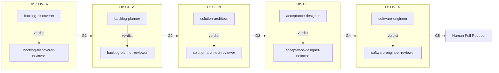

# HVE → SKRAFT: continuity and rupture

> SKRAFT does not replace HVE — it extends it. Where HVE instruments the conversation between a human and an AI, SKRAFT structures the entire lifecycle of a User Story, from discovery to delivery.

## Why the transition?

HVE (High-Value Engineering) provides an RPI (*Refine → Plan → Implement*) workflow that works well for solo developers working with an AI assistant. This workflow assumes quality review remains human and manual.

SKRAFT takes over when you want to:
- **automate adversarial review** before a human intervenes,
- **trace every decision** (artifacts, `state.json`, verdicts),
- **scale** across a team or a full backlog.

## The SKRAFT pipeline in 5 phases

| Phase | Executor agent | Independent reviewer | Exit gate |
|-------|---------------|----------------------|-----------|
| DISCOVER | `backlog-discoverer` | `backlog-discoverer-reviewer` | G1 |
| DISCUSS | `backlog-planner` | `backlog-planner-reviewer` | G2 |
| DESIGN | `solution-architect` | `solution-architect-reviewer` | G3 |
| DISTILL | `acceptance-designer` | `acceptance-designer-reviewer` | G4 |
| DELIVER | `software-engineer` | `software-engineer-reviewer` | G5 |

> **Jargon**: a *gate* is a quality checkpoint that blocks progression if quality thresholds are not met. A *reviewer* is a read-only agent that emits a verdict without modifying artifacts (CQS principle).

## HVE vs SKRAFT: comparison table

| Dimension | HVE (RPI) | SKRAFT (5 phases) |
|-----------|-----------|-------------------|
| Scope | One development session | One User Story end to end |
| Review | Human and manual | Adversarial assisted before human review |
| Traceability | Limited | `state.json`, artifacts, timestamped verdicts |
| Lenses | None | 4 adversarial lenses (architecture, cold-reader, quality-gates, test-integrity) |
| Gates | None | 5 gates (G1–G5) with configurable thresholds |
| Scalability | Solo / pair | Team, full backlog |

## What stays the same

SKRAFT **inherits** the principles of HVE:
- The developer remains in control of decisions.
- AI assists; it does not decide.
- Quality is non-negotiable.

## Sources

- Forsgren, N., Humble, J. & Kim, G., *Accelerate*, 2018.
- Martin, R. C., *Clean Architecture*, 2017.

## See also

- [The pipeline]({{ "/en/pipeline/" | relative_url }}) — detailed description of the 5 phases
- [Gates]({{ "/en/catalogue/gates" | relative_url }}) — what each gate checks
- [Lenses]({{ "/en/catalogue/lens" | relative_url }}) — the 4 adversarial review lenses
