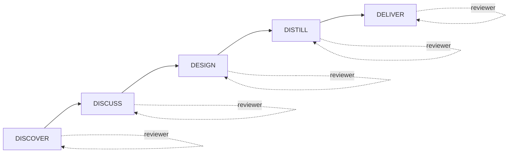

> 🚧 GENERATED DRAFT — to be reviewed and completed by a human.

# HVE → SKRAFT: continuity and evolution

> HVE taught you to work with AI agents in your IDE. SKRAFT turns those isolated agents into a complete delivery pipeline, with controls at every step.

## Why this move?

HVE (*High-Value Engineering*) introduced the RPI workflow (Request → Plan → Implement): an agent receives a request, plans, implements. That is a first step toward disciplined AI assistance.

SKRAFT goes further: it does not replace HVE, it **extends** it. Where HVE covers one interaction, SKRAFT covers the complete lifecycle of a *user story*, from discovery to delivery.

| Dimension | HVE | SKRAFT |
|-----------|-----|--------|
| Scope | One RPI interaction | Full SDLC cycle (5 phases) |
| Review | Implicit | Explicit: independent reviewer per phase |
| Quality control | Manual | Automated gates (Gxx) |
| Analysis perspective | Single | Adversarial lenses (4 viewpoints) |
| Traceability | Limited | `state.json` + artifacts per phase |

## The SKRAFT pipeline at a glance

<!-- 🚧 DIAGRAM REQUIRED — add a mermaid or SVG diagram showing all 5 phases + reviewers + gates + lenses -->

> ⚠️ This diagram is a skeleton. A human must complete it with gates (G01–Gxx), lenses, and artifacts produced by each phase.

## The 5 SKRAFT phases

Each phase is held by an **executor agent** and an **independent reviewer**:

1. **DISCOVER** — Understand the business need, produce an initial Event Storming.
2. **DISCUSS** — Refine BDD scenarios, align stakeholders.
3. **DESIGN** — Produce architecture decisions (ADR), test plan.
4. **DISTILL** — Implement in Outside-In TDD, with mutation testing.
5. **DELIVER** — Verify final quality, open the PR, archive traces.

## Adversarial lenses

The reviewer does not have a single viewpoint: they apply four **lenses** in sequence, each examining the work from a different angle:

- **architecture-boundaries**: are the layers respected?
- **cold-reader**: can a developer unfamiliar with the context understand the code?
- **quality-gates**: are all defined gates cleared?
- **test-integrity**: do the tests genuinely prove the behaviour?

## What stays the same

Your HVE investment remains valid. SKRAFT agents use the same `.agent.md` format, the same MCP tools, the same prompting philosophy. SKRAFT adds **pipeline discipline** without discarding what you have learned.

## Sources

> 🚧 To be completed by a human with cited references (Evans, Freeman & Pryce, Beck, etc.).

---

*Auto-generated page — draft to be completed, especially the diagram (`requires_diagram: true`).*
