# SKRAFT — The Handbook

SKRAFT is an **AI-agent-driven SDLC pipeline**. Each development phase is executed
by a dedicated agent, then validated by an independent reviewer — no agent
validates its own work.

> « The only way to go fast is to go well. »
> — Martin, R. C., *Clean Architecture*, 2017.

## First time here? Install, then choose

1. [Install SKRAFT with `/plugin`]({{ "/en/tutorials/getting-started" | relative_url }}).
2. Choose the journey matching the real state of your project.

| Your starting point | Journey |
| --- | --- |
| Refined story or existing backlog | [Core journey]({{ "/en/explanation/pipeline/" | relative_url }}) |
| Existing code without documentation or a safety net | [Brownfield journey]({{ "/en/explanation/brownfield" | relative_url }}) |

To understand the handoffs before running a workflow, next follow
[one Starbucks order end to end]({{ "/en/explanation/pipeline/fil-rouge" | relative_url }}).

## How to read this handbook

The documentation follows the **Diátaxis** structure — four doors depending on
what you are trying to do:

| Door | For… | Start with |
| --- | --- | --- |
| **Learn** (tutorial) | following a guided path | [Getting started]({{ "/en/tutorials/getting-started" | relative_url }}), [The running example]({{ "/en/explanation/pipeline/fil-rouge" | relative_url }}) |
| **Do** (how-to) | solving a precise task | [Customization]({{ "/en/how-to/customisation" | relative_url }}), [Genesis & contributing]({{ "/en/how-to/contributing" | relative_url }}) |
| **Understand** (explanation) | knowing *why* it is built this way | [The pipeline]({{ "/en/explanation/pipeline/" | relative_url }}), [Review before review]({{ "/en/explanation/why-review-before-review" | relative_url }}) |
| **Look up** (reference) | finding a precise fact | [Agentic catalogue]({{ "/en/dashboard/" | relative_url }}), [Gates]({{ "/en/reference/gates" | relative_url }}), [Patterns]({{ "/en/reference/patterns" | relative_url }}) |

## Where to go by role

- **Executive** — why assisted review lowers time-to-delivery: [For executives]({{ "/en/explanation/for-executives" | relative_url }}).
- **Developer** — the pipeline phase by phase and the agent team: [The pipeline]({{ "/en/explanation/pipeline/" | relative_url }}), [The team]({{ "/en/explanation/pipeline/team" | relative_url }}).
- **Legacy maintainer** — understand, secure, then transform existing code: [Brownfield journey]({{ "/en/explanation/brownfield" | relative_url }}).
- **Architect** — decisions and boundaries: [Architecture]({{ "/en/explanation/architecture" | relative_url }}), [Clean Architecture]({{ "/en/explanation/clean-architecture" | relative_url }}).
- **Coming from HVE?** — the continuity (RPI, `state.json`, BRD/PRD upstream): [HVE → SKRAFT]({{ "/en/explanation/hve-vs-skraft" | relative_url }}).

## The journeys in one picture

```mermaid
flowchart LR
    C{Starting point} -->|raw backlog| D[optional DISCOVER]
    C -->|refined story| R[RESEARCH]
    C -->|legacy code| BF[standalone Brownfield]
    BF -.->|PRD, backlog, or secured code| C
    D -.->|triage| DI[optional DISCUSS]
    DI -.->|refined story| R
    R -->|sourced research| DE[DESIGN]
    DE -->|architecture| DIS[DISTILL]
    DIS -->|scenarios| DEL[DELIVER]
    DEL -->|code| PR[Pull Request]
    style BF fill:#102016,stroke:#6f8478
    style D fill:#1a3a2a,stroke:#4ed58a
    style DI fill:#1a3a2a,stroke:#4ed58a
    style DE fill:#1a3a2a,stroke:#4ed58a
    style DIS fill:#1a3a2a,stroke:#4ed58a
    style DEL fill:#1a3a2a,stroke:#4ed58a
    style PR fill:#102016,stroke:#6f8478
```

DISCOVER then DISCUSS are optional standalone product workflows. They precede
`skraft-orchestrator`, entrypoint for the RESEARCH → DESIGN → DISTILL → DELIVER
engineering pipeline on the shared [HVE-Core]({{ "/en/explanation/hve-core" | relative_url }}) substrate. Brownfield remains a
human-chosen standalone journey. It rejoins the core journey once the backlog,
story, or code is ready.
