# DELIVER cycle: engineer + reviewer

> Overview of the implementation and review loop that constitutes the DELIVER phase.

## When to use

This page is not an agent to invoke — it documents the DELIVER loop combining the [software-engineer](/en/reference/agents/software-engineer) and the [software-engineer-reviewer](/en/reference/agents/software-engineer-reviewer).

## Entry contract

- Approved BDD scenarios (DISTILL validated)
- Architecture decisions (ADRs)

## Exit contract

- Code implemented, tested, and approved by the reviewer
- All artifacts committed

## The cycle

```mermaid
graph TB
    SE[software-engineer] -->|implements| CODE[code + tests]
    CODE -->|submits| SER[software-engineer-reviewer]
    SER -->|approve| DONE[✓ DELIVER complete]
    SER -->|reject| SE
    
    style SE fill:#2d5a3d,stroke:#4ed58a
    style SER fill:#3a2d5a,stroke:#8a4ed5
    style DONE fill:#1a3a2d,stroke:#4ed58a
```

1. **Engineer implements** — Walking Skeleton first, then Outside-In TDD (RED → GREEN → REFACTOR)
2. **Reviewer evaluates** — 4 independent adversarial lenses
3. **If rejected** — The engineer fixes and resubmits (bounded retry)
4. **If approved** — The DELIVER phase is complete, artifacts are committed

## Invariants

- **Tests before code** — The cycle starts with acceptance tests
- **Bounded retry** — The number of engineer → reviewer cycles is limited
- **CQS** — The engineer writes (command), the reviewer reads (query)
- See [Customisation](/en/customisation) for the full list

## Why this shape

The RED-GREEN-REFACTOR cycle is the fundamental rhythm of TDD. Each micro-iteration produces a verified increment — not a large batch of untested code.

> « The two rules of TDD: write new code only if an automated test has failed; eliminate duplication. »
> — Beck, K., *Test-Driven Development by Example*, 2003.

Outside-In TDD starts with the acceptance test (the observable behaviour) and lets internal design emerge from actual needs, not abstract hypotheses.

> « Start with an acceptance test that exercises the functionality you want to build. »
> — Freeman, S. & Pryce, N., *Growing Object-Oriented Software, Guided by Tests*, 2009.

## Allowed customisation

- Maximum number of retries (L2)
- Mutation score threshold (L2)
- Walking Skeleton depth (L2)

## See also

- [software-engineer](/en/reference/agents/software-engineer) — Executor agent
- [software-engineer-reviewer](/en/reference/agents/software-engineer-reviewer) — Reviewer agent
- [Pipeline DELIVER](/en/pipeline/deliver) — Phase description
- [outside-in-tdd](/en/reference/skills/outside-in-tdd) — TDD skill
- [red-synthesize-green](/en/reference/skills/red-synthesize-green) — TDD cycle skill
