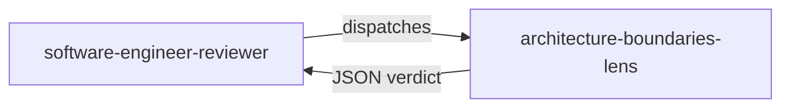

# architecture-boundaries-lens

> Structural lens that verifies dependencies point inward, Domain and Application layers contain no mocks, and the Domain layer respects Object Calisthenics.

## Role in the adversarial panel

This lens belongs to `software-engineer-reviewer`. It is activated **on every** DELIVER cycle — it is one of the 4 CORE lenses. It receives **production code only**; it does not see tests, the engineer's journal, or the checklist.

## What the lens checks

- **G4 — No mock in Domain/Application**: detects `A.Fake<>`, `Mock<>`, `Substitute.For<>` on Domain or Application types inside `*.UnitTest` projects.
- **G5 — Dependency direction**: verifies Domain imports nothing; Application imports Domain only; Infrastructure and API may import Application.
- **G10 — Object Calisthenics on Domain**: enforces all 9 rules on Domain layer code.

## Verdict and thresholds

| Condition | Verdict | Severity |
|-----------|---------|----------|
| `A.Fake<IDomainType>()` or `Mock<IDomainType>()` in a unit test | `fail` | `blocker` |
| Domain `using` → Application, Infrastructure, or API | `fail` | `blocker` |
| Application `using` → Infrastructure or API | `fail` | `blocker` |
| Object Calisthenics violation in Domain | `fail` | `medium` |
| No violation detected | `pass` | — |

A single `blocker` defect is sufficient to reject the cycle.

## Invariants

- Read-only: the lens never modifies code.
- It does not propose fixes; it reports findings.
- It does not see tests, journal, or checklist — production code only.
- `A.Fake<IDrivenPort>()` (repository, gateway) is **allowed** — only Domain/Application types are forbidden.

> « A good architecture allows the system to be easily understood. »
> — Martin, R. C., *Clean Architecture*, 2017.

## Sources

- Martin, R. C. *Clean Architecture*, 2017.
- Bay, J. *Object Calisthenics*, 2008.
- [clean-architecture-testing]({{ "/en/reference/skills/clean-architecture-testing" | relative_url }}) (skill loaded on demand)

## See also

- [Review lenses — overview]({{ "/en/reference/lens" | relative_url }})
- [architecture-boundaries-lens (FR)]({{ "/fr/reference/lenses/architecture-boundaries-lens" | relative_url }})
- [Gates by phase]({{ "/en/reference/gates" | relative_url }})
- [Glossary]({{ "/en/reference/glossary" | relative_url }})
