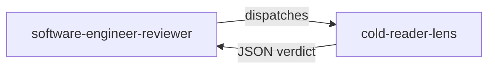

# cold-reader-lens

> Naive lens that reads code and tests as if encountering them for the first time, to verify that business language, naming, and intent remain legible without prior context.

## Role in the adversarial panel

This lens belongs to `software-engineer-reviewer`. It is activated **on every** DELIVER cycle — it is one of the 4 CORE lenses. It receives code **and** tests, but **no** journal, checklist, or knowledge of the TDD cycle that produced the code.

## What the lens checks

- **Test method names (G11)**: do they describe business behaviour in plain language? (e.g. `Should_Reject_When_Driver_Is_Under_18` — not `Test1`)
- **Variable names in tests**: do they use domain vocabulary? (e.g. `eligibilityResult` — not `x`, `data`, `result2`)
- **Assertion messages**: are they understandable by a domain expert?
- **Production method names**: do they express intent? (e.g. `CalculatePremium()` — not `ProcessData()`)
- **Unmotivated abstractions**: interfaces or classes with no clear domain reason?

## Verdict and thresholds

| Condition | Verdict | Severity |
|-----------|---------|----------|
| Generic test method name (`Test1`, `TestMethod`, `ShouldWork`) | `fail` | `medium` |
| Variable without domain vocabulary (`x`, `data`, `result2`) | `fail` | `medium` |
| Production method without clear intent (`ProcessData`, `DoStuff`, `Handle`) | `fail` | `medium` |
| Abstraction with no identifiable domain reason | `fail` | `low` |
| No violation detected | `pass` | — |

Maximum severity for this lens is `medium` — it cannot emit a `blocker`.

## Invariants

- Read-only: the lens never modifies code.
- It has no knowledge of TDD, quality gates, or the fact that code was produced by an agent.
- It does **not** check architecture (another lens), test correctness (another lens), or code style/formatting.
- Its findings concern **clarity** only, not correctness.

> « Programs must be written for people to read, and only incidentally for machines to execute. »
> — Abelson, H. & Sussman, G. J., *Structure and Interpretation of Computer Programs*, 1985.

## Sources

- Abelson, H. & Sussman, G. J. *Structure and Interpretation of Computer Programs*, 1985.
- Martin, R. C. *Clean Code*, 2008.

## See also

- [Review lenses — overview]({{ "/en/reference/lens" | relative_url }})
- [cold-reader-lens (FR)]({{ "/fr/reference/lenses/cold-reader-lens" | relative_url }})
- [Gates by phase]({{ "/en/reference/gates" | relative_url }})
- [Glossary]({{ "/en/reference/glossary" | relative_url }})
