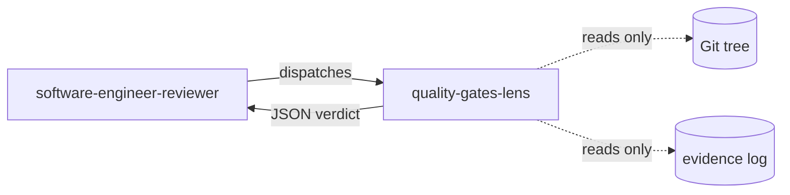

# quality-gates-lens

> Observer-only lens that falsifies every claim in the quality-gates evidence log against the real Git tree — without ever executing a build, tests, or mutation run.

## Role in the adversarial panel

This lens belongs to `software-engineer-reviewer`. It is activated **on every** DELIVER cycle — it is one of the 4 CORE lenses. It receives a single input: the evidence log produced by the `software-engineer` at the end of the COMMIT phase (`.copilot-tracking/skraft-plans/{projectSlug}/evidence/{date}/qg-{story}.json`).

## What the lens checks

- **Log location**: presence, valid JSON, `$schema` equal to `quality-gates-evidence/v1`.
- **Self-consistency (no Git access yet)**: `status: "pass"` implies `metrics.tests_failed == 0`; `status: "not_applicable"` requires a non-empty `rationale`; `stdout_tail` must be a strict suffix of the referenced file.
- **Falsification against the Git tree**: `repo_root_rev` matches HEAD SHA; each `commits_covered[].sha` resolves in the tree; `files_changed` lists exactly the paths in the diff; `commits_covered[].subject` matches the Conventional Commits regex (G8); `stdout_ref` files exist and their `stdout_sha256` matches re-hashing; RED/GREEN snapshots match `git show {commit}:{file}`.
- **G9 — RED→GREEN integrity**: any removal or mutation of a line present in the RED snapshot is an Iron Rule violation.

## Verdict and thresholds

| Condition | Verdict | Severity |
|-----------|---------|----------|
| Log absent, malformed, or `$schema` unsupported | `inconclusive` | — |
| Referenced file unreachable or `stdout_sha256` mismatch | `inconclusive` | — |
| `status: "pass"` with `tests_failed > 0` | `fail` | `high` |
| `status: "not_applicable"` without `rationale` | `fail` | `high` |
| `commits_covered[].subject` fails G8 regex | `fail` | `high` |
| Commit SHA does not resolve, or `files_changed` lists a path absent from the diff | `fail` | `high` |
| RED→GREEN snapshot: removal or mutation of a line (G9) | `fail` | `blocker` |
| Every applicable gate at `pass` and every reference resolves | `pass` | — |

`inconclusive` is **never** equivalent to `pass`. Absence of evidence is not evidence of success.

## Invariants

- Read-only: the lens never executes build, tests, mutation, or any mutating Git command.
- It accesses the Git tree only via `Read`, `Glob`, `Grep` on the working copy (HEAD).
- It does not receive the output of other lenses.
- If a claim cannot be falsified from the Git tree alone, the verdict is `inconclusive` (never `pass`).

> « Absence of evidence is not evidence of absence. »
> — Scientific verification principle, epistemological tradition.

## Sources

- `quality-gates-evidence-contract` (skill loaded mandatory — schema, falsification surface, fixed gate taxonomy G1..G9)
- Freeman, S. & Pryce, N. *Growing Object-Oriented Software, Guided by Tests*, 2009.

## See also

- [Review lenses — overview]({{ "/en/reference/lens" | relative_url }})
- [quality-gates-lens (FR)]({{ "/fr/reference/lenses/quality-gates-lens" | relative_url }})
- [Gates by phase]({{ "/en/reference/gates" | relative_url }})
- [Glossary]({{ "/en/reference/glossary" | relative_url }})
