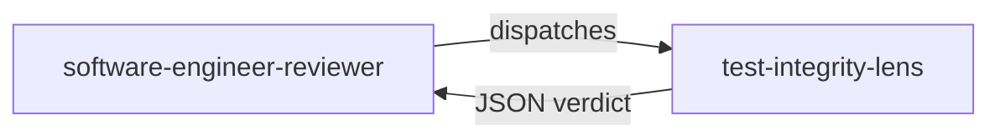

# test-integrity-lens

> Test quality analysis lens that hunts test theater and Iron Rule violations — tests that assert nothing real, or whose assertions were weakened to force a GREEN.

## Role in the adversarial panel

This lens belongs to `software-engineer-reviewer`. It is activated **on every** DELIVER cycle — it is one of the 4 CORE lenses. It receives tests **and** production code. It does not see the journal or checklist.

## What the lens checks

### G7 — Test theater

| Anti-pattern | Description | Severity |
|-------------|-------------|----------|
| **Tautological test** | `Assert.NotNull(result)` as sole assertion; `Assert.True(true)`; any assertion that can never fail | `blocker` |
| **Mock-dominated test** | More mock setup lines than assertion lines; no real Domain object instantiated | `blocker` |
| **Circular verification** | Test recalculates the expected value using the production formula | `blocker` |
| **Implementation mirroring** | `Verify()` / `MustHaveHappened()` without state assertion; asserting HOW instead of WHAT | `blocker` |
| **Fixture theater** | Setup creates the exact expected end-state; `git diff` shows only test file changes between RED and GREEN | `blocker` |

### G9 — Iron Rule violation

| Condition | Severity |
|-----------|----------|
| An assertion was weakened between commits (e.g. `Assert.Equal(90, x)` → `Assert.NotNull(x)`) | `blocker` |
| A test was deleted to make the suite pass | `blocker` |
| `[Skip]` added to a failing test | `blocker` |

## Verdict and thresholds

| Condition | Verdict |
|-----------|---------|
| At least one G7 anti-pattern or G9 violation | `fail` |
| No test theater or Iron Rule violation | `pass` |

Every defect emitted by this lens is `blocker` — it cannot produce a lower severity verdict.

## Invariants

- Read-only: the lens never modifies code or tests.
- It does not propose fixes; it reports findings naming the specific anti-pattern.
- Every finding **must** name the precise pattern: tautological, mock-dominated, circular, implementation-mirroring, fixture-theater.

> « Never refactor a failing test. »
> — Freeman, S. & Pryce, N., *Growing Object-Oriented Software, Guided by Tests*, 2009.

## Sources

- Freeman, S. & Pryce, N. *Growing Object-Oriented Software, Guided by Tests*, 2009.
- Meszaros, G. *xUnit Test Patterns*, 2007.
- Beck, K. *Test-Driven Development by Example*, 2003.

## See also

- [Review lenses — overview]({{ "/en/reference/lens" | relative_url }})
- [test-integrity-lens (FR)]({{ "/fr/reference/lenses/test-integrity-lens" | relative_url }})
- [Gates by phase]({{ "/en/reference/gates" | relative_url }})
- [Glossary]({{ "/en/reference/glossary" | relative_url }})
