# Architecture

SKRAFT applique le principe CQS (Command-Query Separation) au niveau système. L'orchestrateur dispatche des commandes vers des agents exécuteurs, qui produisent des artefacts. Les agents reviewers lisent ces artefacts et émettent des verdicts — ils ne modifient jamais rien.

> « Asking a question should not change the answer. »
> — Meyer, B., *Object-Oriented Software Construction, 2nd ed.*, 1997.

## Vue d'ensemble

```mermaid
graph TB
    O[skraft-orchestrator] -->|dispatch| BD[backlog-discoverer]
    O -->|dispatch| BP[backlog-planner]
    O -->|dispatch| SA[solution-architect]
    O -->|dispatch| AD[acceptance-designer]
    O -->|dispatch| SE[software-engineer]
    
    BD -->|writes| A1[triage report]
    BP -->|writes| A2[refined stories]
    SA -->|writes| A3[ADRs + diagrams]
    AD -->|writes| A4[Gherkin scenarios]
    SE -->|writes| A5[tested code]
    
    A1 -.->|reads| BDR[backlog-discoverer-reviewer]
    A2 -.->|reads| BPR[backlog-planner-reviewer]
    A3 -.->|reads| SAR[solution-architect-reviewer]
    A4 -.->|reads| ADR[acceptance-designer-reviewer]
    A5 -.->|reads| SER[software-engineer-reviewer]
    
    BDR -->|verdict| O
    BPR -->|verdict| O
    SAR -->|verdict| O
    ADR -->|verdict| O
    SER -->|verdict| O
    
    O -.->|reads| S[(state.json)]
    
    style O fill:#2d5a3d,stroke:#4ed58a,stroke-width:2px
    style S fill:#1a2a3a,stroke:#7fd3ff
```

## Légende

| Flèche | Signification |
|--------|---------------|
| **Trait plein** orchestrateur → exécuteur | Commande (côté command de CQS) |
| **Trait plein** exécuteur → artefact | Écriture — l'exécuteur produit un artefact |
| **Trait pointillé** artefact → reviewer | Lecture seule (côté query de CQS) |
| **Trait plein** reviewer → orchestrateur | Verdict (PASS / FAIL + motifs) |
| **Trait pointillé** orchestrateur → state.json | Modèle de lecture CQRS |

## Séparation stricte

Les exécuteurs **écrivent** des artefacts mais n'émettent jamais de verdict sur leur propre travail. Les reviewers **lisent** les artefacts et produisent un verdict, mais ne modifient jamais le code ni les documents. Cette séparation garantit que chaque artefact est validé par un regard indépendant.

Le fichier `state.json` sert de modèle de lecture (CQRS) : l'orchestrateur y enregistre la progression des phases et les verdicts, puis le consulte pour décider de la prochaine action.

Voir [Concepts fondamentaux]({{ "/fr/explanation/concepts" | relative_url }}) pour la théorie derrière CQS et CQRS.
