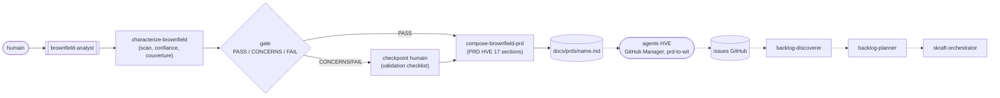
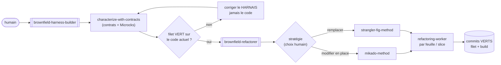
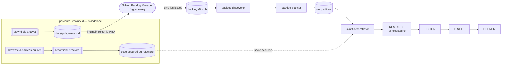

# Parcours Brownfield

> Brownfield est un parcours de premier niveau, frère du parcours principal. Il
> part du code existant plutôt que d'une story affinée.

## Quand choisir ce parcours

Choisissez Brownfield lorsqu'au moins une de ces conditions est vraie :

- le code existe, mais son intention produit n'est pas documentée
- ses comportements réels ou ses intégrations restent incertains
- l'absence de tests rend chaque modification risquée
- une transformation progressive doit préserver le service en production

Si une story est déjà affinée et le code suffisamment protégé, choisissez
directement `skraft-orchestrator` dans le sélecteur d'agents.

## Pourquoi ce parcours existe

Le parcours principal part soit d'issues à préparer avec DISCOVER puis DISCUSS,
soit directement d'une story affinée. `skraft-orchestrator` transforme ensuite
cette story à travers RESEARCH → DESIGN → DISTILL → DELIVER. Un système hérité
peut arriver sans issues, sans intention produit explicite et sans filet de tests.
Il faut d'abord produire l'entrée manquante ou rendre le code sûr à changer.

Brownfield répond avec **deux chemins et trois racines standalone**. L'humain
sélectionne chaque agent directement. Aucun n'est une phase de
`skraft-orchestrator` et aucun ne modifie son état.

## Deux chemins, trois racines

| Besoin | Workflow | Ce qu'il produit |
|--------|----------|------------------|
| **Comprendre** un code sans documentation produit | [`brownfield-analyst`]({{ "/fr/dashboard/" | relative_url }}#agent-brownfield-analyst) | un PRD au format HVE, repris par les agents HVE pour créer des issues |
| **Sécuriser puis transformer** un legacy | [`brownfield-harness-builder`]({{ "/fr/dashboard/" | relative_url }}#agent-brownfield-harness-builder) → [`brownfield-refactorer`]({{ "/fr/dashboard/" | relative_url }}#agent-brownfield-refactorer) | un filet de tests de caractérisation, puis un refactoring qui le garde vert |

Les deux chemins peuvent être choisis indépendamment. Dans le second,
`brownfield-harness-builder` précède toujours `brownfield-refactorer` afin que la
transformation soit mesurée contre un comportement de référence. L'humain reste
décideur aux moments qui comptent.

## Workflow 1 — de l'existant au PRD

[`characterize-brownfield`]({{ "/fr/dashboard/" | relative_url }}#skill-characterize-brownfield)
reconstruit ce que fait le système : stack, inventaire de fonctionnalités, carte
d'intégration, contrats d'API existants, dette technique. La règle centrale est
l'**honnêteté sur la confiance** : chaque affirmation est soit un **fait** vérifié
par un appel outil, soit une **inférence** étiquetée `High` / `Medium` / `Low`. Un
PRD brownfield bâti sur une fausse certitude est pire qu'un PRD qui dit « inconnu ».
Une facette optionnelle de **traçabilité de couverture** (adaptée de la discipline
test-architecture) classe chaque comportement `FULL` / `PARTIAL` / `NONE` et nourrit
un **gate `PASS` / `CONCERNS` / `FAIL`** ; sous le seuil, l'humain confirme ou
corrige avant d'aller plus loin.

[`compose-brownfield-prd`]({{ "/fr/dashboard/" | relative_url }}#skill-compose-brownfield-prd)
mappe ensuite cette caractérisation vers le PRD **au format HVE exact** (17 sections,
identifiants `FR-`/`NFR-`, traçabilité). Ce PRD n'est pas un cul-de-sac : il est le
livrable que l'humain remet aux **agents HVE** (GitHub Backlog Manager, `prd-to-wit`)
qui en dérivent des issues. `backlog-discoverer` les trie, puis `backlog-planner`
affine l'issue retenue en story pour `skraft-orchestrator`.

## Workflow 2 — sécuriser puis transformer

D'abord le filet.
[`characterize-with-contracts`]({{ "/fr/dashboard/" | relative_url }}#skill-characterize-with-contracts)
découvre (ou reconstruit) le contrat d'API du service, monte les mocks Microcks pour
ses dépendances, et écrit des **tests de caractérisation** — un *golden master* qui
verrouille le comportement **actuel**, bugs compris. Un bug capturé ici est un bug
documenté, pas un test à réparer. Ce filet réutilise tel quel les skills existants
[`contract-testing-roster`]({{ "/fr/dashboard/" | relative_url }}#skill-contract-testing-roster)
et [`mocking-strategy-roster`]({{ "/fr/dashboard/" | relative_url }}#skill-mocking-strategy-roster)
(v1 ciblée .NET. Le roster garde la stack extensible). Le
[`brownfield-harness-builder`]({{ "/fr/dashboard/" | relative_url }}#agent-brownfield-harness-builder)
ne franchit son gate que si le filet est **vert sur le code non modifié** : un test
rouge avant tout refactoring signifie que le harnais est faux, pas le code.

> « Code without tests is bad code. »
> — Feathers, M., *Working Effectively with Legacy Code*, 2004.

Une fois le filet vert, le
[`brownfield-refactorer`]({{ "/fr/dashboard/" | relative_url }}#agent-brownfield-refactorer)
**recommande** une stratégie — jamais ne l'impose : un changement de structure aussi
conséquent reste une décision humaine.

- [`mikado-method`]({{ "/fr/dashboard/" | relative_url }}#skill-mikado-method) —
  **modifier en place**. On tente le changement naïvement, on note ce qui casse
  comme prérequis dans un graphe, on **revert** tout, et on implémente en remontant
  des feuilles, chaque commit gardant le code vert. Le graphe est l'artefact ; le
  code de l'expérience est jetable.
- [`strangler-fig-method`]({{ "/fr/dashboard/" | relative_url }}#skill-strangler-fig-method) —
  **remplacer** derrière une façade. La nouvelle implémentation pousse à côté de
  l'ancienne, le trafic bascule tranche par tranche, et le même contrat rejoué sur
  l'ancien et le nouveau **prouve l'équivalence** avant chaque bascule. L'ancien
  meurt étranglé.

Chaque feuille (Mikado) ou tranche (Strangler) est confiée à un
[`refactoring-worker`]({{ "/fr/dashboard/" | relative_url }}#worker-refactoring-worker)
en contexte frais, qui rend un signal terminal `ADVANCE` / `EXPAND` / `DONE` /
`BLOCKED`. Le filet est le **capteur** : toute régression comportementale à la
frontière de l'API devient un test rouge — un prérequis Mikado découvert, ou une
tranche Strangler non basculable.

## Comment le parcours rejoint l'ingénierie

Les deux chemins Brownfield restent hors de `skraft-orchestrator`. Ils ne le
déclenchent pas et ne créent aucune transition dans son état. Ils préparent soit
son entrée produit, soit le code sur lequel il pourra travailler.

- Le chemin **comprendre** produit un PRD. Les agents HVE en dérivent des issues,
  `backlog-discoverer` les trie et `backlog-planner` affine l'issue retenue. La
  story obtenue peut alors être remise à `skraft-orchestrator`.
- Le chemin **sécuriser puis transformer** agit sur le socle technique. Il ne
  produit pas de story. Tout nouveau besoin doit encore être affiné avant de
  sélectionner `skraft-orchestrator`.
- Le filet de caractérisation reste actif sous les nouveaux tests de DELIVER. Il
  détecte les régressions de comportement pendant les évolutions suivantes.

## Ce qui reste à l'humain

Rien ici n'est autonome de bout en bout. L'humain choisit le workflow, tranche la
stratégie de refactoring, confirme les gates sous le seuil, et — pour Mikado —
**pilote le graphe** : la seule étape que la méthode ne délègue pas, parce que
décider quel prérequis attaquer est un jugement, pas une exécution.

## Sources

- Feathers, M., *Working Effectively with Legacy Code*, 2004 — tests de
  caractérisation, coutures, filet avant modification.
- Ellnestam & Brolund, *The Mikado Method*, 2014 — expérience naïve, graphe de
  prérequis, discipline de revert.
- Fowler, M., *Bliki: StranglerFigApplication*, 2004 — remplacement incrémental
  derrière une façade.

Termes à connaître : **golden master**, **caractérisation**, **contrat**, **façade**
— définis dans le [glossaire]({{ "/fr/reference/glossary" | relative_url }}).
