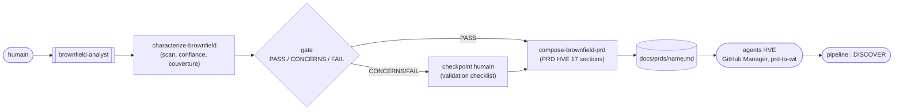

# Brownfield (amont du pipeline)

> Le pipeline SKRAFT suppose deux choses qu'un code hérité n'offre pas : un backlog
> déjà trié et un code sûr à modifier. Les workflows brownfield fabriquent l'un et
> l'autre — en amont, à la demande de l'humain.

## Pourquoi — le pipeline suppose ce que le brownfield n'a pas

Le pipeline DISCOVER → DISCUSS → DESIGN → DISTILL → DELIVER part d'un backlog
d'issues priorisées et d'un code que la discipline de tests rend sûr à faire
évoluer. Un système hérité (« brownfield ») arrive sans documentation produit et,
souvent, sans filet de tests. Le poser tel quel dans le pipeline, c'est demander à
DISCOVER de trier un backlog qui n'existe pas, ou à DELIVER de modifier un code dont
personne ne connaît le comportement réel.

SKRAFT répond avec **deux workflows standalone**, distincts du pipeline : l'humain
les invoque directement, ils ne sont pas des phases de l'orchestrateur et ne
modifient jamais son état. Chacun couvre un besoin que le pipeline présuppose.

## Deux workflows, deux besoins

| Besoin | Workflow | Ce qu'il produit |
|--------|----------|------------------|
| **Comprendre** un code sans docs | [`brownfield-analyst`]({{ "/fr/reference/agents/brownfield-analyst" | relative_url }}) | un PRD au format HVE, repris par les agents HVE pour créer des issues |
| **Sécuriser puis transformer** un legacy | [`brownfield-harness-builder`]({{ "/fr/reference/agents/brownfield-harness-builder" | relative_url }}) → [`brownfield-refactorer`]({{ "/fr/reference/agents/brownfield-refactorer" | relative_url }}) | un filet de tests de caractérisation, puis un refactoring qui garde ce filet vert |

Les deux partent **de zéro** (aucun ne dépend de l'autre) et restent gouvernés par
l'humain aux moments qui comptent.

## Workflow 1 — de l'existant au PRD

[`characterize-brownfield`]({{ "/fr/reference/skills/characterize-brownfield" | relative_url }})
reconstruit ce que fait le système : stack, inventaire de fonctionnalités, carte
d'intégration, contrats d'API existants, dette technique. La règle centrale est
l'**honnêteté sur la confiance** : chaque affirmation est soit un **fait** vérifié
par un appel outil, soit une **inférence** étiquetée `High` / `Medium` / `Low`. Un
PRD brownfield bâti sur une fausse certitude est pire qu'un PRD qui dit « inconnu ».
Une facette optionnelle de **traçabilité de couverture** (adaptée de la discipline
test-architecture) classe chaque comportement `FULL` / `PARTIAL` / `NONE` et nourrit
un **gate `PASS` / `CONCERNS` / `FAIL`** ; sous le seuil, l'humain confirme ou
corrige avant d'aller plus loin.

[`compose-brownfield-prd`]({{ "/fr/reference/skills/compose-brownfield-prd" | relative_url }})
mappe ensuite cette caractérisation vers le PRD **au format HVE exact** (17 sections,
identifiants `FR-`/`NFR-`, traçabilité). Ce PRD n'est pas un cul-de-sac : il est le
livrable que l'humain remet aux **agents HVE** (GitHub Backlog Manager, `prd-to-wit`)
qui en dérivent issues et user-stories — le backlog que **DISCOVER** attend.

## Workflow 2 — sécuriser puis transformer

D'abord le filet.
[`characterize-with-contracts`]({{ "/fr/reference/skills/characterize-with-contracts" | relative_url }})
découvre (ou reconstruit) le contrat d'API du service, monte les mocks Microcks pour
ses dépendances, et écrit des **tests de caractérisation** — un *golden master* qui
verrouille le comportement **actuel**, bugs compris. Un bug capturé ici est un bug
documenté, pas un test à réparer. Ce filet réutilise tel quel les skills existants
[`contract-testing-roster`]({{ "/fr/reference/skills/contract-testing-roster" | relative_url }})
et [`mocking-strategy-roster`]({{ "/fr/reference/skills/mocking-strategy-roster" | relative_url }})
(v1 ciblée .NET, le roster garde la stack extensible). Le
[`brownfield-harness-builder`]({{ "/fr/reference/agents/brownfield-harness-builder" | relative_url }})
ne franchit son gate que si le filet est **vert sur le code non modifié** : un test
rouge avant tout refactoring signifie que le harnais est faux, pas le code.

> « Code without tests is bad code. »
> — Feathers, M., *Working Effectively with Legacy Code*, 2004.

Une fois le filet vert, le
[`brownfield-refactorer`]({{ "/fr/reference/agents/brownfield-refactorer" | relative_url }})
**recommande** une stratégie — jamais ne l'impose : un changement de structure aussi
conséquent reste une décision humaine.

- [`mikado-method`]({{ "/fr/reference/skills/mikado-method" | relative_url }}) —
  **modifier en place**. On tente le changement naïvement, on note ce qui casse
  comme prérequis dans un graphe, on **revert** tout, et on implémente en remontant
  des feuilles, chaque commit gardant le code vert. Le graphe est l'artefact ; le
  code de l'expérience est jetable.
- [`strangler-fig-method`]({{ "/fr/reference/skills/strangler-fig-method" | relative_url }}) —
  **remplacer** derrière une façade. La nouvelle implémentation pousse à côté de
  l'ancienne, le trafic bascule tranche par tranche, et le même contrat rejoué sur
  l'ancien et le nouveau **prouve l'équivalence** avant chaque bascule. L'ancien
  meurt étranglé.

Chaque feuille (Mikado) ou tranche (Strangler) est confiée à un
[`refactoring-worker`]({{ "/fr/reference/workers/refactoring-worker" | relative_url }})
en contexte frais, qui rend un signal terminal `ADVANCE` / `EXPAND` / `DONE` /
`BLOCKED`. Le filet est le **capteur** : toute régression comportementale à la
frontière de l'API devient un test rouge — un prérequis Mikado découvert, ou une
tranche Strangler non basculable.

## Comment ça alimente le pipeline

Les deux workflows sont **en amont** du pipeline, pas dedans :

- Le PRD du *workflow 1* franchit la frontière vers les agents HVE, qui remplissent
  le backlog que **DISCOVER** trie ensuite.
- Le code sécurisé par le *workflow 2* redevient un terrain où la phase **DELIVER**
  (Outside-In TDD, mutation) peut évoluer sans casse — le filet de caractérisation
  reste le garde-fou sous les nouveaux tests.

## Ce qui reste à l'humain

Rien ici n'est autonome de bout en bout. L'humain choisit le workflow, tranche la
stratégie de refactoring, confirme les gates sous le seuil, et — pour Mikado —
**pilote le graphe** : la seule étape que la méthode ne délègue pas, parce que
décider quel prérequis attaquer est un jugement, pas une exécution.

## Sources

- Feathers, M., *Working Effectively with Legacy Code*, 2004 — tests de
  caractérisation, coutures, filet avant modification.
- Ellnestam & Brolund, *The Mikado Method*, 2014 — expérience naïve, graphe de
  prérequis, discipline de revert.
- Fowler, M., *Bliki: StranglerFigApplication*, 2004 — remplacement incrémental
  derrière une façade.

Termes à connaître : **golden master**, **caractérisation**, **contrat**, **façade**
— définis dans le [glossaire]({{ "/fr/reference/glossary" | relative_url }}).
