# Zoom L3 : contract testing

> La vue [architecture]({{ "/fr/explanation/architecture" | relative_url }}) s'arrête à
> L2. Cette page zoome sur le fan-out L3 frère : comment DELIVER vérifie que **notre
> propre** API se comporte comme son contrat l'annonce.

## Pourquoi ce zoom

Le schéma système garde `software-engineer` (L2) comme une seule boîte. Dans DELIVER,
cet agent **dispatche un sous-agent interne** (`contract-testing-worker`,
`user-invocable: false`) pour câbler le test de contrat côté fournisseur. C'est le
niveau **L3**, masqué du schéma principal pour le garder lisible.

Contrairement au [fan-out mocking]({{ "/fr/explanation/deep-dive/mocking-microcks" | relative_url }})
(côté consommateur, remplace ce que le service appelle), ce worker est **côté
fournisseur** : il vérifie notre propre API. Les deux ne se recouvrent jamais.

## La chaîne L3

```mermaid
graph LR
    SE[software-engineer<br/>lead L2] -->|fan-out| CTW[contract-testing-worker<br/>L3]
    CTW -->|charge| RST[contract-testing-roster]
    RST -->|stack + opt-in| CTD[contract-testing-dotnet]
    CTW -->|Layer 1 toujours| BL[(test WAF + HttpClient)]
    CTW -->|Layer 2 si opt-in| MC[(Microcks TestEndpointAsync)]
    BL -.si actif.-> CFL[contract-fidelity-lens]
    MC -.si actif.-> CFL
    CFL -->|verdict| SER[software-engineer-reviewer]

    style SE fill:#2d5a3d,stroke:#4ed58a,stroke-width:2px
    style CTW fill:#243a2e,stroke:#4ed58a
    style CFL fill:#3a2e1a,stroke:#d5a84e
```

Le worker détecte la stack et lit l'opt-in Microcks via une cascade — prompt >
`skraft.instructions.md` `testing.contract.microcks` > défaut `false` — par appel
d'outil, puis le skill
`contract-testing-roster`
renvoie l'adaptateur et le drapeau d'opt-in (ou un blocage).

| Couche | Quand | Ce qu'elle câble |
| --- | --- | --- |
| Layer 1 — baseline | **toujours**, quel que soit l'opt-in | un test d'intégration `WebApplicationFactory` + `HttpClient` |
| Layer 2 — Microcks | seulement quand l'opt-in est `true` | un test fournisseur `TestEndpointAsync(OPEN_API_SCHEMA)`, **ajouté** à la baseline |

La couche Microcks est **additive** — elle ne remplace jamais la baseline et n'est
jamais supprimée. Le worker n'émet que du câblage de test et renvoie un résultat
structuré ; il ne commit jamais. Le lead garde le cycle TDD métier et vérifie le worker
en **TIER-1**.

## Comment la lentille de fidélité l'audite

Quand le diff relu touche un contrat, un appel `VerifyAsync`/`TestEndpointAsync`, ou un
scaffold côté fournisseur, la `contract-fidelity-lens` rejoint le panel adverse du
`software-engineer-reviewer` (conditionnelle, pas l'une des quatre lentilles CORE).

| Gate | Ce qu'elle vérifie | Sévérité |
| --- | --- | --- |
| K1 | Le test baseline WAF + HttpClient est présent | blocker |
| K2 | La couche Microcks correspond à l'opt-in (présente ssi `true`) | high |
| K3 | Le résultat du test de contrat est assérté, non supprimé, quand l'opt-in est actif | blocker |
| K4 | Le contrat de réponse est réellement assérté (codes, en-têtes, forme ProblemDetails) | high |
| K5 | Aucun appel réel au dépendant ne fuit | blocker |

## Pourquoi cette pratique

> « We grow working software, guided by tests, from the outside in. »
> — Freeman, S. & Pryce, N., *Growing Object-Oriented Software, Guided by Tests*, 2009.

Un test de contrat côté fournisseur fige la frontière de notre propre API pour qu'un
consommateur puisse se fier à sa forme sans environnement end-to-end vivant.

## Pièges & anti-patterns

- **Abandonner la baseline** quand l'opt-in Microcks est actif — la Layer 1 est toujours
  requise (K1) ; la Layer 2 est additive, jamais un remplacement (K2 / K3).
- **N'assérter que le code de statut** en ignorant les en-têtes ou la forme
  ProblemDetails — le contrat est sous-vérifié (K4).
- **Un hostname vivant** qui fuit dans le test fournisseur au lieu du host in-process
  (K5).

## Pour aller plus loin

- [Architecture]({{ "/fr/explanation/architecture" | relative_url }}) — la vue L1 + L2 d'où cette page zoome.
- [Zoom L3 : mocking (Microcks)]({{ "/fr/explanation/deep-dive/mocking-microcks" | relative_url }}) — le fan-out frère, côté consommateur.
- [DELIVER]({{ "/fr/explanation/pipeline/deliver" | relative_url }}) — la phase qui possède ce fan-out.
- [Catalogue agentique]({{ "/fr/dashboard/" | relative_url }}) — chaque agent, worker et lentille. Un terme vous échappe ? Voir le [glossaire]({{ "/fr/reference/glossary" | relative_url }}).

## Sources

- Freeman, S. & Pryce, N., *Growing Object-Oriented Software, Guided by Tests*, 2009.
