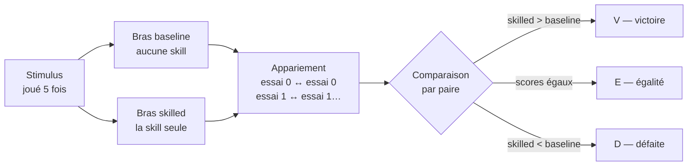
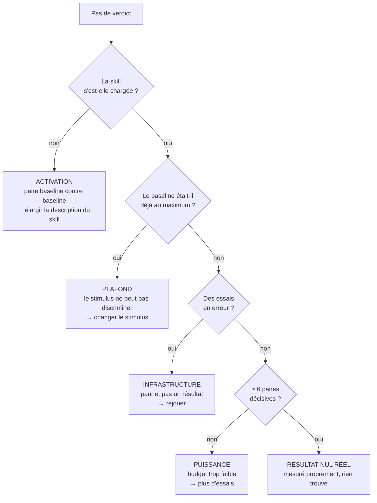

# Lire un verdict d'évaluation

> Un verdict d'évaluation tient en une ligne : `9V/4E/2D (p=0.065)`. Cette page
> déplie cette ligne, chiffre par chiffre, sur un cas réel du dépôt.

---

## 1. Le dispositif : deux bras, rien d'autre ne change

Chaque stimulus est joué **deux fois sur la même entrée** : une fois sans aucune
skill montée, une fois avec la seule skill testée. Tout le reste est identique —
même modèle, même juge, même instant.



L'appariement essai par essai est ce qui rend la mesure exploitable : il annule
l'essentiel de la variance propre au modèle. Ce qui reste est attribuable à la
skill.

---

## 2. D'un lot d'essais à trois nombres

Prenons `adr-eligibility-gate`, mesurée sur 3 stimuli × 5 essais = **15 paires** :

> ℹ️ **9 victoires · 4 égalités · 2 défaites**

---

## 3. Les égalités sont jetées — et c'est le point clé

Une égalité ne dit **rien sur la direction**. Elle n'est ni un argument pour, ni
un argument contre. Le test les met de côté.

```
15 paires au départ

  V V V V V V V V V   E E E E   D D
  └───── 9 ─────┘   └── 4 ──┘  └2┘
                        ▲
                        │ jetées : aucune information de direction
                        ▼
Il reste 11 paires DÉCISIVES  →  9 pour, 2 contre
```

Le vocabulaire compte : ces 11 paires sont les **paires discordantes**. C'est la
seule chose que le test des signes regarde.

---

## 4. La seule question posée

> **Si la skill ne faisait absolument rien, chaque paire décisive serait un pile
> ou face. À quelle fréquence une pièce équilibrée lancée 11 fois donne-t-elle un
> écart au moins aussi déséquilibré que 9 contre 2 ?**

C'est un dénombrement, pas une formule. Sur les 2¹¹ = **2048** séquences
également probables :

```
 faces │ combien de façons │ distribution
───────┼───────────────────┼──────────────────────────────────────────────
     0 │       1           │ █                                    ← compté
     1 │      11           │ █                                    ← compté
     2 │      55           │ █████                                ← compté
     3 │     165           │ ███████████████
     4 │     330           │ ██████████████████████████████
     5 │     462           │ ██████████████████████████████████████████
     6 │     462           │ ██████████████████████████████████████████
     7 │     330           │ ██████████████████████████████
     8 │     165           │ ███████████████
     9 │      55           │ █████                                ← compté
    10 │      11           │ █                                    ← compté
    11 │       1           │ █                                    ← compté
───────┴───────────────────┴──────────────────────────────────────────────
                                  les deux queues : 134 sur 2048 = 0,065
```

**p = 0,065.** Ça se lit : *« une pièce qui ne fait rien produit un résultat au
moins aussi tranché 6,5 % du temps »*.

Le seuil (l'*alpha*) est **0,05**. 6,5 % > 5 % → pas significatif. De très peu.

> ⚠️ **`p` n'est pas la probabilité que la skill marche.** Et `1 − p` n'est pas un
> niveau de confiance. `p` répond à une seule question : *ce résultat est-il
> difficile à expliquer par le hasard ?*

---

## 5. Pourquoi le plancher est à six paires décisives

| Paires décisives | `p` si **tout** est gagné | |
|---|---|---|
| 3 | 0,250 | ❌ |
| 4 | 0,125 | ❌ |
| 5 | 0,0625 | ❌ |
| **6** | **0,031** | ✅ |
| 7 | 0,016 | ✅ |
| 8 | 0,008 | ✅ |

Avec 5 paires décisives, même un sans-faute **5V/0D** donne 0,0625 — au-dessus du
seuil. Une pièce donne cinq faces d'affilée assez souvent pour que ça ne prouve
rien.

> ℹ️ **En dessous de six paires décisives, aucun résultat ne peut conclure, si parfait
> soit-il.** C'est pourquoi le verdict est alors `inconclusive` et non « pas
> d'amélioration » : on ne reproche pas à la skill un budget qui ne pouvait rien
> trancher, dans un sens comme dans l'autre.

### Ce que coûte chaque défaite

Le tableau ci-dessus suppose un sans-faute. Dès qu'une paire part dans l'autre
sens, la barre monte — et elle monte vite :

| Défaites | Victoires minimum | Paires décisives | `p` atteint |
|---|---|---|---|
| 0 | **6** | 6 | 0,031 |
| 1 | **8** | 9 | 0,039 |
| 2 | **10** | 12 | 0,039 |
| 3 | **12** | 15 | 0,035 |
| 4 | **13** | 17 | 0,049 |

```
   0 défaite  ████████████ 6 victoires
   1 défaite  ████████████████ 8
   2 défaites ████████████████████ 10
   3 défaites ████████████████████████ 12
   4 défaites ██████████████████████████ 13
              └── chaque défaite coûte environ deux victoires de plus ──┘
```

**Une défaite ne s'annule pas avec une victoire, elle en coûte deux.** C'est la
nature du test : une paire qui part dans l'autre sens n'enlève pas seulement un
point au décompte, elle rend l'ensemble moins déséquilibré, donc plus banal pour
une pièce.

`adr-eligibility-gate` avait 9 victoires et **2 défaites**. Le seuil pour deux
défaites est de 10 victoires. **Il a manqué exactement une victoire** — une seule
paire de plus dans le bon sens et le verdict basculait.

---

## 6. Le point aveugle : l'ampleur

Le test des signes ne voit **que la direction, jamais la taille de l'écart**.

```
Une victoire de 0,001  ─┐
                        ├─→  toutes deux comptées « V », indistinguables
Une victoire de 0,900  ─┘
```

Or `adr-eligibility-gate` est passée de **0,593 à 0,911** — un des plus gros
mouvements mesurés. Le test des signes est aveugle à ça.

C'est le rôle du **test de rang** (Wilcoxon signé) : il classe les paires par
ampleur d'écart et pèse chacune. Sur la même mesure il donne **p = 0,012**,
largement sous le seuil.

| | Question posée | `adr` |
|---|---|---|
| **Test des signes** | La skill gagne-t-elle **souvent** ? | p = 0,065 ❌ |
| **Test de rang** | La skill gagne-t-elle **de beaucoup** ? | p = 0,012 ✅ |

Les deux doivent passer pour qu'un verdict soit crédible. Exiger l'accord plutôt
que l'un ou l'autre évite que deux tirages sur la même question doublent le taux
de faux positifs sur le champ qui bloque une fusion.

---

## 7. Les autres raisons qu'un verdict ne conclue pas

Un `inconclusive` n'est pas toujours un problème de budget. Quatre causes
distinctes, quatre actions opposées :



**Ajouter des essais ne répare que la dernière branche.** Sur une skill qui ne
s'active pas, doubler le budget double simplement le nombre de paires jetées.

---

## 8. Le tableau de lecture

| Verdict | Ce que ça veut dire | Ce qu'on en fait |
|---|---|---|
| ✅ `pass` | Amélioration crédible : les deux tests passent, plus de victoires que de défaites | Rien — la skill gagne sa place |
| 🔴 `regression` | Dégradation crédible | **Bloque la fusion.** Seul état qui le fait |
| ➖ `no improvement` | Mesuré proprement, l'écart ne se distingue pas du hasard | Regarder l'ampleur et l'activation avant de conclure |
| ⚪ `inconclusive` | La mesure n'a pas pu décider | Lire la cause : essais en erreur, non appariés, ou budget trop faible |

Un résultat absent ou fragile n'est **jamais** affiché comme un succès.

---

## Voir aussi

- [Évaluer un skill]({{ "/fr/how-to/evaluation" | relative_url }}) — la procédure complète
- [Genesis & contribution]({{ "/fr/how-to/contributing" | relative_url }}) — proposer un pattern
- [Tableau de bord]({{ "/dashboard/" | relative_url }}) — les verdicts et leur tendance
