# Zoom L3 : mocking (Microcks)

> La vue [architecture]({{ "/fr/explanation/architecture" | relative_url }}) s'arrête à
> L2. Cette page zoome sur un fan-out L3 : comment DELIVER mocke un dépendant aval que
> le service-sous-test appelle.

## Pourquoi ce zoom

Le schéma système garde `software-engineer` (L2) comme une seule boîte pour rester
lisible. Mais dans DELIVER, cet agent ne câble pas les tests d'intégration à la main —
il **dispatche un sous-agent interne** (`mock-integration-worker`, `user-invocable:
false`) pour le faire. C'est le niveau **L3** : un fan-out que le schéma principal
masque volontairement.

Cette page rend la chaîne L3 explicite pour que vous puissiez la raisonner sans
surcharger la vue de haut niveau.

## La chaîne L3

```mermaid
graph LR
    SE[software-engineer<br/>lead L2] -->|fan-out| MIW[mock-integration-worker<br/>L3]
    MIW -->|charge| RST[mocking-strategy-roster]
    RST -->|microcks defaut| MMD[mocking-microcks-dotnet]
    RST -->|inprocess surcharge| MID[mocking-inprocess-dotnet]
    MIW -->|cablage de test| A[(test d'integration)]
    A -.si actif.-> MFL[mock-fidelity-lens]
    MFL -->|verdict| SER[software-engineer-reviewer]

    style SE fill:#2d5a3d,stroke:#4ed58a,stroke-width:2px
    style MIW fill:#243a2e,stroke:#4ed58a
    style MFL fill:#3a2e1a,stroke:#d5a84e
```

Le worker est **côté consommateur** : il remplace ce que le service-sous-test appelle,
jamais le service lui-même. Il résout la stratégie via une cascade de surcharge —
prompt > `skraft.instructions.md` `testing.mocking.*` > défaut `microcks` — lit ce
fichier d'instructions par appel d'outil, détecte la stack, puis le skill
`mocking-strategy-roster`
renvoie l'adaptateur concret (ou un blocage).

| Stratégie résolue | Câblage concret |
| --- | --- |
| `microcks` (défaut) | un conteneur Microcks amorcé depuis le contrat du dépendant |
| `inprocess` (surcharge) | un double in-process — `fakeiteasy`, `nsubstitute` ou `moq` |

Le worker n'émet que du **câblage de test** et renvoie un résultat structuré — il ne
commit jamais. Le lead garde le cycle TDD métier et vérifie le worker en **TIER-1**
(le test échoue d'abord, puis passe). Le dépendant est mocké ; le service-sous-test ne
l'est pas.

## Comment la lentille de fidélité l'audite

Quand le diff relu touche un mock ou un test d'intégration qui en utilise un, la
`mock-fidelity-lens` rejoint le panel adverse du `software-engineer-reviewer` (elle est
conditionnelle, pas l'une des quatre lentilles CORE).

| Gate | Ce qu'elle vérifie | Sévérité |
| --- | --- | --- |
| M1 | La stratégie résolue a été respectée (pas de Microcks là où in-process était en vigueur, et inversement) | high |
| M2 | Le mock est réellement câblé dans le test host | blocker |
| M3 | Aucun appel réel au dépendant ne fuit | blocker |
| M4 | Il mocke le dépendant, pas le service-sous-test | high |

## Pourquoi cette pratique

> « Only mock types that you own. »
> — Freeman, S. & Pryce, N., *Growing Object-Oriented Software, Guided by Tests*, 2009.

Mocker un dépendant dont on possède le contrat garde le test d'intégration rapide et
déterministe tout en exerçant la vraie frontière dont le service dépend.

## Pièges & anti-patterns

- **Mocker le service-sous-test** au lieu de son dépendant — le test ne prouve alors
  rien du comportement réel (M4).
- **Un mock créé mais jamais injecté** dans le client du SUT — le test appelle encore
  la vraie dépendance (M2 / M3).
- **Coder en dur `dotnet test`** au lieu de résoudre la commande depuis la stack — le
  worker la résout pour que le lead lance la vérification TIER-1.

## Pour aller plus loin

- [Architecture]({{ "/fr/explanation/architecture" | relative_url }}) — la vue L1 + L2 d'où cette page zoome.
- [Zoom L3 : contract testing]({{ "/fr/explanation/deep-dive/contract-testing" | relative_url }}) — le fan-out frère, côté fournisseur.
- [DELIVER]({{ "/fr/explanation/pipeline/deliver" | relative_url }}) — la phase qui possède ce fan-out.
- [Catalogue agentique]({{ "/fr/dashboard/" | relative_url }}) — chaque agent, worker et lentille. Un terme vous échappe ? Voir le [glossaire]({{ "/fr/reference/glossary" | relative_url }}).

## Sources

- Freeman, S. & Pryce, N., *Growing Object-Oriented Software, Guided by Tests*, 2009.
