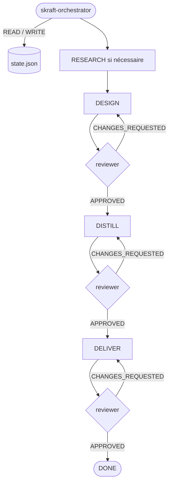

# Le substrat HVE-Core

> HVE-Core fournit au pipeline d'ingénierie sa mémoire durable (`state.json`), sa
> reprise après interruption et ses transitions conditionnées par les verdicts.

## Pourquoi un substrat

Le pipeline piloté par `skraft-orchestrator` a besoin d'un point de vérité unique :
où en est l'ingénierie, quel verdict a été rendu et combien de reprises ont eu lieu.
Sans cela, chaque agent improviserait son propre état et la reprise après interruption
serait impossible. DISCOVER, DISCUSS et les racines Brownfield restent des workflows
autonomes. Ils ne mutent pas cet état.

## `state.json` — la mémoire du pipeline

L'état persiste en JSON à
`.copilot-tracking/skraft-plans/{project-slug}/state.json`. Son contrat est le schéma JSON
`plugins/skraft-framework/src/domain/state.schema.json`. Champs clés :

```json
{
  "currentPhase": "RESEARCH | DESIGN | DISTILL | DELIVER | DONE",
  "phaseArtifacts": { "DESIGN": ["adrs/ADR-001-...md"], "...": [] },
  "verdicts": { "DESIGN": "APPROVED | CHANGES_REQUESTED | null" },
  "retryCount": { "DESIGN": 0 },
  "userPreferences": { "maxRetriesPerPhase": 2 },
  "adrRatification": { "checkpointStatus": "none | awaiting_human | resolved", "pending": [], "ratified": [] }
}
```

- `currentPhase` n'avance **que** sur un verdict `APPROVED`.
- `phaseArtifacts`, `verdicts`, `retryCount` tracent ce que chaque phase a
  produit et comment elle a été jugée.
- `maxRetriesPerPhase` (défaut 2) borne les reprises avant escalade humaine.
- `adrRatification` retient DESIGN tant qu'un humain n'a pas ratifié chaque ADR proposée.

La CLI d'état applique ce schéma à chaque lecture et écriture. Un champ que le schéma ne
déclare pas, ou une valeur hors de sa forme, rend l'état invalide : aucun ancien format
n'est migré. Un pipeline démarré avec une version antérieure s'arrête donc sur
`INVALID_STATE` ; `state.mjs diagnose` indique la commande suivante, et après `reset`
l'orchestrateur reconstruit l'état depuis les artefacts sur disque, avec votre confirmation.

L'état ne porte **aucun dial de qualité**. Les seuils de mutation et de couverture, les
quatre lentilles de revue adverse, la porte Gherkin et la variante TDD Outside-In
double-boucle sont fixés une fois pour toutes par la skill `skraft-quality-bar` ; ils
sont identiques à chaque run, et rien de ce qui est écrit dans `state.json` ne peut les
abaisser.

## Le modèle write-through

`state.json` est un snapshot de sécurité, pas un bloc relu à chaque tour :

1. **Rehydrate** — lire et valider le snapshot une fois au début de la session.
2. **Execute** — décider depuis le dernier état affiché par la CLI, puis dispatcher l'agent ou demander une décision humaine.
3. **Record** — appliquer chaque mutation par la CLI déterministe `state.mjs`, qui affiche l'état mis à jour.

## Comment les phases s'articulent

`skraft-orchestrator` est sélectionné avec une story affinée. Il séquence uniquement
RESEARCH → DESIGN → DISTILL → DELIVER. RESEARCH peut être sauté quand un handoff HVE
amont confirmé prouve qu'il est déjà satisfait ; il n'a pas de reviewer de phase déclaré. Les trois phases suivantes avancent selon
les verdicts de leurs reviewers dédiés.



Sur `CHANGES_REQUESTED`, la même phase est re-dispatchée, `retryCount` augmente et
`currentPhase` ne bouge pas. Quand le budget de reprises est atteint sans
`APPROVED`, l'orchestrateur escalade à l'utilisateur.

## Voir aussi

- [Traces & auditabilité](traces.html)
- [HVE → SKRAFT](hve-vs-skraft.html)
- [Architecture](architecture.html)
