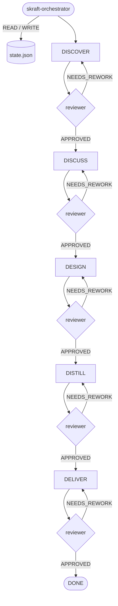

# Le substrat HVE-Core

> SKRAFT n'est pas autonome : il s'exécute sur **HVE-Core**. C'est ce substrat qui
> porte l'articulation des phases en architecture — une mémoire partagée (`state.json`),
> un protocole de tour, et des transitions conditionnées par les verdicts.

## Pourquoi un substrat

Un pipeline en 5 phases, avec un agent et un reviewer par phase, a besoin d'un point
de vérité unique : où en est-on, quel verdict a été rendu, combien de reprises ont eu
lieu. Sans cela, chaque agent improviserait son propre état et la reprise après
interruption serait impossible. HVE-Core fournit cette colonne vertébrale, partagée
avec les planners voisins (Security, RAI, SSSC).

## `state.json` — la mémoire du pipeline

L'état persiste en JSON à
`.copilot-tracking/skraft-plans/{project-slug}/state.json`. Champs clés :

```json
{
  "currentPhase": "DISCOVER | DISCUSS | DESIGN | DISTILL | DELIVER | DONE",
  "difficulty": "simple | medium | medium-hard | challenging | null",
  "phaseArtifacts": { "DESIGN": ["adrs/ADR-001-...md"], "...": [] },
  "reviewerVerdicts": { "DESIGN": "APPROVED | REJECTED | NEEDS_REWORK | null" },
  "retryCount": { "DESIGN": 0 },
  "userPreferences": {
    "autonomyTier": "full | partial | manual",
    "maxRetriesPerPhase": 2
  },
  "neighborPlanners": { "securityPlanFile": null, "raiPlanFile": null }
}
```

- `currentPhase` n'avance **que** sur un verdict `APPROVED`.
- `phaseArtifacts`, `reviewerVerdicts`, `retryCount` tracent ce que chaque phase a
  produit et comment elle a été jugée.
- `maxRetriesPerPhase` (défaut 2) borne les reprises avant escalade humaine.
- `difficulty` est écrit une seule fois à la sortie de DISCOVER et n'est jamais réévalué.
  Il choisit le **modèle d'exécution de DELIVER** — cycle TDD inline, ou un sous-agent
  dispatché par scénario Gherkin. Il route *comment* le travail est exécuté, jamais *avec
  quelle sévérité* il est jugé.

L'état ne porte **aucun dial de qualité**. Les seuils de mutation et de couverture, les
quatre lentilles de revue adverse, la porte Gherkin et la variante TDD Outside-In
double-boucle sont fixés une fois pour toutes par la skill `skraft-quality-bar` ; ils
sont identiques à chaque run, et rien de ce qui est écrit dans `state.json` ne peut les
abaisser.

## Le protocole 6-étapes par tour

À **chaque tour**, avant toute sortie utilisateur :

1. **READ** — charger `state.json`.
2. **VALIDATE** — vérifier le schéma (sinon procédure de récupération).
3. **DETERMINE** — inspecter `currentPhase`, le verdict et `retryCount` pour décider
   la prochaine action concrète.
4. **EXECUTE** — dispatcher l'agent de phase, dispatcher le reviewer, ou demander une
   décision humaine.
5. **UPDATE** — muter l'état en mémoire (append-only sur les listes ; `currentPhase`
   n'avance que sur `APPROVED` ; incrémenter `retryCount` sur reprise).
6. **WRITE** — persister `state.json` avant de rendre la main.

## Comment les phases s'articulent

Chaque phase lit l'état, écrit ses artefacts datés, puis son reviewer écrit un verdict
qui conditionne la transition. L'**orchestrateur** est l'entrée unique.



Sur `REJECTED`/`NEEDS_REWORK`, la même phase est re-dispatchée, `retryCount` augmente,
et `currentPhase` ne bouge pas. Quand le seuil de reprises est atteint sans `APPROVED`,
l'orchestrateur escalade à l'utilisateur.

## Planners voisins

HVE-Core héberge d'autres planners (Security, RAI, SSSC). SKRAFT référence leurs plans
via `neighborPlanners.*` mais **n'écrit jamais** dans leur répertoire — chaque planner
reste maître de ses artefacts.

## Voir aussi

- [Traces & auditabilité](traces.html)
- [HVE → SKRAFT](hve-vs-skraft.html)
- [Architecture](architecture.html)
