# HVE → SKRAFT : continuité et rupture

> SKRAFT ne remplace pas HVE — il le prolonge. Là où HVE outille la conversation entre un humain et l'IA, SKRAFT sépare la préparation produit du pipeline d'ingénierie et trace leurs artefacts.

## Pourquoi ce passage ?

HVE (Hypervelocity Engineering) fournit un workflow RPI (*Research → Plan → Implement*) efficace pour les développeurs travaillant en solo avec un assistant IA. Ce workflow suppose que la revue de qualité reste humaine et manuelle.

SKRAFT prend le relais quand vous souhaitez :
- **automatiser la revue adverse** avant qu'un humain intervienne,
- **tracer chaque décision** (artefacts, `state.json`, verdicts),
- **passer à l'échelle** sur une équipe ou un backlog complet.

## Les deux couches SKRAFT

```mermaid
graph LR
    H((humain)) --> D[DISCOVER optionnel]
    D -->|rapport de triage| H
    H --> DI[DISCUSS optionnel]
    DI -->|story INVEST| H
    H --> O[skraft-orchestrator]
    O -->|si nécessaire| R[RESEARCH]
    R -->|recherche sourcée| DE[DESIGN]
    O -.séquence.-> DE
    DE -->|ADR + modèle d'événements| DIS[DISTILL]
    DIS -->|scénarios Gherkin| DEL[DELIVER]
    DEL -->|code + évidence| PR[Pull Request]
    style D fill:#1a3a2a,stroke:#4ed58a
    style DI fill:#1a3a2a,stroke:#4ed58a
    style DE fill:#1a3a2a,stroke:#4ed58a
    style DIS fill:#1a3a2a,stroke:#4ed58a
    style DEL fill:#1a3a2a,stroke:#4ed58a
    style PR fill:#102016,stroke:#6f8478
```

| Couche | Étape | Agent exécuteur | Reviewer indépendant |
|-------|-------|----------------|----------------------|
| Produit autonome | DISCOVER | `backlog-discoverer` | `backlog-discoverer-reviewer` |
| Produit autonome | DISCUSS | `backlog-planner` | `backlog-planner-reviewer` |
| Ingénierie orchestrée | RESEARCH | `solution-researcher` | aucun reviewer de phase déclaré |
| Ingénierie orchestrée | DESIGN | `solution-architect` | `solution-architect-reviewer` |
| Ingénierie orchestrée | DISTILL | `acceptance-designer` | `acceptance-designer-reviewer` |
| Ingénierie orchestrée | DELIVER | `software-engineer` | `software-engineer-reviewer` |

> **Jargon** : une *gate* est un point de contrôle qui bloque la progression si la qualité n'est pas atteinte. Un *reviewer* est un agent en lecture seule qui émet un verdict sans modifier les artefacts. La [grille active des 48 gates]({{ "/fr/reference/gates" | relative_url }}) détaille les contrats actuels.

## HVE vs SKRAFT : tableau comparatif

| Dimension | HVE (RPI) | SKRAFT |
|-----------|-----------|-------------------|
| Périmètre | Une session de développement | Une User Story de bout en bout |
| Revue | Humaine et manuelle | Adverse assistée avant la revue humaine |
| Traçabilité | Limitée | `state.json`, artefacts, verdicts horodatés |
| Lentilles | Non | 4 lentilles adverses (architecture, cold-reader, quality-gates, test-integrity) |
| Gates | Non | 48 gates explicites et non négociables |
| Passage à l'échelle | Solo / pair | Équipe, backlog complet |

## Ce qui ne change pas

SKRAFT **hérite** des principes de HVE :
- Le développeur reste maître des décisions.
- L'IA assiste, elle ne décide pas.
- La qualité est non négociable.

## Sources

> « Peer reviews are the single most effective quality practice a software organization can employ. »
> — Wiegers, K., *Peer Reviews in Software*, 2002.

## Voir aussi

- [Le pipeline]({{ "/fr/explanation/pipeline/" | relative_url }}) — préparation produit et ingénierie orchestrée
- [Les gates]({{ "/fr/reference/gates" | relative_url }}) — ce que chaque gate vérifie
- [Les lentilles]({{ "/fr/dashboard/" | relative_url }}) — le catalogue actif de la revue adverse
