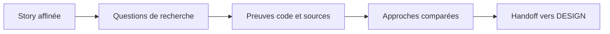



# RESEARCH — réduire l'incertitude avant de concevoir

> RESEARCH cherche des preuves dans le code, les conventions et les sources externes. Il recommande une approche sans écrire de code ni prendre la décision d'architecture.

## Ce qui entre / Ce qui sort

| Ce qui entre | Ce qui sort |
| --- | --- |
| Story affinée, code existant, instructions du dépôt | Document de recherche cité avec approches évaluées, recommandation et questions ouvertes pour DESIGN |

Le `solution-researcher` travaille en deux temps : cadrer les questions et réunir
les sources, puis comparer les approches. Chaque constat pointe vers une source.
DESIGN garde la responsabilité des ADR et de l'architecture.

☕ Fil rouge — Starbucks <em>(exemple illustratif)</em>

La story « commander une boisson personnalisée » entre avec ses critères. RESEARCH
repère le fournisseur de paiement existant, les contraintes du dépôt et les options
d'intégration. Il transmet à DESIGN une recommandation sourcée, sans choisir l'ADR.

## Les gates franchies ici

RESEARCH n'a pas de reviewer de phase déclaré. Son contrat bloquant est la
traçabilité : une affirmation sans source est retirée. Les reviewers et gates des
phases suivantes restent consultables dans la [référence des gates]({{ "/fr/reference/gates" | relative_url }}).

## Source

Cette page reflète le descripteur
[`solution-researcher`]({{ "/fr/dashboard/" | relative_url }}#agent-solution-researcher).
