# L'équipe — le pipeline comme une course de relais

> Six exécuteurs et cinq reviewers, répartis entre deux racines produit autonomes et un orchestrateur d'ingénierie.

SKRAFT n'est pas un agent monolithique. DISCOVER et DISCUSS sont deux workflows
produit que le développeur sélectionne directement. `skraft-orchestrator` prend
ensuite une story affinée et séquence les agents d'ingénierie. Aucun orchestrateur
global ne pilote les six étapes.

## Le relais en un coup d'œil

```mermaid
graph LR
    H((humain)) --> D[backlog-discoverer]
    D -->|triage| H
    H --> DI[backlog-planner]
    DI -->|story affinée| H
    H --> O[skraft-orchestrator]
    O -->|si nécessaire| R[solution-researcher]
    R -->|recherche| DE[solution-architect]
    O -.séquence.-> DE
    DE -->|architecture| DIS[acceptance-designer]
    DIS -->|scénarios| DEL[software-engineer]
    style H fill:#102016,stroke:#6f8478
    style O fill:#102016,stroke:#6f8478
    style D fill:#1a3a2a,stroke:#4ed58a
    style DI fill:#1a3a2a,stroke:#4ed58a
    style DE fill:#1a3a2a,stroke:#4ed58a
    style DIS fill:#1a3a2a,stroke:#4ed58a
    style DEL fill:#1a3a2a,stroke:#4ed58a
```

## L'orchestrateur — `skraft-orchestrator`

Le chef d'orchestre de l'ingénierie uniquement. Il ne produit aucun artefact
métier : il **séquence** RESEARCH → DESIGN → DISTILL → DELIVER, vérifie les
pré-conditions, déclenche les reviewers déclarés et applique leurs verdicts. Il
ne lance ni `backlog-discoverer` ni `backlog-planner`. C'est lui qui tient le
`state.json` (voir [le substrat HVE-Core]({{ "/fr/explanation/hve-core" | relative_url }})).

## Les deux racines produit autonomes

### 1. `backlog-discoverer` — le trieur (DISCOVER)

- **Mission :** transformer un flux brut d'issues en un rapport de triage priorisé.
- **Reçoit :** des issues, un milestone.
- **Passe le relais :** un rapport de triage.
- **Contrôlé par :** `backlog-discoverer-reviewer` (gates G1–G6).
- **Invoqué par :** le développeur, hors `skraft-orchestrator`.

### 2. `backlog-planner` — le raffineur (DISCUSS)

- **Mission :** faire d'une issue triée une story INVEST avec critères d'acceptation.
- **Reçoit :** le rapport de triage.
- **Passe le relais :** une story prête, sans ambiguïté.
- **Contrôlé par :** `backlog-planner-reviewer` (gates G1–G8).
- **Invoqué par :** le développeur, hors `skraft-orchestrator`.

## Les quatre exécuteurs d'ingénierie

### 3. `solution-researcher` — le chercheur (RESEARCH)

- **Mission :** réduire les inconnues par une investigation sourcée lorsque la difficulté le justifie.
- **Reçoit :** la story affinée et le contexte du dépôt.
- **Passe le relais :** une recommandation sourcée.
- **Contrôlé par :** aucun reviewer de phase déclaré. `skraft-orchestrator` vérifie le contrat de sortie avant de fermer la phase.

### 4. `solution-architect` — l'architecte (DESIGN)

- **Mission :** modéliser l'architecture (Event Modeling, DDD) et tracer les décisions en ADR.
- **Reçoit :** la story INVEST.
- **Passe le relais :** un ADR + un modèle d'événements + des contrats.
- **Contrôlé par :** `solution-architect-reviewer` (gates G1–G15).

### 5. `acceptance-designer` — le spécificateur (DISTILL)

- **Mission :** traduire l'architecture en scénarios Gherkin exécutables.
- **Reçoit :** l'ADR et le modèle d'événements.
- **Passe le relais :** des `.feature` + un plan d'implémentation.
- **Contrôlé par :** `acceptance-designer-reviewer` (gates G1–G8).

### 6. `software-engineer` — l'artisan (DELIVER)

- **Mission :** implémenter le code en Outside-In TDD, prouvé par le score de mutation.
- **Reçoit :** les scénarios Gherkin.
- **Passe le relais :** du code testé + l'évidence qualité, vers la Pull Request.
- **Contrôlé par :** `software-engineer-reviewer` (gates de livraison).
- **Délègue en interne :** le câblage des tests à deux sous-agents (`user-invocable: false`) — `mock-integration-worker` (mocking du dépendant) et `contract-testing-worker` (test de contrat fournisseur). Le software-engineer garde le cycle TDD métier et vérifie chaque worker en TIER-1 (RED → GREEN). Quand une capacité est active, sa lentille de fidélité (`mock-fidelity-lens` / `contract-fidelity-lens`) rejoint le panel du reviewer.

## Pourquoi cinq reviewers pour six exécuteurs

> « Peer reviews are the single most effective quality practice a software organization can employ. »
> — Wiegers, K., *Peer Reviews in Software*, 2002.

DISCOVER, DISCUSS, DESIGN, DISTILL et DELIVER ont chacun un reviewer dédié qui ne
modifie jamais le travail jugé. RESEARCH fait exception : aucun reviewer de phase
n'est déclaré, donc l'orchestrateur clôt cette phase après vérification de son
contrat. Personne ne valide son propre artefact dans les cinq boucles avec revue.

## Pour aller plus loin

- [Le fil rouge : une commande Starbucks de bout en bout]({{ "/fr/explanation/pipeline/fil-rouge" | relative_url }})
- [Le catalogue des agents]({{ "/fr/dashboard/" | relative_url }})
- [Le détail des gates]({{ "/fr/reference/gates" | relative_url }})
- [La revue avant la revue]({{ "/fr/explanation/why-review-before-review" | relative_url }})
