# L'équipe — le pipeline comme une course de relais

> Cinq exécuteurs, cinq reviewers, un orchestrateur. Chacun reçoit l'artefact du précédent, le transforme, franchit une gate, puis passe le relais.

SKRAFT n'est pas un agent monolithique : c'est une **équipe spécialisée**. Chaque
membre a une mission unique, et personne ne valide son propre travail — un
reviewer indépendant contrôle chaque passage de relais.

## Le relais en un coup d'œil

```mermaid
graph LR
    O((orchestrateur)) -.séquence.-> D
    D[backlog-discoverer] -->|triage| DI[backlog-planner]
    DI -->|story| DE[solution-architect]
    DE -->|architecture| DIS[acceptance-designer]
    DIS -->|scénarios| DEL[software-engineer]
    style O fill:#102016,stroke:#6f8478
    style D fill:#1a3a2a,stroke:#4ed58a
    style DI fill:#1a3a2a,stroke:#4ed58a
    style DE fill:#1a3a2a,stroke:#4ed58a
    style DIS fill:#1a3a2a,stroke:#4ed58a
    style DEL fill:#1a3a2a,stroke:#4ed58a
```

## L'orchestrateur — `skraft-orchestrator`

Le chef d'orchestre. Il ne produit aucun artefact métier : il **séquence** les
phases, vérifie les pré-conditions, déclenche les reviewers et n'autorise une
transition qu'après un verdict positif. C'est lui qui tient le `state.json` (voir
[le substrat HVE-Core]({{ "/fr/explanation/hve-core" | relative_url }})).

## Les cinq coéquipiers

### 1. `backlog-discoverer` — le trieur (DISCOVER)

- **Mission :** transformer un flux brut d'issues en un rapport de triage priorisé.
- **Reçoit :** des issues, un milestone.
- **Passe le relais :** un rapport de triage.
- **Contrôlé par :** `backlog-discoverer-reviewer` (gates G1–G6).

### 2. `backlog-planner` — le raffineur (DISCUSS)

- **Mission :** faire d'une issue triée une story INVEST avec critères d'acceptation.
- **Reçoit :** le rapport de triage.
- **Passe le relais :** une story prête, sans ambiguïté.
- **Contrôlé par :** `backlog-planner-reviewer` (gates G1–G8).

### 3. `solution-architect` — l'architecte (DESIGN)

- **Mission :** modéliser l'architecture (Event Modeling, DDD) et tracer les décisions en ADR.
- **Reçoit :** la story INVEST.
- **Passe le relais :** un ADR + un modèle d'événements + des contrats.
- **Contrôlé par :** `solution-architect-reviewer` (gates G1–G15).

### 4. `acceptance-designer` — le spécificateur (DISTILL)

- **Mission :** traduire l'architecture en scénarios Gherkin exécutables.
- **Reçoit :** l'ADR et le modèle d'événements.
- **Passe le relais :** des `.feature` + un plan d'implémentation.
- **Contrôlé par :** `acceptance-designer-reviewer` (gates G1–G8).

### 5. `software-engineer` — l'artisan (DELIVER)

- **Mission :** implémenter le code en Outside-In TDD, prouvé par le score de mutation.
- **Reçoit :** les scénarios Gherkin.
- **Passe le relais :** du code testé + l'évidence qualité, vers la Pull Request.
- **Contrôlé par :** `software-engineer-reviewer` (gates de livraison).
- **Délègue en interne :** le câblage des tests à deux sous-agents (`user-invocable: false`) — `mock-integration-worker` (mocking du dépendant) et `contract-testing-worker` (test de contrat fournisseur). Le software-engineer garde le cycle TDD métier et vérifie chaque worker en TIER-1 (RED → GREEN). Quand une capacité est active, sa lentille de fidélité (`mock-fidelity-lens` / `contract-fidelity-lens`) rejoint le panel du reviewer.

## Pourquoi un reviewer par membre

> « Peer reviews are the single most effective quality practice a software organization can employ. »
> — Wiegers, K., *Peer Reviews in Software*, 2002.

Chaque coéquipier a un binôme reviewer qui ne modifie jamais son travail : il
**juge** selon des gates explicites. C'est la *revue avant la revue* — le filtre
adverse qui agit avant l'humain.

## Pour aller plus loin

- [Le fil rouge : une commande Starbucks de bout en bout]({{ "/fr/explanation/pipeline/fil-rouge" | relative_url }})
- [La référence des agents]({{ "/fr/reference/agents/" | relative_url }})
- [Le détail des gates]({{ "/fr/reference/gates" | relative_url }})
- [La revue avant la revue]({{ "/fr/explanation/why-review-before-review" | relative_url }})
