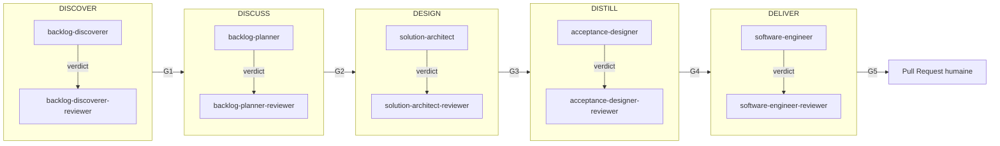

# HVE → SKRAFT : continuité et rupture

> SKRAFT ne remplace pas HVE — il le prolonge. Là où HVE outille la conversation entre un humain et l'IA, SKRAFT structure l'ensemble du cycle de vie d'une User Story, de la découverte à la livraison.

## Pourquoi ce passage ?

HVE (High-Value Engineering) fournit un workflow RPI (*Refine → Plan → Implement*) efficace pour les développeurs travaillant en solo avec un assistant IA. Ce workflow suppose que la revue de qualité reste humaine et manuelle.

SKRAFT prend le relais quand vous souhaitez :
- **automatiser la revue adverse** avant qu'un humain intervienne,
- **tracer chaque décision** (artefacts, `state.json`, verdicts),
- **passer à l'échelle** sur une équipe ou un backlog complet.

## Le pipeline SKRAFT en 5 phases

| Phase | Agent exécuteur | Reviewer indépendant | Gate de sortie |
|-------|----------------|----------------------|----------------|
| DISCOVER | `backlog-discoverer` | `backlog-discoverer-reviewer` | G1 |
| DISCUSS | `backlog-planner` | `backlog-planner-reviewer` | G2 |
| DESIGN | `solution-architect` | `solution-architect-reviewer` | G3 |
| DISTILL | `acceptance-designer` | `acceptance-designer-reviewer` | G4 |
| DELIVER | `software-engineer` | `software-engineer-reviewer` | G5 |

> **Jargon** : un *gate* est un point de contrôle qui bloque la progression si la qualité n'est pas atteinte. Un *reviewer* est un agent en lecture seule qui émet un verdict sans modifier les artefacts (principe CQS).

## HVE vs SKRAFT : tableau comparatif

| Dimension | HVE (RPI) | SKRAFT (5 phases) |
|-----------|-----------|-------------------|
| Périmètre | Une session de développement | Une User Story de bout en bout |
| Revue | Humaine et manuelle | Adverse assistée avant la revue humaine |
| Traçabilité | Limitée | `state.json`, artefacts, verdicts horodatés |
| Lentilles | Non | 4 lentilles adverses (architecture, cold-reader, quality-gates, test-integrity) |
| Gates | Non | 5 gates (G1–G5) avec seuils configurables |
| Passage à l'échelle | Solo / pair | Équipe, backlog complet |

## Ce qui ne change pas

SKRAFT **hérite** des principes de HVE :
- Le développeur reste maître des décisions.
- L'IA assiste, elle ne décide pas.
- La qualité est non négociable.

## Sources

- Forsgren, N., Humble, J. & Kim, G., *Accelerate*, 2018.
- Martin, R. C., *Clean Architecture*, 2017.

## Voir aussi

- [Le pipeline]({{ "/fr/pipeline/" | relative_url }}) — description détaillée des 5 phases
- [Les gates]({{ "/fr/catalogue/gates" | relative_url }}) — ce que chaque gate vérifie
- [Les lentilles]({{ "/fr/catalogue/lens" | relative_url }}) — les 4 lentilles de revue adverse
