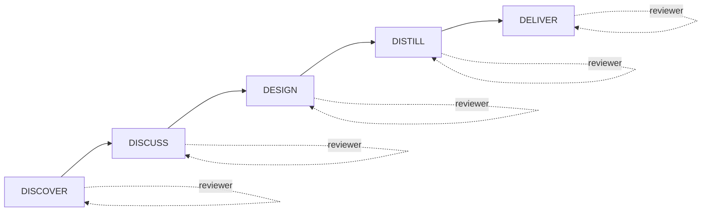

> 🚧 GENERATED DRAFT — to be reviewed and completed by a human.

# HVE → SKRAFT : continuité et évolution

> HVE vous a appris à travailler avec des agents IA dans votre IDE. SKRAFT transforme ces agents isolés en un pipeline de livraison complet, avec des contrôles à chaque étape.

## Pourquoi ce passage ?

HVE (*High-Value Engineering*) introduit le workflow RPI (Request → Plan → Implement) : un agent reçoit une demande, planifie, implémente. C'est un premier pas vers l'assistance IA disciplinée.

SKRAFT va plus loin : il ne remplace pas HVE, il le **prolonge**. Là où HVE couvre une interaction, SKRAFT couvre le cycle de vie complet d'une *user story*, de la découverte à la livraison.

| Dimension | HVE | SKRAFT |
|-----------|-----|--------|
| Périmètre | Une interaction RPI | Un cycle SDLC complet (5 phases) |
| Revue | Implicite | Explicite : reviewer indépendant par phase |
| Contrôle qualité | Manuel | Gates (Gxx) automatisés |
| Perspective d'analyse | Unique | Lentilles adversariales (4 points de vue) |
| Traçabilité | Limitée | `state.json` + artefacts par phase |

## Le pipeline SKRAFT en un coup d'œil

<!-- 🚧 DIAGRAM REQUIRED — ajouter un schéma mermaid ou SVG montrant les 5 phases + reviewers + gates + lenses -->

> ⚠️ Ce diagramme est un squelette. Un humain doit le compléter avec les gates (G01–Gxx), les lentilles et les artefacts produits par chaque phase.

## Les 5 phases SKRAFT

Chaque phase est tenue par un **agent exécuteur** et un **reviewer indépendant** :

1. **DISCOVER** — Comprendre le besoin métier, produire un Event Storming initial.
2. **DISCUSS** — Affiner les scénarios BDD, aligner les parties prenantes.
3. **DESIGN** — Produire les décisions d'architecture (ADR), le plan de tests.
4. **DISTILL** — Implémenter en Outside-In TDD, avec mutation testing.
5. **DELIVER** — Vérifier la qualité finale, ouvrir la PR, archiver les traces.

## Les lentilles adversariales

Le reviewer n'a pas un point de vue unique : il applique successivement quatre **lentilles** qui examinent le code sous des angles différents :

- **architecture-boundaries** : les couches sont-elles respectées ?
- **cold-reader** : un développeur qui ne connaît pas le contexte comprend-il le code ?
- **quality-gates** : les gates définis sont-ils tous franchis ?
- **test-integrity** : les tests prouvent-ils vraiment le comportement ?

## Ce qui ne change pas

Votre investissement HVE reste valide. Les agents SKRAFT utilisent le même format `.agent.md`, les mêmes outils MCP, la même philosophie de prompting. SKRAFT ajoute la **discipline de pipeline** sans jeter ce que vous avez appris.

## Sources

> 🚧 À compléter par un humain avec les références citées (Evans, Freeman & Pryce, Beck, etc.).

---

*Page générée automatiquement — brouillon à compléter, notamment le diagramme (`requires_diagram: true`).*
