# SKRAFT — Le Handbook

SKRAFT est un **pipeline SDLC piloté par des agents IA**. Chaque phase de
développement est exécutée par un agent dédié, puis validée par un reviewer
indépendant — aucun agent ne valide son propre travail.

> « The only way to go fast is to go well. »
> — Martin, R. C., *Clean Architecture*, 2017.

## Première visite ? Installez, puis choisissez

1. [Installez SKRAFT avec `/plugin`]({{ "/fr/tutorials/getting-started" | relative_url }}).
2. Choisissez le parcours correspondant à l'état réel de votre projet.

| Votre point de départ | Parcours |
| --- | --- |
| Story affinée ou backlog existant | [Parcours principal]({{ "/fr/explanation/pipeline/" | relative_url }}) |
| Code existant sans documentation ou sans filet de sécurité | [Parcours Brownfield]({{ "/fr/explanation/brownfield" | relative_url }}) |

Pour comprendre le passage de relais avant de lancer un workflow, suivez ensuite
[une commande Starbucks de bout en bout]({{ "/fr/explanation/pipeline/fil-rouge" | relative_url }}).

## Comment lire ce handbook

La documentation suit la structure **Diátaxis** — quatre portes selon ce que vous
cherchez à faire :

| Porte | Pour… | Commencez par |
| --- | --- | --- |
| **Apprendre** (tutoriel) | suivre un parcours guidé | [Premiers pas]({{ "/fr/tutorials/getting-started" | relative_url }}), [Le fil rouge]({{ "/fr/explanation/pipeline/fil-rouge" | relative_url }}) |
| **Faire** (guide pratique) | résoudre une tâche précise | [Customisation]({{ "/fr/how-to/customisation" | relative_url }}), [Genesis & contribution]({{ "/fr/how-to/contributing" | relative_url }}) |
| **Comprendre** (explication) | savoir *pourquoi* c'est construit ainsi | [Le pipeline]({{ "/fr/explanation/pipeline/" | relative_url }}), [La revue avant la revue]({{ "/fr/explanation/why-review-before-review" | relative_url }}) |
| **Consulter** (référence) | retrouver un fait précis | [Catalogue agentique]({{ "/fr/dashboard/" | relative_url }}), [Gates]({{ "/fr/reference/gates" | relative_url }}), [Patterns]({{ "/fr/reference/patterns" | relative_url }}) |

## Où aller selon votre rôle

- **Décideur** — pourquoi la revue assistée réduit le délai de livraison : [Pour décideurs]({{ "/fr/explanation/for-executives" | relative_url }}).
- **Développeur** — le pipeline phase par phase et l'équipe d'agents : [Le pipeline]({{ "/fr/explanation/pipeline/" | relative_url }}), [L'équipe]({{ "/fr/explanation/pipeline/team" | relative_url }}).
- **Mainteneur d'un legacy** — comprendre, sécuriser puis transformer l'existant : [Parcours Brownfield]({{ "/fr/explanation/brownfield" | relative_url }}).
- **Architecte** — décisions et frontières : [Architecture]({{ "/fr/explanation/architecture" | relative_url }}), [Clean Architecture]({{ "/fr/explanation/clean-architecture" | relative_url }}).
- **Vous venez de HVE ?** — la continuité (RPI, `state.json`, BRD/PRD en amont) : [HVE → SKRAFT]({{ "/fr/explanation/hve-vs-skraft" | relative_url }}).

## Les parcours en une image

```mermaid
flowchart LR
    C{Point de départ} -->|backlog brut| D[DISCOVER optionnel]
    C -->|story affinée| R[RESEARCH]
    C -->|code hérité| BF[Brownfield standalone]
    BF -.->|PRD, backlog ou code sécurisé| C
    D -.->|triage| DI[DISCUSS optionnel]
    DI -.->|story affinée| R
    R -->|recherche sourcée| DE[DESIGN]
    DE -->|architecture| DIS[DISTILL]
    DIS -->|scénarios| DEL[DELIVER]
    DEL -->|code| PR[Pull Request]
    style BF fill:#102016,stroke:#6f8478
    style D fill:#1a3a2a,stroke:#4ed58a
    style DI fill:#1a3a2a,stroke:#4ed58a
    style DE fill:#1a3a2a,stroke:#4ed58a
    style DIS fill:#1a3a2a,stroke:#4ed58a
    style DEL fill:#1a3a2a,stroke:#4ed58a
    style PR fill:#102016,stroke:#6f8478
```

DISCOVER puis DISCUSS sont deux workflows produit autonomes et optionnels. Ils
précèdent `skraft-orchestrator`, point d'entrée du pipeline d'ingénierie
RESEARCH → DESIGN → DISTILL → DELIVER, sur le substrat partagé
[HVE-Core]({{ "/fr/explanation/hve-core" | relative_url }}). Brownfield reste un
parcours standalone choisi par l'humain. Il rejoint le parcours principal quand
le backlog, la story ou le code sont prêts.
