# Le fil rouge — une commande Starbucks de bout en bout

> Une seule demande, suivie de l'idée jusqu'au code livré, pour voir comment chaque phase passe le relais à la suivante.

Cette page est un **tutoriel** : elle ne décrit pas SKRAFT dans l'abstrait, elle
vous fait suivre **un exemple concret** d'un bout à l'autre. Le fil conducteur est
le *flux d'artefacts* — la sortie d'une phase devient l'entrée de la suivante.

> ☕ **Exemple illustratif.** Le cas Starbucks ci-dessous est inventé pour la
> pédagogie. Il n'est pas tiré du code du plugin ; aucun chiffre n'y est réel.

## Ce que vous allez suivre

La demande : **« permettre à un client de commander et payer une boisson
personnalisée depuis l'application mobile, pour la récupérer en magasin. »**

Vous verrez cette demande se transformer, phase par phase, en code testé.

```mermaid
graph LR
    A[Idée] -->|rapport de triage| B[Story INVEST]
    B -->|ADR + événements| C[Architecture]
    C -->|scénarios Gherkin| D[Spécification]
    D -->|code + évidence| E[Code livré]
    style A fill:#102016,stroke:#6f8478
    style B fill:#1a3a2a,stroke:#4ed58a
    style C fill:#1a3a2a,stroke:#4ed58a
    style D fill:#1a3a2a,stroke:#4ed58a
    style E fill:#1a3a2a,stroke:#4ed58a
```



## Étape 1 — DISCOVER : trier l'idée

L'idée arrive comme une **issue brute** dans le backlog. Le `backlog-discoverer`
la trie : il lui donne la priorité **P1**, détecte qu'elle recoupe une ancienne
demande « paiement in-app », et l'inscrit dans un **rapport de triage**.

- **Ce qui entre :** « permettre la commande mobile dans l'app ».
- **Ce qui sort :** une ligne priorisée du rapport de triage.

➡️ Détail de la phase : [DISCOVER]({{ "/fr/pipeline/discover" | relative_url }}).

## Étape 2 — DISCUSS : en faire une story

Le `backlog-planner` reçoit le rapport et transforme la ligne priorisée en
**story INVEST** :

> En tant que client, je commande une boisson personnalisée pour la récupérer en
> magasin, afin de gagner du temps à l'arrivée.

Avec ses **critères d'acceptation** :

1. Le client choisit la taille et le type de lait avant de payer.
2. Le paiement est exigé avant que la commande parte en préparation.
3. Une boisson indisponible ne peut pas être ajoutée au panier.

- **Ce qui entre :** la ligne de triage.
- **Ce qui sort :** la story + ses 3 critères.

➡️ Détail de la phase : [DISCUSS]({{ "/fr/pipeline/discuss" | relative_url }}).

## Étape 3 — DESIGN : décider l'architecture

Le `solution-architect` conçoit la solution. Il acte un **ADR** :

> **Décision :** déléguer le paiement à un fournisseur externe via une couche
> anti-corruption (ACL), pour ne pas coupler le domaine commande au prestataire.

Et un **modèle d'événements** :

```
PasserCommande → CommandePayée → CommandePrête
```

- **Ce qui entre :** la story et ses critères.
- **Ce qui sort :** l'ADR + le modèle d'événements + les contrats.

➡️ Détail de la phase : [DESIGN]({{ "/fr/pipeline/design" | relative_url }}).

## Étape 4 — DISTILL : écrire le contrat exécutable

L'`acceptance-designer` traduit l'architecture en **scénario Gherkin**, lisible
par le métier :

```gherkin
Scénario: payer une boisson personnalisée
  Étant donné un panier contenant un latte taille moyenne, lait d'avoine
  Quand le paiement est validé
  Alors un reçu est émis
  Et des points de fidélité sont crédités au client
```

- **Ce qui entre :** l'ADR + le modèle d'événements.
- **Ce qui sort :** le `.feature` + le plan d'implémentation.

➡️ Détail de la phase : [DISTILL]({{ "/fr/pipeline/distill" | relative_url }}).

## Étape 5 — DELIVER : implémenter, guidé par les tests

Le `software-engineer` rend le scénario vert en **Outside-In TDD**. Il écrit
d'abord le test d'acceptation (rouge), puis les tests unitaires du calcul du
total et de l'attribution des points, et enfin le code (vert). Un **score de
mutation** vérifie que les tests protègent réellement la règle de fidélité.

- **Ce qui entre :** le scénario Gherkin + le plan.
- **Ce qui sort :** le code testé + l'évidence qualité, prêt pour la Pull Request.

➡️ Détail de la phase : [DELIVER]({{ "/fr/pipeline/deliver" | relative_url }}).

## Ce que vous venez de voir

Une seule demande a traversé cinq phases sans jamais perdre son contexte :

| Phase | Artefact produit |
| --- | --- |
| DISCOVER | Ligne priorisée du rapport de triage |
| DISCUSS | Story INVEST + 3 critères d'acceptation |
| DESIGN | ADR (paiement via ACL) + modèle d'événements |
| DISTILL | Scénario Gherkin + plan d'implémentation |
| DELIVER | Code testé + score de mutation |

Chaque artefact est devenu le **contexte** de la phase suivante — et chaque
transition n'a été permise qu'après le verdict d'un [reviewer indépendant]({{ "/fr/catalogue/gates" | relative_url }}).

## Pour aller plus loin

- [Vue d'ensemble du pipeline]({{ "/fr/pipeline/" | relative_url }})
- [Le détail des gates franchies]({{ "/fr/catalogue/gates" | relative_url }})
- [Le substrat HVE-Core]({{ "/fr/hve-core" | relative_url }})
