# Cycle DELIVER : engineer + reviewer

> Vue d'ensemble de la boucle d'implémentation et de revue qui constitue la phase DELIVER.

## Quand l'utiliser

Cette page n'est pas un agent à invoquer — c'est la documentation de la boucle DELIVER qui combine le [software-engineer]({{ "/fr/reference/agents/software-engineer" | relative_url }}) et le [software-engineer-reviewer]({{ "/fr/reference/agents/software-engineer-reviewer" | relative_url }}).

## Contrat d'entrée

- Scénarios BDD approuvés (DISTILL validé)
- Architecture décidée (ADRs)

## Contrat de sortie

- Code implémenté, testé, et approuvé par le reviewer
- Tous les artefacts commités

## Le cycle

```mermaid
graph TB
    SE[software-engineer] -->|implémente| CODE[code + tests]
    CODE -->|soumet| SER[software-engineer-reviewer]
    SER -->|approve| DONE[✓ DELIVER terminé]
    SER -->|reject| SE
    
    style SE fill:#2d5a3d,stroke:#4ed58a
    style SER fill:#3a2d5a,stroke:#8a4ed5
    style DONE fill:#1a3a2d,stroke:#4ed58a
```

1. **Engineer implémente** — Walking Skeleton d'abord, puis Outside-In TDD (RED → GREEN → REFACTOR)
2. **Reviewer évalue** — 4 lentilles adversariales indépendantes
3. **Si rejet** — L'engineer corrige et resoumet (retry borné)
4. **Si approbation** — La phase DELIVER est terminée, les artefacts sont commités

## Invariants

- **Tests avant code** — Le cycle commence par les tests d'acceptation
- **Retry borné** — Le nombre de cycles engineer → reviewer est limité
- **CQS** — L'engineer écrit (commande), le reviewer lit (query)
- Voir [Customisation]({{ "/fr/how-to/customisation" | relative_url }}) pour la liste complète

## Pourquoi cette forme

Le cycle RED-GREEN-REFACTOR est le rythme fondamental du TDD. Chaque micro-itération produit un incrément vérifié — pas un gros batch de code non testé.

> « The two rules of TDD: write new code only if an automated test has failed; eliminate duplication. »
> — Beck, K., *Test-Driven Development by Example*, 2003.

L'Outside-In TDD commence par le test d'acceptation (le comportement observable) et laisse le design interne émerger des besoins réels, pas d'hypothèses abstraites.

> « Start with an acceptance test that exercises the functionality you want to build. »
> — Freeman, S. & Pryce, N., *Growing Object-Oriented Software, Guided by Tests*, 2009.

## Customisation autorisée

- Nombre maximal de retries (L2)
- Seuil de mutation score (L2)
- Profondeur du Walking Skeleton (L2)

## Voir aussi

- [software-engineer]({{ "/fr/reference/agents/software-engineer" | relative_url }}) — Agent exécuteur
- [software-engineer-reviewer]({{ "/fr/reference/agents/software-engineer-reviewer" | relative_url }}) — Agent reviewer
- [Pipeline DELIVER]({{ "/fr/explanation/pipeline/deliver" | relative_url }}) — Description de la phase
- [outside-in-tdd]({{ "/fr/reference/skills/outside-in-tdd" | relative_url }}) — Skill TDD
- [red-synthesize-green]({{ "/fr/reference/skills/red-synthesize-green" | relative_url }}) — Skill cycle TDD
