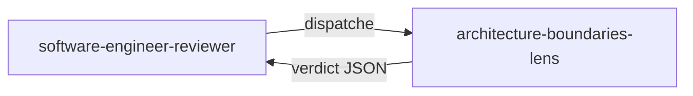

# architecture-boundaries-lens

> Lentille structurelle qui vérifie que les dépendances restent tournées vers l'intérieur, que les couches Domain et Application ne contiennent aucun mock, et que le Domain respecte l'Object Calisthenics.

## Rôle dans le panel adversarial

Cette lentille appartient au `software-engineer-reviewer`. Elle est activée **systematiquement** sur chaque cycle DELIVER — elle fait partie des 4 lentilles CORE. Elle reçoit **uniquement le code de production** ; elle ne voit ni les tests, ni le journal, ni la checklist.

## Ce que la lentille vérifie

- **G4 — Pas de mock dans Domain/Application** : détecte `A.Fake<>`, `Mock<>`, `Substitute.For<>` sur des types Domain ou Application dans les projets `*.UnitTest`.
- **G5 — Direction des dépendances** : vérifie que Domain n'importe rien ; Application n'importe que Domain ; Infrastructure et API peuvent importer Application.
- **G10 — Object Calisthenics sur le Domain** : contrôle les 9 règles sur le code de la couche Domain.

## Verdict et seuils

| Condition | Verdict | Sévérité |
|-----------|---------|----------|
| `A.Fake<IDomainType>()` ou `Mock<IDomainType>()` dans un test unitaire | `fail` | `blocker` |
| `using` Domain → Application, Infrastructure ou API | `fail` | `blocker` |
| `using` Application → Infrastructure ou API | `fail` | `blocker` |
| Violation Object Calisthenics dans le Domain | `fail` | `medium` |
| Aucune violation détectée | `pass` | — |

Un seul défaut `blocker` suffit à rejeter le cycle.

## Invariants

- Lecture seule : la lentille ne modifie jamais le code.
- Elle ne propose pas de corrections ; elle rapporte des constats.
- Elle ne voit pas les tests, le journal ni la checklist — uniquement le code de production.
- `A.Fake<IDrivenPort>()` (repository, gateway) est **autorisé** — seuls les types Domain/Application sont interdits.

> « A good architecture allows the system to be easily understood. »
> — Martin, R. C., *Clean Architecture*, 2017.

## Sources

- Martin, R. C. *Clean Architecture*, 2017.
- Bay, J. *Object Calisthenics*, 2008.
- [clean-architecture-testing]({{ "/fr/reference/skills/clean-architecture-testing" | relative_url }}) (skill chargé à la demande)

## Voir aussi

- [Lentilles de revue — vue d'ensemble]({{ "/fr/reference/lens" | relative_url }})
- [architecture-boundaries-lens (EN)]({{ "/en/reference/lenses/architecture-boundaries-lens" | relative_url }})
- [Gates par phase]({{ "/fr/reference/gates" | relative_url }})
- [Glossaire]({{ "/fr/reference/glossaire" | relative_url }})
