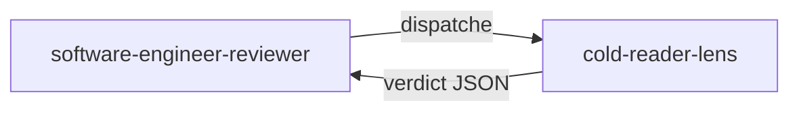

# cold-reader-lens

> Lentille naive qui lit le code et les tests comme si elle les découvrait pour la première fois, afin de vérifier que le langage métier, le nommage et l'intention restent lisibles sans contexte préalable.

## Rôle dans le panel adversarial

Cette lentille appartient au `software-engineer-reviewer`. Elle est activée **systematiquement** sur chaque cycle DELIVER — elle fait partie des 4 lentilles CORE. Elle reçoit le code **et** les tests, mais **aucun** journal, checklist, ni connaissance du cycle TDD qui a produit ce code.

## Ce que la lentille vérifie

- **Noms de méthodes de test (G11)** : décrivent-ils un comportement métier en langage naturel ? (ex. `Should_Reject_When_Driver_Is_Under_18` — pas `Test1`)
- **Noms de variables dans les tests** : utilisent-ils le vocabulaire du domaine ? (ex. `eligibilityResult` — pas `x`, `data`, `result2`)
- **Messages d'assertion** : sont-ils compréhensibles par un expert métier ?
- **Noms de méthodes en code de production** : expriment-ils l'intention ? (ex. `CalculatePremium()` — pas `ProcessData()`)
- **Abstractions non motivées** : des interfaces ou classes sans raison domain clairement identifiable ?

## Verdict et seuils

| Condition | Verdict | Sévérité |
|-----------|---------|----------|
| Nom de méthode de test générique (`Test1`, `TestMethod`, `ShouldWork`) | `fail` | `medium` |
| Variable sans vocabulaire domaine (`x`, `data`, `result2`) | `fail` | `medium` |
| Méthode de production sans intention claire (`ProcessData`, `DoStuff`, `Handle`) | `fail` | `medium` |
| Abstraction sans raison domaine identifiable | `fail` | `low` |
| Aucune violation détectée | `pass` | — |

La sévérité maximale de cette lentille est `medium` — elle ne peut pas émettre de `blocker`.

## Invariants

- Lecture seule : la lentille ne modifie jamais le code.
- Elle n'a aucune connaissance du cycle TDD, des quality gates ni du fait que le code ait été produit par un agent.
- Elle ne vérifie **pas** l'architecture (autre lentille), ni l'exactitude des tests (autre lentille), ni le style/formatage.
- Ses constats portent uniquement sur la **clarté**, pas sur la correction.

> « Programs must be written for people to read, and only incidentally for machines to execute. »
> — Abelson, H. & Sussman, G. J., *Structure and Interpretation of Computer Programs*, 1985.

## Sources

- Abelson, H. & Sussman, G. J. *Structure and Interpretation of Computer Programs*, 1985.
- Martin, R. C. *Clean Code*, 2008.

## Voir aussi

- [Lentilles de revue — vue d'ensemble]({{ "/fr/reference/lens" | relative_url }})
- [cold-reader-lens (EN)]({{ "/en/reference/lenses/cold-reader-lens" | relative_url }})
- [Gates par phase]({{ "/fr/reference/gates" | relative_url }})
- [Glossaire]({{ "/fr/reference/glossaire" | relative_url }})
