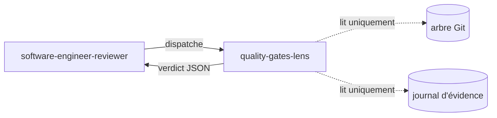

# quality-gates-lens

> Lentille observatrice qui falsifie chaque affirmation du journal d'évidence des quality gates contre l'arbre Git réel — sans jamais exécuter de build, de tests ni de mutation.

## Rôle dans le panel adversarial

Cette lentille appartient au `software-engineer-reviewer`. Elle est activée **systematiquement** sur chaque cycle DELIVER — elle fait partie des 4 lentilles CORE. Elle reçoit une seule entrée : le journal d'évidence produit par le `software-engineer` en fin de phase COMMIT (`.copilot-tracking/skraft-plans/{projectSlug}/evidence/{date}/qg-{story}.json`).

## Ce que la lentille vérifie

- **Localisation du journal** : présence, JSON valide, `$schema` égal à `quality-gates-evidence/v2`.
- **Auto-cohérence (sans accès Git)** : `status: "pass"` implique `metrics.tests_failed == 0` ; `status: "not_applicable"` exige un `rationale` non vide ; `stdout_tail` doit être un suffixe strict du fichier référencé.
- **Falsification contre l'arbre Git** : `repo_root_rev` correspond au SHA HEAD ; chaque `commits_covered[].sha` résout dans l'arbre ; `files_changed` liste exactement les chemins du diff ; `commits_covered[].subject` respecte la regex Conventional Commits (G8) ; les `stdout_ref` existent et leur `stdout_sha256` correspond au re-hachage ; les snapshots RED/GREEN correspondent à `git show {commit}:{fichier}`.
- **G9 — Intégrité RED→GREEN** : tout retrait ou mutation d'une ligne présente dans le snapshot RED est une violation de la règle d'or des tests.
- **G10 — RED constaté** : pour chaque cycle, le `red_stdout_ref` existe et son re-hachage correspond à `red_stdout_sha256`, et le `red_exit_code_ref` enregistré est non nul — un zéro signifie que le test n'a jamais échoué avant l'arrivée de l'implémentation.

## Verdict et seuils

| Condition | Verdict | Sévérité |
|-----------|---------|----------|
| Journal absent, malformé ou `$schema` non supporté | `inconclusive` | — |
| Fichier référencé inaccessible ou `stdout_sha256` ne correspond pas | `inconclusive` | — |
| `status: "pass"` avec `tests_failed > 0` | `fail` | `high` |
| `status: "not_applicable"` sans `rationale` | `fail` | `high` |
| `commits_covered[].subject` ne respecte pas la regex G8 | `fail` | `high` |
| SHA de commit qui ne résout pas, ou `files_changed` liste un chemin absent du diff | `fail` | `high` |
| Snapshot RED→GREEN : retrait ou mutation d'une ligne (G9) | `fail` | `blocker` |
| Un cycle enregistre un code de sortie nul pour son exécution RED (G10) | `fail` | `blocker` |
| Toutes les gates applicables à `pass` et toutes les références résolvent | `pass` | — |

`inconclusive` n'est **jamais** équivalent à `pass`. L'absence de preuve n'est pas une preuve de succès.

## Invariants

- Lecture seule : la lentille n'exécute jamais build, tests, mutation ni commande Git mutante.
- Elle accède à l'arbre Git uniquement via `Read`, `Glob`, `Grep` sur la copie de travail (HEAD).
- Elle ne reçoit pas les sorties des autres lentilles.
- Si une affirmation ne peut pas être falsifiée depuis l'arbre Git seul, le verdict est `inconclusive` (jamais `pass`).

> « Absence of evidence is not evidence of absence. »
> — Principe de vérification scientifique, tradition épistémologique.

## Sources

- `quality-gates-evidence-contract` (skill chargé obligatoirement — schéma, surface de falsification, taxonomie G1..G10)
- Freeman, S. & Pryce, N. *Growing Object-Oriented Software, Guided by Tests*, 2009.

## Voir aussi

- [Lentilles de revue — vue d'ensemble]({{ "/fr/reference/lens" | relative_url }})
- [quality-gates-lens (EN)]({{ "/en/reference/lenses/quality-gates-lens" | relative_url }})
- [Gates par phase]({{ "/fr/reference/gates" | relative_url }})
- [Glossaire]({{ "/fr/reference/glossary" | relative_url }})
