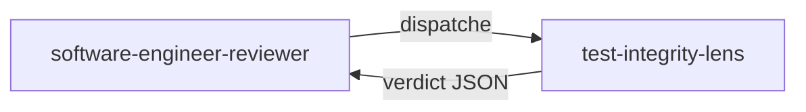

# test-integrity-lens

> Lentille d'analyse de la qualité des tests qui traque le théâtre de test et les violations de la règle d'or — les tests qui n'assertent rien de réel, ou dont les assertions ont été affaiblies pour forcer un GREEN.

## Rôle dans le panel adversarial

Cette lentille appartient au `software-engineer-reviewer`. Elle est activée **systematiquement** sur chaque cycle DELIVER — elle fait partie des 4 lentilles CORE. Elle reçoit les tests **et** le code de production. Elle ne voit ni le journal, ni la checklist.

## Ce que la lentille vérifie

### G7 — Théâtre de test

| Anti-pattern | Description | Sévérité |
|-------------|-------------|----------|
| **Test tautologique** | `Assert.NotNull(result)` comme seule assertion ; `Assert.True(true)` ; toute assertion qui ne peut jamais échouer | `blocker` |
| **Test dominé par les mocks** | Plus de lignes de setup mock que de lignes d'assertion ; aucun objet Domain réel instancié | `blocker` |
| **Vérification circulaire** | Le test recalcule la valeur attendue avec la formule de production | `blocker` |
| **Miroir d'implémentation** | `Verify()` / `MustHaveHappened()` sans assertion d'état ; assertion sur le COMMENT plutôt que sur le QUOI | `blocker` |
| **Théâtre de fixture** | Le setup crée exactement l'état final attendu ; `git diff` ne montre que des changements de tests entre RED et GREEN | `blocker` |

### G9 — Violation de la règle d'or (Iron Rule)

| Condition | Sévérité |
|-----------|----------|
| Une assertion a été affaiblie entre deux commits (ex. `Assert.Equal(90, x)` → `Assert.NotNull(x)`) | `blocker` |
| Un test a été supprimé pour faire passer la suite | `blocker` |
| `[Skip]` ajouté sur un test en échec | `blocker` |

## Verdict et seuils

| Condition | Verdict |
|-----------|---------|
| Au moins un anti-pattern G7 ou une violation G9 | `fail` |
| Aucun théâtre de test ni violation Iron Rule | `pass` |

Tout défaut émis par cette lentille est `blocker` — elle ne peut pas produire de verdict inférieur.

## Invariants

- Lecture seule : la lentille ne modifie jamais le code ni les tests.
- Elle ne propose pas de corrections ; elle rapporte des constats en nommant l'anti-pattern spécifique.
- Chaque finding **doit** nommer le pattern précis : tautologique, dominé-par-mocks, circulaire, miroir-d'implémentation, théâtre-de-fixture.

> « Never refactor a failing test. »
> — Freeman, S. & Pryce, N., *Growing Object-Oriented Software, Guided by Tests*, 2009.

## Sources

- Freeman, S. & Pryce, N. *Growing Object-Oriented Software, Guided by Tests*, 2009.
- Meszaros, G. *xUnit Test Patterns*, 2007.
- Beck, K. *Test-Driven Development by Example*, 2003.

## Voir aussi

- [Lentilles de revue — vue d'ensemble]({{ "/fr/reference/lens" | relative_url }})
- [test-integrity-lens (EN)]({{ "/en/reference/lenses/test-integrity-lens" | relative_url }})
- [Gates par phase]({{ "/fr/reference/gates" | relative_url }})
- [Glossaire]({{ "/fr/reference/glossaire" | relative_url }})
