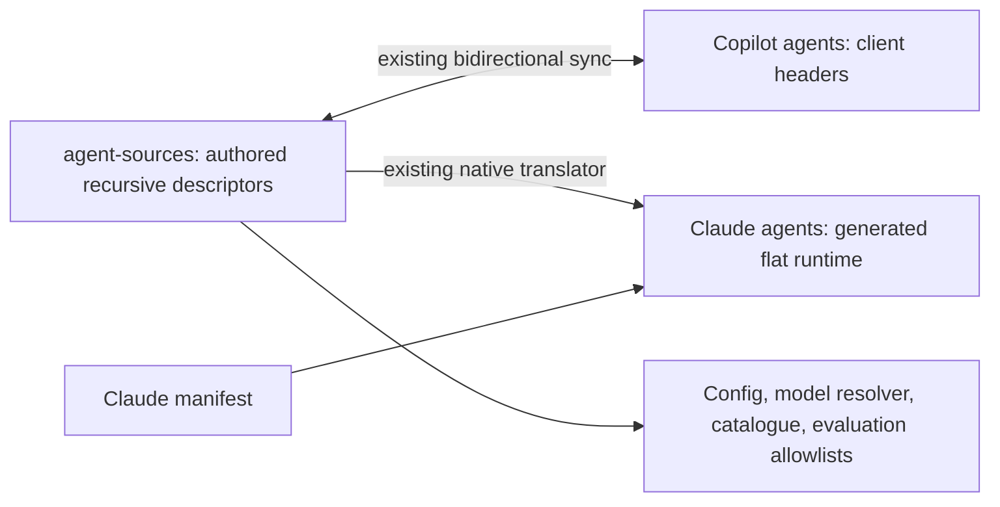

# Agent path naming correction

Approved scope: packaging rename only. No agentic module, dispatch, prompt, model,
tool, identity, sync-key or policy changes. Supersedes only directory naming in
the native-agent compatibility plan; historical reports and plans stay unchanged.



```mermaid
sequenceDiagram
    participant Migration
    participant Sources
    participant Runtime
    participant Projector
    Migration->>Sources: Snapshot SHA-256; move agents to agent-sources
    Migration->>Runtime: Move native-agents to agents
    Migration->>Projector: Update source and native target constants
    Projector->>Runtime: Regenerate with computed links
    Migration->>Sources: Verify unchanged bytes and relative baseline keys
```

Interface unchanged: existing projector apply/sync/check commands; recursive
source-relative keys in .agent-sync.json remain unchanged. Native manifest lists
flat runtime agents. Runtime links use the translator's existing path computation.
Runtime token cost unchanged except computed path lengths; no model calls needed.

## One-shot migration process

Use the temporary scripts/rename-agent-paths-once.mjs with --check, then --apply,
then --verify after normal projection regeneration. Script snapshots authored,
native and Copilot SHA-256 hashes plus sync baseline hash in the OS temporary
directory, checks destinations, renames directories without deleting files,
and applies only literal canonical path replacements to scoped live consumers.
Each file replaces old source first, then old native target. Handbook evaluation
fixture trees move together with their staging paths and catalogue metadata.
Generated agent bodies are not manually edited. Remove the script after verification.

Validation: existing full framework/tooling suites, native stop/wire regressions,
projection/config/model checks, catalogue, citations and handbook build. Parent
owns final review and live native smoke. No commits or personal config changes.

## Result

- Moved 31 authored files, 31 native runtime files and 6 fixture files in three trees.
- SHA-256 verified all 31 authored, 31 native and 31 Copilot descriptors unchanged;
    sync baseline bytes unchanged. Relative paths retained; regeneration required no
    native link edits. Existing stale Copilot hook projection regenerated normally.
- Updated 39 literal-path consumers plus escaped-path detection/assertions and
    matching packaging prose. Historical reports and earlier plans preserved.
- Before: 139 targeted projection/native stop/wire tests passed.
- After: 1,011 framework tests and 264 tooling tests passed; projection, config,
    model policy and catalogue checks passed. Citations valid, zero handbook drift,
    Jekyll build passed, 30 site tests passed on isolated port 4109.
- Temporary migration script and site config removed after verification. Hash
    snapshot and test logs retained in the OS temporary directory. No live native
    smoke or mutation campaign run in this naming-only change.