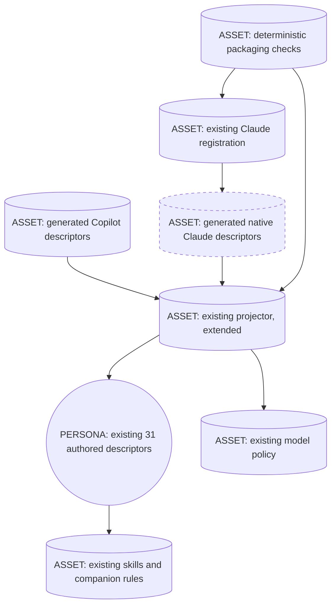
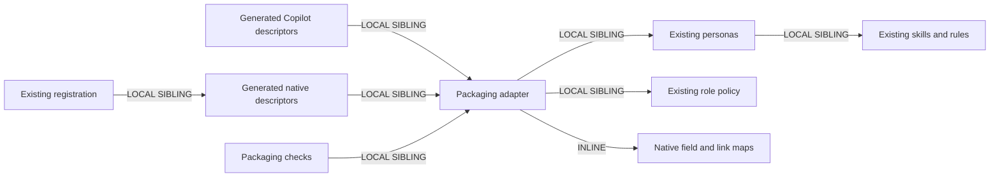

# Native agent compatibility: F1 / F6 design packet

Date: 2026-09-16. Status: design complete; implementation and native validation pending.
Scope: F1/F6 of the six-finding audit only. Parent owns hook wiring and stop behavior independently.
Cost stance: balanced. No monetary cap. No new runtime LLM calls.

## 1. Intent, boundary, targets

Make the existing 31 personas load with client-native tool and model declarations while preserving one authored content source, Copilot filename IDs, current policy-selected Copilot models, all Claude registrations, and six public flags. Translate packaging, not behavior. No prompt authoring, tree migration, new skills, changed reviewer topology, model-policy retuning, hook changes, or modernization metadata.

This turn writes only this packet. Source inspection used file reads/searches; no terminal, build, native probe, paid evaluation, or graph refresh ran. Graph query was skipped under the explicit read/grep-only restriction. Historical session notes were not treated as current compatibility evidence.

Targets: Claude Code; GitHub Copilot CLI and VS Code. Common-substrate design first: persona identity, body, capability boundary, role class, and linked assets. Per-harness reach is necessary because model identifiers, tool restrictions, filename conventions, and registration syntax are the defects being repaired. Adapter references were loaded for that boundary only, not to draft prompts.

Invocation: existing public roots BOTH; existing workers/reviewers/lenses FORCED within their present chains. Projection and checks FORCED by contributor commands. No new dispatch description. Existing descriptions remain exact, including indirect triggers and public/internal intent.

## 2. Component diagram



No persona box is a new runtime thread. Generated descriptors are deployment artifacts, not independently authored personas.

## 3. Sequence and one-writer boundary

```mermaid
sequenceDiagram
    participant Designer as Designer thread
    participant Author as Later implementation thread
    participant CPU as Deterministic file and script substrate
    participant Client as Native harness
    Designer->>CPU: Persist design packet only
    CPU-->>Designer: Written artifact
    Note over Designer,Author: Design ends; no child spawned in this task
    Author->>CPU: Reload packet and inspect current parent changes
    CPU-->>Author: Current source and ownership boundary
    Author->>CPU: Implement adapter then compute complete projection
    CPU-->>Author: Validate all inputs before writes
    Note over Author,CPU: One author owns projector and registration; parent owns hooks
    Author->>CPU: Apply projections; check independent expected outputs
    CPU-->>Author: Stable IDs, model/tool maps, links, no-write-on-error receipts
    Author->>Client: Validate native discovery in isolated installation
    Client-->>Author: Loaded descriptors and available capabilities
    Note over Author,Client: Existing runtime dispatch topology unchanged; no added LLM calls
```

Tier-3: A9 SUPERVISED EXECUTION for the later contributor change, not a new agent pipeline. Tier-2: S2 DEPENDENCY ADAPTER, S7 DETERMINISTIC TOOL BRIDGE, S4 VALIDATION DECORATOR, B4 PLAN MEMENTO, B8 ATTENTION ANCHOR. Reload this packet before each owned unit. Refactor pass: extract deployment translation from byte-copy semantics; no R1 persona split, R2 fusion, or runtime proxy. Avoid STAGE COLLAPSE, TASKS WITHOUT PLAN, VERIFY-WITH-LLM-ONLY, and broad tool grants disguised as compatibility.

## 4. Decision and HUMAN_RATIONALE

**Choose a second generated descriptor target outside the authored directory.** Keep the current recursive authoring tree unchanged. Generate flat native Claude descriptors in a new sibling directory named com.anthropic.claude-code/native-agents, with the same basename IDs and the native Markdown suffix. Keep flat Copilot output at its existing location.

The current directory's vendor label is misleading, but moving it is not necessary to repair the runtime surface. [scripts/project-plugin-adapters.mjs](../../../scripts/project-plugin-adapters.mjs) already owns discovery, collision checking, output containment, and generation. Extending this seam preserves every canonical consumer while isolating client syntax.

Rejected alternative: making the existing descriptors Claude-native, with `metadata.copilot_model` and tool overrides. The current [model CLI](../../../plugins/skraft-framework/src/cli/resolve-model.mjs) reads and rewrites top-level `model`; [catalogue scanner](../../../eng/catalog/scan.mjs) displays it; [evaluation descriptor loader](../../../eng/vally-agent-executor/agent-descriptor.mjs) consumes the current name, tools, model, and body. Native canonical frontmatter would require changing those consumers, their tests, and likely identity handling. Tool mappings are lossy, so a reverse map would not recover precise Copilot permissions without storing another tool list.

Rejected alternative: moving the whole authored tree. This adds source-path churn, evaluation allowlist changes, config discovery changes, and documentation churn without improving F1/F6 behavior.

Tradeoff: the selected design adds 31 generated files and changes Claude registration paths. That is a bounded deployment cost, with no duplicated authorship. A nested output under the authored directory is prohibited: recursive scans would count it as another source catalogue.

Registration risk is explicit. [Claude manifest](../../../plugins/skraft-framework/.claude-plugin/plugin.json) must list exactly the 31 native outputs, never source plus output. Root v1 manifest keeps no `agents` list. Do not add a root agents directory, another fallback manifest, or hook pointers. VS Code versions that fall back to the Claude manifest may now see Claude dialects: validate the supported v1 path independently; do not claim old fallback clients compatible or hide the mismatch with wildcards.

This rationale is human-facing and must never be copied into a runtime spawn brief.

## 5. Exact source fields and interface contract

**No new authored metadata fields.** In particular, do not add `copilot_model`, `claude_model`, per-agent tool overrides, or runtime adapter prose.

| Existing source field | Authority and projection |
|---|---|
| Canonical relative path / basename | Stable ID; reject NFC/case-folded stem collisions. Both outputs keep that ID. |
| `name` | Preserve exact Copilot display name. Native Claude `name` is basename ID; validate native identifier syntax. |
| `description` | Preserve exact text and scalar/folded semantics for both clients. |
| `model` | Preserve exact scalar in Copilot; validate against existing policy. Native model comes from effective role tier, except orchestrator `inherit`. |
| `tools` | Explicit source capability set. Preserve exact Copilot list. Translate by the closed native map below; never omit to inherit all tools. |
| `agents` | Preserve exact Copilot child refs. Resolve each ref through the unique source name/ID index for native dispatch restriction; no best-effort slug guessing. |
| `user-invocable` | Preserve all six true and 25 false values; not a promise that Claude hides internal subagents. |
| `metadata.cost_role_class` | Existing role authority. Reuse effective-tier calculation. |
| `metadata.model_requirement` | Preserve requirement and honor its capability floor. |
| Other metadata | Preserve declarative metadata, including `skills`, `instructions`, phase declarations, and input/output contracts; no semantic rewrite. |
| Body | Same authored prose. Generated changes limited to actual Markdown link destinations; no global replacements of tool words, names, or extensions. |

Proposed projector helpers, kept inline in the existing maintainer script unless complexity proves a split necessary:

- `parseDescriptor(sourceBytes, sourcePath)`: bounded frontmatter parse plus source spans and body; reject malformed/duplicate ambiguous fields. Do not round-trip the whole document through a formatter.
- `projectDescriptor(descriptor, targetClient, sourceIndex)`: returns generated bytes; deterministic header projection and link destination edits only.
- `projectClaudeTools(tools, childRefs, sourceIndex)`: returns a deduplicated stable-order native allowlist or a source-anchored error.
- `rewriteDescriptorLinks(body, sourcePath, targetPath, sourceIndex)`: resolves bundled resources then renders target-relative destinations; leaves all non-link bytes intact.
- `buildProjection(pluginRoot)`: retain return shape `{root, files}` and `{source, target, content}` entries. Include both descriptor sets and the unchanged hook-copy entry. Compute and validate all entries before any write.
- `projectPluginAdapters({pluginRoot, mode})`: retain check/apply behavior, sorted diagnostics, idempotence, symlink/hard-link rejection, no deletion of unknown files. Inspect both generated directories. Hook translation is not part of this design.

Keep the Claude manifest list as an explicitly owned registration edit, checked against the projector's native target set; do not regenerate unrelated manifest fields. A partial implementation that changes registrations without committed outputs cannot ship.

### Native model mapping

Reuse `resolveModel({costRoleClass, modelRequirement}).tier` from the [existing application policy](../../../plugins/skraft-framework/src/application/resolve-model.mjs). Do not import its preferred Copilot model into native output.

| Effective role/tier | Native `model` | Copilot |
|---|---|---|
| Explicit orchestrator exception | `inherit` | Existing `inherit` |
| Reviewer, economy, no raised floor | `haiku` | Preserve accepted current Luna or Haiku value |
| Implementer / researcher, standard | `sonnet` | Preserve current Sonnet spelling |
| Reviewer raised by Sonnet requirement | `sonnet` | Preserve current accepted standard value |
| Planner, frontier | `sonnet` | Preserve current accepted frontier value |

Planner maps to Sonnet deliberately: current [model-class policy](../../../plugins/skraft-framework/src/domain/model-class-policy.mjs) binds both standard and frontier to Sonnet. This is a compatibility repair, not authorization to promote every planner to Opus. Unknown role/tier, missing required scalar, invalid native mapping, or unsupported requirement must fail validation rather than fall back to `inherit`. The source model resolver remains unchanged and still owns Copilot compliance.

### Native tool map and non-equivalences

The following is the chosen mapping contract, subject to native-schema confirmation before implementation ships. Installed Genesis Claude adapter is dated and calls the dispatch tool `Task`; confirm current `Agent` spelling and scoped dispatch syntax against the supported Claude build. Do not silently substitute broad access if a spelling is unsupported.

| Source tool(s) | Native projection | Constraint |
|---|---|---|
| `read/readFile`, `read` | `Read` | File content only. |
| `search/codebase` | `Grep`, `Glob` | Lexical lookup fallback, not semantic-search equivalence. |
| `search/textSearch`, `search/usages` | `Grep` | Usages fallback is lexical, not language-server resolution. |
| `search/fileSearch`, `search/listDirectory` | `Glob` | No shell grant just to list paths. |
| `edit/createFile` | `Write` | Native Write can overwrite; approval boundary still applies. |
| `edit/editFiles` | `Edit` | No broader native write tool added solely for edit. |
| `edit/createDirectory` | No standalone tool | Existing Write creates parents when writing; unsupported empty-directory-only work is not a reason to add Bash. |
| `edit` | `Write`, `Edit` | Preserve existing edit category; no NotebookEdit without an actual source requirement. |
| `execute/runInTerminal` | `Bash` | Existing shell capability only; not a new grant to read-only lenses. |
| `execute/getTerminalOutput` | `TaskOutput` | Native background-process output, after verifying supported name. |
| `execute/killTerminal` | `TaskStop` | Native process-stop capability, after verifying supported name. |
| `execute/sendToTerminal` | No direct equivalent | Retain existing Bash; do not claim interactive stdin forwarding works. Native behavior probe required where used. |
| `execute/testFailure` | No dedicated equivalent | Existing test command/log output via already granted Bash/Read; do not add shell to compensate if absent. |
| `execute` | `Bash`, `TaskOutput`, `TaskStop` | Explicit bounded native shell family; no universal wildcard. |
| `agent` without `agents` restriction | `Agent` | Existing unrestricted dispatch capability only. |
| `agent` with `agents` restriction | `Agent(resolved-native-ids)` | Native allowlist syntax/namespace must be proven. Never silently emit unrestricted Agent. |
| `graphify/*` | `mcp__graphify__*` | Preserve only this server namespace; require confirmed configured server ID and native wildcard support. Never `*` or `mcp__*`. |

Unknown tool strings fail before writes. An MCP wildcard is not proof the server exists. Missing server, unsupported scoped dispatch, or required non-equivalent capability blocks compatibility claims; do not add new servers, bridges, runtime prompts, shell wrappers, or network tools in this patch. Existing tool lists contain no web tool: this patch does not add one.

### Complete 31-descriptor inventory

Tool notation: R = readFile; S = codebase; W = createFile; E = editFiles; D = createDirectory; X = runInTerminal; O = getTerminalOutput; F = testFailure; A = agent; G = graphify server. Exact source identifiers are given in the mapping table; category aliases are spelled out below. All rows preserve current public flags.

| IDs | Count | Current source tools | Native model |
|---|---:|---|---|
| skraft-orchestrator | 1 | agent, read, edit, execute, G | inherit |
| backlog-discoverer; backlog-planner | 2 | A R W E D S | sonnet |
| brownfield-analyst | 1 | R W D E S X | sonnet |
| brownfield-harness-builder; brownfield-refactorer | 2 | R W D E S X O | sonnet |
| solution-researcher; solution-architect | 2 | R W E S G | sonnet |
| acceptance-designer | 1 | R W E D listDirectory S X O F G | sonnet |
| software-engineer | 1 | O killTerminal sendToTerminal F X R A D W E S fileSearch textSearch usages | sonnet |
| software-engineer-reviewer | 1 | R S A X | sonnet, requirement floor |
| backlog-discoverer-reviewer; backlog-planner-reviewer | 2 | A R S | haiku |
| acceptance-designer-reviewer; solution-architect-reviewer | 2 | R S X | haiku |
| discovery-completeness-lens; discovery-duplicate-lens; discovery-prioritization-lens | 3 | R S | haiku |
| planning-ac-quality-lens; planning-coherence-lens; planning-dor-lens; planning-invest-lens | 4 | R S | haiku |
| architecture-boundaries-lens; cold-reader-lens; quality-gates-lens; test-integrity-lens | 4 | R S | haiku |
| contract-fidelity-lens; mock-fidelity-lens | 2 | R S | haiku |
| contract-testing-worker; mock-integration-worker | 2 | R S D W E X O | sonnet |
| refactoring-worker | 1 | R W E S X O | sonnet |

Totals: 31; 17 Haiku, 13 Sonnet, one inherited. Public six: orchestrator, both backlog roots, all three brownfield roots. Existing missing dispatch permissions or capabilities in bodies are not repaired by inference from prose. Read-only R/S lenses remain Read/Grep/Glob only; reviewers already carrying X retain their current shell boundary, which is not an OS-level read-only sandbox.

### Link translation

Current source links predate the directory layout: root personas use `../skills/`, lenses use `../../skills/`, workers use `../../../skills/`; each points one level short of actual bundled skills. Agent links still use the generated suffix and nested directories. Copying those bytes cannot produce valid flat outputs.

1. Parse actual Markdown links and reference definitions outside fenced and inline code. Preserve labels, titles, fragments, query strings, whitespace, code examples, and artifact templates. In particular, do not rewrite the inline ADR supersession template in [solution-architect](../../../plugins/skraft-framework/com.anthropic.claude-code/agents/solution-architect.md#L298).
2. Resolve valid relative targets from the source directory first. If missing, allow only the explicit legacy skills prefix appropriate to that source depth, or a known canonical agent link whose old generated suffix maps to a unique source file. No basename search across arbitrary files and no arbitrary missing-target repair.
3. Treat skills as plugin-root resources. Both flat outputs reach them through `../../skills/...`. Agent links map through the source-to-target index: same-directory native Markdown target for Claude; same-directory existing agent suffix for Copilot. Preserve nested source identity in the index, not in flat output links.
4. Resolve ordinary valid bundled assets relative to the output directory. Preserve external URLs and fragment-only links. Reject unresolved bundled links, escapes, and symlink targets. Template artifact paths remain outside bundled-link validation.
5. Copilot frontmatter remains byte-identical; its body can differ only at translated link destinations. Native header differences are explicit above; all other body bytes remain identical. Assertions compare each generated file against independently specified examples, not only against the generator's own output.

## 6. Composition, ownership, interfaces



| Component | Composition | Trigger / input / output | Audience |
|---|---|---|---|
| Existing personas | LOCAL SIBLING | Existing invocation; unchanged work contracts | INTERNAL runtime |
| Model policy | LOCAL SIBLING | Role and requirement to effective tier | INTERNAL deterministic |
| Extended projector and maps | INLINE in maintainer script | Contributor build/check; sources to client descriptors | INTERNAL deterministic |
| Copilot/native descriptors | LOCAL SIBLING generated assets | Native harness loading; same personas | INTERNAL runtime |
| Claude registration | LOCAL SIBLING | Plugin load; 31 output paths | INTERNAL deterministic |
| Packaging checks | LOCAL SIBLING, contributor scope | Projection and fixtures to pass/fail diagnostics | EXTERNAL developer |
| Skills and rules | LOCAL SIBLING, unchanged | Existing lazy-load triggers | INTERNAL runtime |

External modules required: none newly introduced. Existing graphify capability remains an ambient optional integration, not a new dependency declaration or server install. No module-system adapter or dependency-manifest edit is needed for this design.

### Required ownership set for later implementation

- One packaging owner: [scripts/project-plugin-adapters.mjs](../../../scripts/project-plugin-adapters.mjs), [tests/skraft-framework/plugin-adapters.test.mjs](../../../tests/skraft-framework/plugin-adapters.test.mjs), and [tests/skraft-framework/plugin-packaging.test.mjs](../../../tests/skraft-framework/plugin-packaging.test.mjs).
- Same owner: all 31 existing Copilot descriptor outputs, all 31 new native Claude outputs, and only the `agents` array in [plugins/skraft-framework/.claude-plugin/plugin.json](../../../plugins/skraft-framework/.claude-plugin/plugin.json). Existing authored descriptors remain read-only.
- Contributor contract/docs owner, after implementation: [AGENTS.md](../../../AGENTS.md), [plugins/skraft-framework/README.md](../../../plugins/skraft-framework/README.md), [docs/architecture.md](../../architecture.md). Replace claims of source/output byte equality and native canonical syntax; preserve historical ADR evidence. Handbook changes, if needed, require its FR/EN instructions and a separately owned documentation pass.
- Verification dependencies, no planned edits: [model-resolution tests](../../../tests/skraft-framework/model-resolution.test.mjs), [model CLI tests](../../../tests/skraft-framework/resolve-model-cli.test.mjs), [model policy](../../../plugins/skraft-framework/src/domain/model-class-policy.mjs), [model resolver](../../../plugins/skraft-framework/src/cli/resolve-model.mjs), [catalogue scanner](../../../eng/catalog/scan.mjs), [evaluation loader](../../../eng/vally-agent-executor/agent-descriptor.mjs), [framework config policy](../../../plugins/skraft-framework/src/domain/framework-config-policy.mjs), and [identity normalization](../../../plugins/skraft-framework/src/domain/instruction-policy.mjs).
- Parent exclusively owns hook source/output, hook services, stop logic, associated tests, and any config changes. The shared projector still copies parent's latest hook bytes without modifying their contract; coordinate before regeneration. No runtime source or test changed by this packet.

Existing alias generation already maps basename IDs to display names; `canonicalAgentName` strips plugin prefixes. Native slug names therefore need no new runtime alias scheme. Prove this with current parent state before claiming native rule/skill injection works.

## 7. Compliance findings and implementation gates

- SoC/SRP/encapsulation: one capability, one source catalogue, dialect logic at packaging seam. No description collisions introduced. No new persona or skill container, so new-entrypoint name/budget/trigger requirements are not applicable.
- Composition/inversion/open-closed: reuse tier policy and source metadata; no mirrored authoring. Translation belongs to maintainer tooling, not shipped prompt prose.
- Isolation/interlock: no runtime fan-out changes; one writer for projector/registrations; parent hook ownership retained.
- PROSE: lazy skill references retained, scope limited to F1/F6, explicit generated hierarchy, bounded capabilities, no policy text copied into prompts.
- LLM physics: facts sourced from current files; output transformations and checks deterministic; packet persists intent; no hidden handoff context, extra runtime reasoning, prefix timestamps, or mid-session model switching.
- HIGH, implementation gate: native syntax/availability is not proven by this read-only design. Verify model aliases, tool spellings, MCP namespace filtering, scoped dispatch names, and native name loading against supported clients. Local Genesis adapters carry 2025-11-14 assumptions and are not current execution evidence.
- HIGH, compatibility gate: changing Claude registration affects VS Code fallback readers. Test CLI v1, VS Code v1, and native Claude separately; retain explicit unsupported-client limits if any surface cannot honor restrictions.
- HIGH, behavior boundary: lexical search and interactive terminal capability are not exact counterparts. Do not state full tool equivalence or expand permissions to conceal these gaps.
- MEDIUM, retained limitation: canonical bodies still contain existing harness references. No full portable-body cleanup is claimed. Public flags remain factual metadata, not a Claude picker-hiding guarantee.

## 8. Validation / EVALS PLAN

No new skill or dispatch description: paired with/without-skill trials and a 20-query trigger-training exercise would not test this deterministic packaging change. Record them as not applicable, not completed. Do not edit evaluation specs or buy live trials in this task.

Three content acceptance cases for later validation:

1. Input request: load a read-only planning lens. Expected: same stable ID and review body; native Haiku + Read/Grep/Glob; Copilot retains its current Luna/Haiku choice and exact tool list; no write, shell, or dispatch capability added.
2. Input request: load software engineer and its reviewer. Expected: both native Sonnet, Sonnet requirement floor retained; engineer keeps approved process/file operations, reviewer gains no edit tools; workers remain distinct registered personas.
3. Input request: load a reviewer and follow a nested worker/skill link. Expected: destination exists in each target layout, body instruction text unchanged; all 31 agents registered exactly once and public set unchanged.

Deterministic tests replace old source-equals-output expectations with client-specific expected bytes. Preserve hook byte parity and existing safety fixtures. Cover CRLF, BOM, Unicode, no trailing newline, model scalars, invalid fields, unknown tool, duplicate name/ID, scoped child refs, broken bundled links, legacy-depth repair, fragments/titles/reference definitions, inline/fenced-code immunity, and twice-apply timestamp stability. Negative cases must fail before any output write; unknown files are never deleted. Tightening descriptor parsing may require replacing permissive malformed fixtures, not removing their encoding coverage.

Native smoke checks must load real projected descriptors, not only the existing name-only probe fixture. Source [compatibility smoke script](../../../scripts/copilot-plugin-compat-smoke.mjs) currently probes names/flags and optional hooks; that alone cannot prove model/tool compatibility. Plan a later isolated probe or narrowly owned extension of that script, with any paid native invocation approved separately.

Current model CLI and domain tests stay green without edits. Catalogue/config scans still count 31 canonical sources and preserve Copilot model evidence. Generated descriptors must not be hashed as a second canonical catalogue. Source checks, output existence, model resolution, and actual native permissions are separate assertions.

## 9. COST PROJECTION

Balanced: preserve role assignments, accepted Copilot choices, stable body prefixes, and existing tool subsets. No LLM translation step, runtime router, added spawn, or mandatory live eval. B13 applies to stable descriptors; B12 maps roles at generation time; B15 forbids universal tool grants. Cost-shape matrix references: Genesis pattern-tradeoffs section 9, fact/side-effect -> tool-delegated; section 10, long-running read-only prefix -> B13, heterogeneous tool surface -> B15/S7. No profile exists to claim measured savings.

| Component | Role | Prefix/output/turn contract |
|---|---|---|
| Projector, mapping, registration, checks | No LLM | 0 model input/output tokens; 0 model turns |
| Existing personas | Existing classes; native map above | Unchanged authored body band, output contract, and turn topology; no added runtime turn |
| Changed generated headers/links | No new persona role | Near-zero text delta; estimate at most 256 absolute changed input tokens per descriptor load, excluding native tool-schema sizes |
| This human packet | Planner design work | One-time contributor cost, not shipped or loaded in runtime prefixes |

Representative incremental runtime projection (planning estimate, not tokenizer measurement):

| Workload | Descriptor loads | Absolute text input delta | Added output / turns / premium requests | Added LLM-call cost |
|---|---:|---:|---|---|
| S: one persona / file | 1 | 0-256 tokens | 0 / 0 / 0 | $0 |
| M: known-module chain | 8 | 0-2,048 tokens | 0 / 0 / 0 | $0 |
| L: whole catalogue loaded once | 31 | 0-7,936 tokens | 0 / 0 / 0 | $0 |

These are text-delta bounds per stated workload, not full-run cost or a claim that repeated prompt input is free. Native tool schemas, cache misses, task duration, and host-selected `inherit` pricing remain unmeasured. Existing Claude execution with invalid model names is not a usable billed baseline, so do not claim native model cost parity with a failed run.

Pricing provenance: Genesis Claude adapter section 9, verified 2025-11-14, lists historical input rates $1/Mtok Haiku and $3/Mtok Sonnet, output $5/$15. Historical cold-input sensitivity for the text delta alone: S $0-$0.000768; M $0-$0.006144; L $0-$0.023808, excluding inherited-model loads. These are arithmetic illustrations using dated rates, not current price quotes. Re-check official pricing before presenting a live dollar budget. Copilot adapter pricing is request-based and dated; unchanged model selections and zero added requests imply no added request charge from projection. Cache ratio is observational, not a design gate. Cap: none; no cap refusal.

## 10. Handoff and ordered todos

PER-SPAWN DECLARATION TABLE: empty; zero new or planned child spawns in this design task.
SPAWN_BRIEFS: none. RECEIPT_SCHEMAS: no subagent receipts. Deterministic check receipt retains `missing`, `stale`, `extra`, `written`, `ok`.
EXTERNAL_ARTIFACT_SPEC: this packet; human/next implementer; normal prose, explicit limitations. Not loaded into runtime descriptors.

- [x] D0: inspect all 31 tool/model declarations, nested links, policy consumers, and test contracts; persist packet before descriptor changes.
- [ ] D1: confirm native field/tool syntax, namespace behavior, model aliases, and registration/discovery path with supported clients. Depends on D0; no permission widening fallback.
- [ ] D2: implement closed native mapping and link translation in existing projector, with independent expected-output fixtures and preserved file safety. Depends on D1.
- [ ] D3: generate both client sets; update only Claude `agents` registration array; coordinate hook-copy output with parent. Depends on D2.
- [ ] D4: run deterministic packaging/model/config/catalogue checks, idempotence, and isolated native loading/permission/link probes. Depends on D3. Load applicable stack/quality instructions before running those checks.
- [ ] D5: update current contributor packaging docs, retaining history and any demonstrated compatibility limits. Depends on D4; load handbook rules if scope reaches handbook pages.

Stop here. No descriptor body, runtime code, test, manifest, or generated adapter has been modified by this design task.