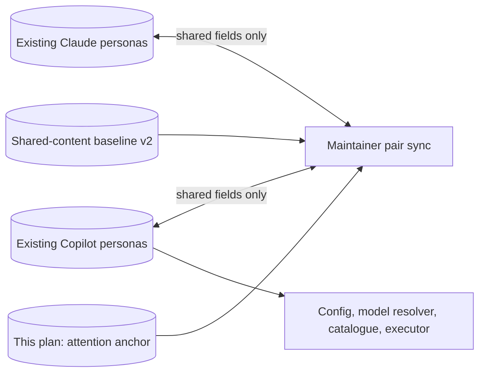

# Two editable agent trees — superseding handoff

Supersedes agent-path-naming addendum and earlier canonical-third-tree plans.
Scope: remove third descriptor tree, preserve all 31 personas and six public
entry flags, synchronize shared prose without changing client capabilities.
No prompt redesign, new persona, runtime generation, install, commit or push.



```mermaid
sequenceDiagram
    participant Owner as Single writer
    participant Check as Deterministic preflight
    participant Trees as Existing three trees
    participant Pair as Two runtime trees
    Owner->>Check: Test pair-sync contract before migration
    Owner->>Check: Read old baseline and all descriptor bytes
    Check->>Trees: Compare old baseline, source, Copilot, native Claude
    Check-->>Owner: Conflict or complete preservation plan plus hashes
    Note over Owner,Pair: No writes on unknown files, ambiguous mapping or conflict
    Owner->>Pair: Apply validated shared changes; retain local headers
    Owner->>Check: Verify shared equivalence and original metadata
    Owner->>Trees: Remove only 31 recognized source files, prune empty directories
    Owner->>Check: CI, catalogue, docs, graph; report exact results
```

## Interface and invariants

- `buildProjection(root)` reads two flat runtime trees; returns all writes,
  missing pairs, conflicts, extras before any mutation. Never creates one side
  by inheriting another client's tools. New IDs require both explicit versions.
- `mergeAgentPair(claude, copilot, baseline, links)` merges body and raw
  description only. Markdown destinations normalize to stable logical IDs and
  plugin-relative skill paths. Render destinations for receiving client.
- Baseline v2: stable basename ID -> per-side previous normalized body and
  description. No header copies. Unchanged intentional differential prose stays
  unchanged. Both sides editing same field differently is conflict, not priority.
- Native name/model/tools/agents and every non-description header byte remain
  client-local. Hooks retain their existing one-way byte synchronization.
- Migration: old v1 baseline must agree with old source/Copilot, or expose
  pending change/conflict explicitly; never reset baseline to bless drift.
  Native normalized shared content compared with old baseline too. Original
  metadata must survive in Copilot before deletion; unknown source files abort.
- Consumers read Copilot runtime only; strip `.agent` suffix for stable IDs;
  classify workers/lenses by descriptor metadata or stable IDs, not old folders.
- Claude manifest continues registering all 31 native files. Historical ADRs,
  reports and prior plans retain historical references.

## Composition, portability, cost

Maintainer-only deterministic adapter: local sibling JS modules; no external
module, shadow tree, template surface or new runtime asset. Existing personas
remain runtime-local. Plan and audit are human-facing; baseline machine-facing.
Common substrate: description + body portable; tool/model/name fields native.
R1/R3: extract shared merge/link rules, do not split personas. Supervised
execution with plan memento and attention anchor; one writer, no helper spawns.
Avoid partial preflight, overwrite-on-conflict and hidden capability inheritance.
Cost stance frugal. Runtime model roles, dispatch topology and tool surfaces
unchanged. Added runtime token delta **zero**; link spelling normalization may
change tokenization but adds no instructions or model calls. Maintainer tests
only; no Vally campaign. Existing repo Node CI commands used, not a claimed
formal pipeline quality-gate adapter (JavaScript adapter unavailable).

## Execution checklist

1. Capture working-tree status and inspect baseline/consumers.
2. RED tests: reverse body/description edits, native headers, link translation,
   divergent edits without writes, idempotence, explicit pair additions.
3. Implement pair sync and migration preflight; test before deleting sources.
4. Migrate bytes with SHA/equivalence proof; remove recognized third tree.
5. Update live consumers, maps, tests/fixtures, CI, contributor instructions,
   FR/EN docs. No history rewriting.
6. Run local CI + native regressions, catalogue uniqueness, site build, graph.
   Parent handles native live smoke. Remove only tasks added by this change.

## Migration evidence

Executed 2026-09-16. Preflight compared all 31 source and Copilot body/description
fields with existing v1 baseline before mutation: exact equality, no pending drift.
Original complete parsed metadata equals Copilot metadata for every identity.
Native shared fields match previous source projection after Markdown destination
normalization. Every native descriptor retained its original full SHA-256.
Copilot changes only repair Markdown destinations; prose and metadata preserved.
Unknown files, pending source/client fields or differing native shared fields would
abort migration; baseline was not reset to accept divergence.

Temporary receipt: `skraft-two-agent-trees-1789513169937.json` in OS temporary
directory; contains 31 original/native/Copilot SHA-256 rows and normalized-body
hashes, no full descriptor/header surrogate. Final verifier checks those hashes
against both remaining trees and baseline v2. Six moved evaluation fixture files
retain their contents. Exactly 31 baseline basename IDs; catalogue reads 31 unique
Copilot IDs (15 agents, 5 worker-family entries, 11 reviewer lenses).

Guardrail configuration parsed object equality verified before regeneration;
only serialized key order changed due to flat descriptor traversal.
Initial new acceptance suite: 9 RED (missing native pair support), then 9 GREEN.
Local CI, native regressions, citations, navigation, zero handbook drift, Jekyll
build and 30 Playwright site tests passed. Native live smoke delegated to parent;
no new live-client compatibility claim, mutation run, commit, push or installation.