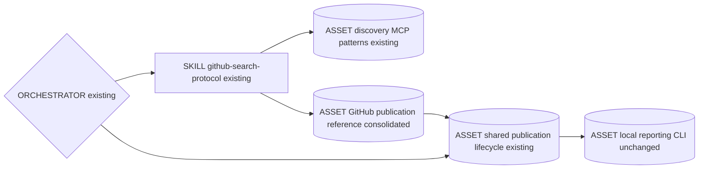
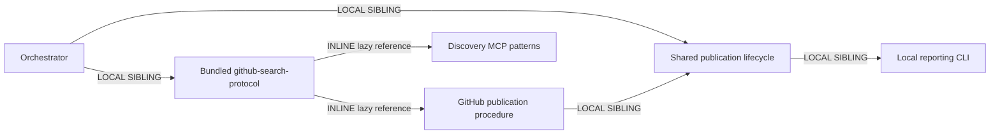
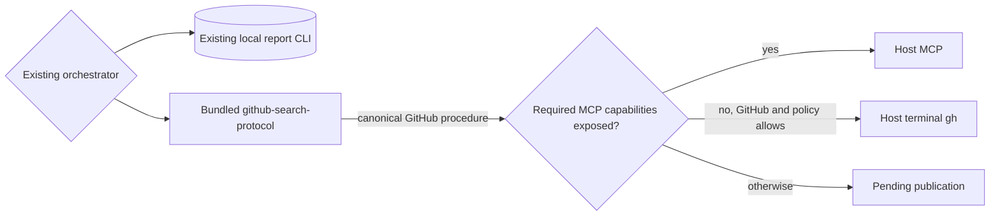
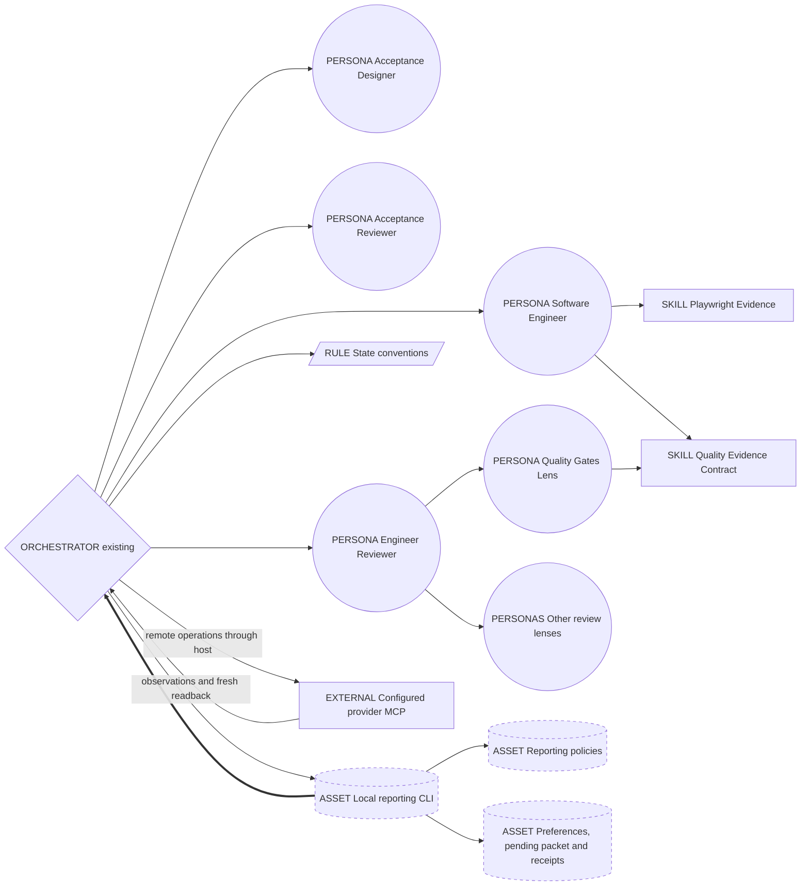
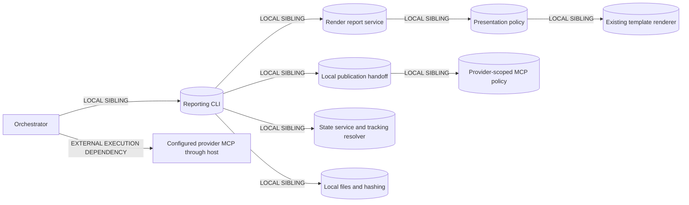

# PR Markdown reporting: compact Genesis handoff

Date: 2026-09-17; MCP pivot approved 2026-09-18; host gh fallback and canonical skill consolidation approved 2026-09-19. Status: integration and validation in progress.
Audience: maintainers. Plan-only rationale, not runtime instructions or an agent catalogue.

## Current Genesis ownership: one bundled GitHub protocol

This consolidation supersedes the optional external `gh-cli` skill dependency in the
earlier fallback design. Execution stays unchanged: MCP first, conditional host `gh`
for GitHub. The shipped [github-search-protocol](../../../plugins/skraft-framework/skills/github-search-protocol/SKILL.md)
owns GitHub transport policy and operations; its publication reference is loaded only
for prepared Markdown publication. Discovery keeps its existing reference and semantics.
The [shared publication lifecycle](../../../plugins/skraft-framework/assets/reporting/mcp-publication.md)
owns provider-neutral local handoffs and receipts, plus Azure DevOps/GitLab mappings.

### Consolidated component ownership



### Consolidated sequence and single writer

```mermaid
sequenceDiagram
  participant O as Existing orchestrator
  participant R as Shared publication lifecycle
  participant S as Bundled github-search-protocol
  participant H as Host MCP or conditional gh
  participant C as Local reporting CLI
  O->>R: Read local lifecycle and confirmed provider
  opt GitHub selected
    O->>S: Load prepared-publication route, not discovery
    S-->>O: Canonical GitHub procedure from lazy reference
  end
  O->>C: Prepare saved Markdown
  O->>H: Observe through selected transport per skill
  H-->>O: Actual observations
  O->>C: Decide locally
  opt Authorized publication
    O->>H: Write if needed and request fresh readback
    H-->>O: Actual readback
    O->>C: Record local comparison
  end
  Note over O,C: Same writer, handoffs and review ownership; no new spawn
```

### Composition and interface boundaries



| Owner | Input / responsibility | Output / boundary |
|---|---|---|
| Orchestrator | Confirmed provider and existing report artifacts | Routing and host calls; no copied GitHub recipes or report authoring |
| github-search-protocol | Discovery intent or prepared GitHub publication | Select relevant reference; own GitHub MCP mappings, gh fallback and probes |
| Shared lifecycle | Confirmed destination and saved Markdown | Provider-neutral handoff, observation/receipt contract and recovery; Azure DevOps/GitLab mappings |
| Local CLI | Saved packet and actual host observations | Same deterministic local comparison; no remote transport |
| README / handbook | Reader following the report artifact flow | Short behavior explanation and canonical link, not another procedure |

All knowledge ships locally; external primitive modules required: none. Host MCP and
installed `gh` are execution capabilities, not companion skills. Both runtime surfaces
retain native headers; synchronization is a packaging requirement, not another source
of GitHub policy. This documentation pass changes no runtime surface.

Rationale: R3 moves shared GitHub procedure under its existing skill; R2 consolidates
duplicate authority. B4 preserves the handoff, B8 loads the relevant reference, B13
keeps procedure context lazy. Existing A2 pipeline and A9 supervised execution remain.
Stable skill identity and discovery behavior stay intact. README and handbook link to
the owner so changing transport does not require editing four explanations in lockstep.

Cost stance: balanced. Projection is qualitative: fewer repeated procedure blocks,
unchanged model dispatch count, no added inference calls. No measured token savings,
price, cache hit rate or cost-free execution is asserted.

## Earlier transport delta, aligned with consolidated ownership

This delta replaces the prior categorical CLI-fallback prohibition, not the local-only
reporting CLI boundary. MCP remains first. Only GitHub with absent MCP or a required
capability not exposed can use installed host-terminal `gh`; announce the selection.
Azure DevOps/GitLab stay MCP-only, with no automatic `az`/`glab` fallback.



The transport delta preserves the same local prepare/decide/record handoff and single
writer. GitHub probing, fallback, recovery and provenance details belong to the bundled
skill and shared lifecycle linked above, not this historical sketch. No restored network
adapter, MCP SDK, provider client or package is introduced. Common substrate remains
sufficient; no new spawn or tool-permission expansion is required.

Documentation ownership: plugin README, paired FR/EN DISTILL/DELIVER pages and this
plan only. Runtime skill/assets, descriptors, synchronization, source and tests remain
outside this pass. Citation/build checks do not imply live transport certification.
The detailed MCP baseline below retains report interfaces and phase flow; the current
ownership diagrams above govern GitHub transport selection.

## Intent and authority

Make approved plans and actual delivery evidence readable in user-selected Markdown
comments without replacing the engineering chain. This packet condenses the session
plan's latest approved **host-MCP pivot**, superseding script-owned network publication.
The earlier Markdown clarification still excludes hosting. No report upload, release
asset, hosted HTML, storage budget, attachment byte quota, or automatic binary transfer.
No new reporting agent, skill entrypoint, engineering phase, merge, or issue closure.

Optional product preflight remains `backlog-discoverer` then `backlog-planner`.
`skraft-orchestrator` remains the single engineering entrypoint for
`RESEARCH → DESIGN → DISTILL → DELIVER`. Reporting projects existing artifacts at
review boundaries; it does not manufacture evidence or a second approval authority.

## Components

Existing personas/skills/rules retain ownership; dashed assets are new reporting work.
The local CLI is deterministic code, not a spawned thread. The orchestrator separately
invokes the configured provider's MCP tools through its host; the CLI has no remote calls.



## Sequence and single writer

Agent participants are existing threads; local CLI and host MCP are separate execution
boundaries. The orchestrator is the sole publication caller. Existing reviewer fan-out
is unchanged; other core lenses stay mandatory, capability lenses remain conditional.

```mermaid
sequenceDiagram
    participant O as Orchestrator
    participant D as Acceptance Designer
    participant A as Acceptance Reviewer
    participant E as Software Engineer
    participant R as Engineer Reviewer
    participant Q as Quality Gates Lens
    participant L as Other review lenses
    participant C as Local reporting CLI
    participant M as Configured provider MCP through host
    O->>C: setup confirmed provider, target and consent
    O->>D: Approved design and acceptance criteria
    D-->>O: Scenarios, test plan, expected impact refs
    O->>A: Original artifacts and forecast inputs
    A-->>O: Persisted approval or defects
    O->>C: render forecast once; prepare selected destination
    C-->>O: Exact marked body, digest, target or pending
    O->>M: Read viewer, target/head and complete comments
    M-->>O: Actual outputs with server/tool provenance
    O->>C: decide normalized observation snapshot
    C-->>O: create / update / unchanged / pending
    opt Authorized create or update
      O->>M: Write exact packet body to selected target
      M-->>O: Write result and IDs
    end
    opt Non-pending decision
      O->>M: Fresh comment readback
      M-->>O: Body, author, IDs, target and URL if returned
      O->>C: record normalized readback with provenance
      C-->>O: Locally compared host-MCP receipt
    end
    O->>E: Approved plan, forecast refs, selected media cap
    E-->>O: Code, quality evidence, change log, actual impact and media refs
    O->>R: Raw evidence and report inputs
    par Existing quality review
        R->>Q: Evidence contract and scoped raw refs
        Q-->>R: Gate findings
    and Other existing reviews
        R->>L: Isolated inputs; cold reader gets no producer journal
        L-->>R: Independent findings
    end
    R-->>O: Canonical persisted verdict
    O->>C: Completion or blockage: render outcome; prepare
    Note over O,M: Repeat host read, local decide, authorized host write, fresh host read, local record
    Note over O,C: Issue pointer requires matching PR receipt with returned URL; chat summary from honest status
    Note over O: Publication failure retries saved Markdown, never engineering
```

Without a selected PR, the forecast remains pending. Draft creation is a separate
user-approved action, with separately scoped push consent and real branch changes;
the reporting CLI does neither. Re-run setup with the confirmed PR identity afterward.
Never infer a target from an active editor PR or create empty commits for reporting.

## Dependencies and composition



| Component group | Composition / ownership |
|---|---|
| Orchestrator checkpoints | INLINE routing only; no capture, gate execution, or review synthesis |
| Designer / engineer | LOCAL SIBLING existing personas; own forecast interpretation / actual evidence |
| Acceptance reviewer / engineer reviewer / lenses | LOCAL SIBLING existing personas; validate original artifacts; reviewer owns verdict |
| Playwright / quality evidence skills / state rule | LOCAL SIBLING existing contracts; no duplicated taxonomy or thresholds |
| CLI / policies / preferences / receipts | LOCAL SIBLING deterministic assets; application services coordinate IO ports; domain owns pure validation/presentation |
| Configured provider MCP server | EXTERNAL EXECUTION DEPENDENCY of orchestrator's host, not a CLI transport or SDK dependency |

Targets: common-only design, both existing Copilot and Claude runtime surfaces.
Invocation: FORCED at existing start/resume, approved DISTILL, completion/blockage,
and publication retry checkpoints; no discovery description. External primitive
modules required: none. Local Node/Git and the host's configured, authenticated MCP
server are execution dependencies, not new package dependencies. No MCP SDK/client,
provider HTTP implementation, automatic server installation or token management.
The retired script-owned GitHub transport stays removed; conditional host-terminal
gh above reuses local handoffs instead. This packet stays outside the distributed runtime.

Provider references: [official GitHub MCP](https://github.com/github/github-mcp-server)
for PR conversation/issue comments; [official Azure DevOps MCP toolset](https://github.com/microsoft/azure-devops-mcp/blob/main/docs/TOOLSET.md)
for PR comment threads and work-item comments; [community GitLab MCP](https://github.com/zereight/gitlab-mcp)
as an available candidate for MR/issue notes. These are reporting targets, not promises
of full Azure DevOps/GitLab engineering-pipeline support. Official GitLab operation
coverage and live installed availability remain unverified.

Server existence is not capability evidence. The host must discover actual exposed
tools and schemas, then probe identity, exact target/head, complete comment pagination,
fresh body reads and required create/update capabilities. Names vary by installation;
no fixed host namespace is assumed. Absent GitHub MCP or unexposed required capability
may use the declared host-gh route; denied access and remaining gaps stay pending for
user-managed configuration, without installation or guessed transport.

## CLI and handoff interfaces

The [MCP CLI acceptance contract](../../../tests/skraft-framework/reporting/report-mcp-cli.acceptance.test.mjs)
defines these commands for [the reporting CLI](../../../plugins/skraft-framework/src/cli/report.mjs).
The [handoff acceptance contract](../../../tests/skraft-framework/reporting/report-mcp-handoff.acceptance.test.mjs)
covers local decisions and readback comparisons. Neither suite proves installed MCP
availability, live publication or completed end-to-end integration.

| Command arguments | Input → output / owner |
|---|---|
| `setup --slug <slug> --data <preferences>` | Explicit choices → `userPreferences.reporting` through state service; existing initialized state required |
| `render --slug <slug> --data <report-data> --out <markdown>` | Producer data + source refs + persisted media cap → local Markdown |
| `prepare --slug <slug> --story <story> --kind forecast\|outcome --body <markdown> --destination pr\|issue` | Existing body + consent → persisted marked packet, digest and provider-scoped target, or pending |
| `decide --slug <slug> --data <snapshot>` | Normalized host observation → persisted create/update/unchanged/pending decision |
| `record --slug <slug> --data <readback>` | Normalized fresh host readback → local comparison against saved packet/decision and per-target receipt |
| `status --slug <slug>` | Pending work first with previous scoped receipt; otherwise last receipt, or `idle` when neither exists; no engineering dispatch |
| `abandon --slug <slug> --reason <reason>` | Explicit human confirmation + nonblank reason → archive unresolved local packet/decisions before clearing pending work; preserve receipts, no remote undo |

All seven commands are local; none invokes MCP or makes remote calls.

Preferences: `confirmed`, `provider`, `host`, `repo`, `branch`, `prNumber`, `issueNumber`,
`destinations: {pr: boolean, issue: link|full|none, chat: boolean}`, `maxMedia`,
`allowDraftPr`. No inferred consent or hard media default; `maxMedia` is explicitly
chosen at startup, including zero. PR enabled means full report; recommended choice
is PR full + issue link + chat summary, not an automatic selection.

`provider` is `github`, `azure-devops` or `gitlab`; omitted means legacy GitHub.
`host` defaults to the provider's public host. GitHub `repo` is `owner/repo`;
GitLab retains nested group/project paths. Azure DevOps additionally requires
`organization` and `project`, with repository name or ID in `repo`. Existing
`prNumber` means PR number or GitLab MR IID (project-local identifier), not note ID;
`issueNumber` means issue number or Azure DevOps work-item ID. Destinations `pr` and
`issue` remain wire aliases. Azure PR comments also retain thread and comment IDs;
unsupported GitLab string discussion-ID mapping stays pending, not coerced to a number.

Report input: `kind`, `story`, `revision`, `title`, `language`, `impact`, `criteria`,
`limitations`, `media`, and explicit `testPlanRef` or `qualityEvidenceRef`,
`reviewRef`, `changeLogRef`. `renderReport(data, {readText, hashText})` reads evidence;
`preparePublication`, `decidePublication` and `recordPublication` compose pure
provider-scoped policy with injected hashing. The host agent reads the exact prepared
Markdown and invokes the configured MCP with that body, then requests fresh readback.
Full destinations reuse the same rendered body; issue link mode uses the prior
matching PR/MR receipt URL. Two stable PR/MR comments represent
forecast and outcome for the story/report identity, not one comment per retry.

Internal receipts: compact producer refs/revision/blockers, existing reviewer verdict
path and lens findings, plus publication `targets` and optional `chatSummary`.
Publication receipts are separate from phase state so retries work at `DONE` without
rolling back engineering. Partial failure stays visible; returned summary text is not
proof that chat was delivered. Retry uses saved Markdown: `status` → `prepare` →
host read → `decide` → authorized host write → fresh host read → `record`.

Snapshots normalize actual MCP outputs: target, branch, viewer, comments, completeness,
capabilities and `provenance: {server, tool}`. Raw tool results/transcript references
retain contributing calls and pages. Readback carries exact body, author, optional returned URL,
comment/thread IDs and write result when applicable. These are observations, never
caller replacements for the CLI-owned pending packet or decision. One unresolved
ready handoff per plan prevents another destination from replacing its authority.

`record` compares exact body/digest, identity, branch, full provider scope and URL when supplied.
Without a browser URL it still records `published` with scoped IDs, provenance and
`urlStatus: unavailable`; dependent issue pointers stay pending. No permalink is invented.
Receipt labels `verification: host-mcp-readback` and `localValidation: body-target-match`
describe a locally compared host attestation, **not independent script network
verification**. Incomplete reads, unknown identity, scope mismatch, conflicting manual
edits or missing update capability stay pending; no duplicate-create fallback. After
uncertain writes, fresh observation precedes any retry. No cross-machine atomicity
or compare-and-swap guarantee. An installed older CLI without these commands requires
a user-managed upgrade, not fallback to the retired network publisher.

`status` prioritizes the pending envelope over an older receipt, reports changed prepared
scope and filters previous receipt targets to the current scope without rewriting disk
receipts. With no pending work it returns the last receipt, or `{status: idle}` when
neither exists. If reconciliation cannot finish, explicit human confirmation and a
nonblank reason are required before `abandon`. It archives the complete unresolved local
packet/decision envelope before clearing pending work, even after a scope change;
archive failure leaves the pending attempt intact. Existing receipts and pipeline state
remain unchanged. Remote outcome stays unresolved or unknown: abandonment neither
cancels nor undoes or deletes a remote write.

Existing dispatch deltas only; no new spawn:

| Existing recipient | Role / internal brief → receipt | Reporting handoff |
|---|---|---|
| Acceptance Designer | implementer / compact → artifact refs | Approved AC/design → test plan, forecast inputs, unresolved items |
| Acceptance Reviewer | reviewer / compact → existing verdict path | Original plan + forecast inputs → traceability/planned-status findings |
| Software Engineer | implementer / compact → evidence refs | Approved plan + capture choice → actual impact, quality log, media, blockers |
| Engineer Reviewer | reviewer / compact → existing verdict path | Raw refs → unchanged panel and canonical synthesis |
| Quality Gates Lens | reviewer / scoped → existing findings | Evidence contract + raw proofs → contradictions, not repairs |
| Other lenses | existing roles / unchanged isolated briefs → findings | No added producer context for cold reader |

## Report truth and ownership

External artifacts use normal human prose: expected impact, criterion-to-test
traceability and planned tests in forecast; expected versus actual impact, recorded
tests/build/static checks/coverage/mutation evidence, review, changes and limitations
in outcome. Forecast follows approved DISTILL, never claims tests already passed.
Outcome is emitted at completion or blockage and states incomplete work honestly.
Metrics require actual evidence; delivery does not imply deployment.

Local proof verification and recorded reviewer verdict remain distinct. In the current
renderer G8/G9 stay `UNVERIFIED` because Git-object checks belong to the reviewer.
Missing/stale/malformed evidence is not success. Frontend producers own Playwright
capture and reviewers validate it; report rendering does not run browsers. Only
already remotely accessible evidence receives links; local-only evidence is explicitly
unavailable remotely. URL syntax validation is not an accessibility test. The selected
`maxMedia` limits report links, not evidence retained for review; omissions stay visible.
No new capture run merely to format a report, no upload, hosting, or fake attachment.

## Pattern choices and cost rationale

- R1/R4: no new reporting persona or thin proxy. R3/R5: share policies and deterministic
  projection instead of repeating report prose in each agent or destination.
- A2 PIPELINE: preserve ordered artifact handoffs. Avoid STAGE COLLAPSE, INFINITE
  PLANNING, TASKS WITHOUT PLAN.
- A9 SUPERVISED EXECUTION: human-selected target → local preparation → host MCP
  operations → fresh host readback → local comparison; no independent CLI fetch claim.
- B4 PLAN MEMENTO: persisted preferences, artifact refs and publication receipts.
- B8 ATTENTION ANCHOR: reload choices and pending publication at resume/retry.
- B13/B15: stable contracts precede variable refs/receipts; discover only the selected
  provider's required tool subset. No new reporting model; cache savings are not guaranteed.
- S7 DETERMINISTIC TOOL BRIDGE: local services format, hash and compare; remote execution
  stays in the host: MCP first, conditional gh per the delta above. R5 keeps the retired
  script network adapter removed. Existing specialists retain impact judgment.

[Genesis tradeoff matrices](../../../.agents/skills/genesis/assets/pattern-tradeoffs.md):
section 9 assigns facts/side effects to tools and interpretation to specialists;
section 10 long synthesis output → S7, long-lived prefix → B13;
section 11 external reports use normal prose, internal receipts stay compact.

Cost stance: balanced; no cap supplied. **No new reporting spawn; no cost-free claim or
measured price.** Existing implementer/reviewer classes and dispatch count remain
unchanged. Local CLI phases use CPU, not model inference, but the agent must see and
transmit the Markdown in MCP body arguments unless an actually exposed tool supports
file input. This can cost more output/context tokens than a file-based CLI transport.
More full destinations repeat body transmission and readback, not synthesis; prefer
issue links and chat summaries. Earlier numeric bands are superseded, unmeasured and
not a forecast for this pivot. No new pricing fetch or live spend.

## Pending validation and handoff

Provider mappings have local fixture tests only. No live MCP runs, installed-tool
capability certification or end-to-end host validation are claimed. Parent owns the
final regression run and legacy-test retirement; no unconfirmed final totals are
recorded here.

- [ ] Complete CLI integration and run offline reporting/state/MCP-handoff regressions:
  consent, scope changes, missing PR, body reuse, marker recovery, read-back failure,
  partial success, forged snapshots/packet replacement and retry at `DONE`; no remote writes.
- [ ] Retire only unreleased GitHub transport tests after successor handoff/CLI coverage;
  retain local setup/render/security behavior. Removed tests are migrated, not counted as passes.
- [ ] Validate evidence truth: missing/stale hashes, unknown schemas, legacy gaps,
  planned versus executed, G8/G9 reviewer ownership, escaping and path confinement.
- [ ] After CLI integration, check existing producer/reviewer routing on both harnesses;
  preserve mandatory lenses and cold-reader isolation. No extra reporting dispatch.
- [ ] Check frontend accessible-link/local-only/zero-cap behavior; review evidence
  independently of the report's bounded media selection.
- [x] Canonical-skill documentation consolidation, 2026-09-19: paired FR/EN narrative,
  ribbons and illustrative examples retained; all four skill links use localized
  dashboard anchors through `relative_url`. Owned docs contain no retired publication
  links or external companion requirement. Whitespace and editor diagnostics clean;
  citation validation passed.
- [x] Jekyll handbook build passed with disk cache disabled and destination under
  the temporary directory. No generated site files were written into the repository.
- [ ] Browser smoke, Mermaid rendering and remote source links were not checked;
  catalogue/drift scans were not run in this six-document pass.
- [ ] Probe installed provider tools and schemas; validate actual host normalization and
  readback separately. Offline fixtures do not prove tool exposure, auth or provider access.
- [ ] After offline checks, seek separate approval for live eval spend and a dedicated
  issue/draft-PR smoke. Cases: approved plan forecast, blocked outcome, lost connection
  retry without duplicate comments. No new skill entrypoint means no new trigger eval.

Open findings: HIGH integration not yet verified; HIGH remote media accessibility must
not be inferred from URL shape; BLOCKER external writes without scoped consent or
publication claims without read-back. No gate threshold changes or fabricated adapter
evidence. This documentation task runs no engineering tests, provider calls or commits;
official public documentation may be read to verify command syntax.

## HUMAN_RATIONALE — never copy into runtime briefs

The specialists already own the facts, and reviewers already own the quality decision.
A deterministic Markdown bridge exposes those artifacts without buying another agent
or moving engineering into the router. Two stable comments let reviewers compare the
approved forecast with the outcome. Separate publication receipts keep a network
failure from masquerading as an engineering failure or causing an expensive rerun.

Source anchors: [preferences](../../../plugins/skraft-framework/src/domain/reporting-preferences.mjs),
[render service](../../../plugins/skraft-framework/src/application/render-report.mjs),
[presentation policy](../../../plugins/skraft-framework/src/domain/reporting-presentation.mjs),
[local handoff service](../../../plugins/skraft-framework/src/application/report-publication-handoff.mjs),
[MCP policy](../../../plugins/skraft-framework/src/domain/report-mcp-policy.mjs),
[host MCP protocol](../../../plugins/skraft-framework/assets/reporting/mcp-publication.md),
[state service](../../../plugins/skraft-framework/src/application/state-service.mjs).