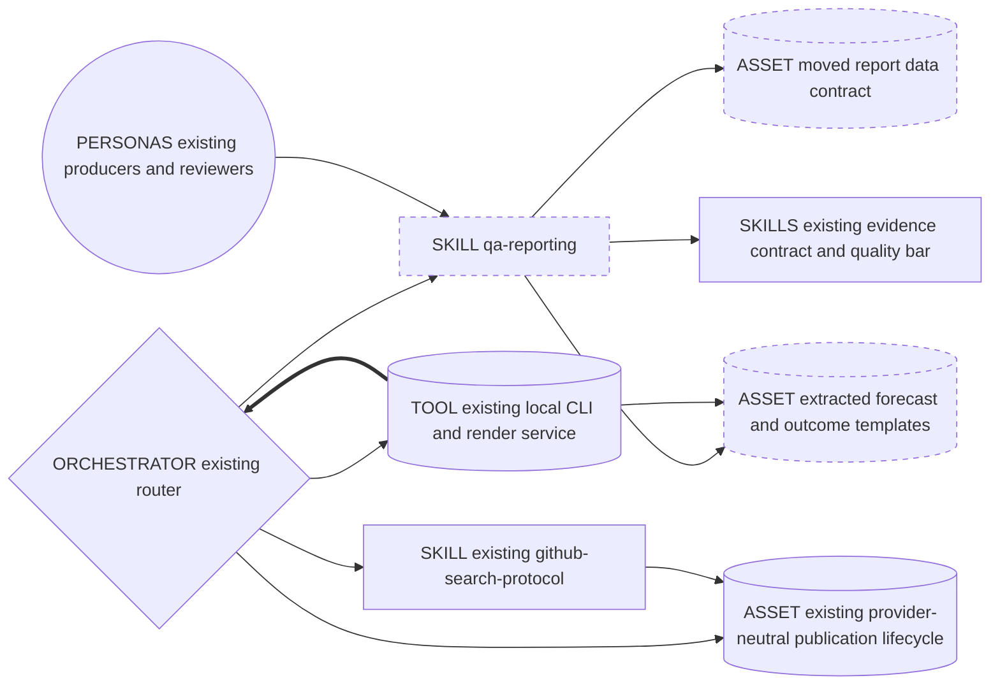
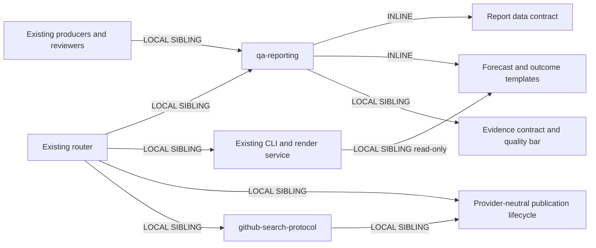

# QA reporting skill: definitive reduced-scope Genesis packet

Date: 2026-09-19. Status: approved design; source extraction in progress,
integration validation pending. Audience: maintainers, not runtime instructions.
This packet supersedes earlier company-override, profile, resolver and configuration
proposals. The [earlier reporting plan](2026-09-17-pr-markdown-reporting.md) remains
historical context for the unchanged publication lifecycle, not QA ownership.

## Intent and boundary

Group QA report guidance, the canonical report data contract and bundled forecast/outcome
Markdown templates in one `qa-reporting` skill. Existing specialists supply facts,
existing reviewers own verdicts, scripts render the actual bundled templates, and the
router coordinates publication. Generated data, Markdown and receipts stay in the
consumer project's resolved tracking directories, never in the installed skill.
No company override, profile, path resolver, new configuration key, agent, review
panel, external module or speculative extension point. Existing evidence rules,
CLI flags, output locations and publication behavior remain unchanged.

## Component diagram

Dashed nodes identify the new skill or moved/extracted assets; other nodes already
exist. Deterministic CLI is a tool, not a reporting thread.



## Sequence and single writer

```mermaid
sequenceDiagram
  participant O as Existing router thread
  participant S as Existing specialist thread
  participant V as Existing reviewer thread
  Note over O,V: Load QA skill and triggered contract; no reporting thread
  O->>S: Existing work plus canonical report contract and source refs
  S-->>O: Forecast or outcome data and evidence refs
  O->>V: Original artifacts and report inputs
  Note over V: Existing review and lens isolation unchanged
  V-->>O: Persisted verdict and findings
  Note over O: Bind review ref; invoke local CLI to render bundled template
  Note over O: Save report in consumer project tracking, not skill bundle
  Note over O: Existing lifecycle and GitHub skill govern authorized host publication
  Note over O: Single writer retains pending packet and readback receipt
```

Forecast follows approved DISTILL. Outcome records approved or blocked DELIVER and
available proof honestly. A publication-only retry reuses saved Markdown without
another specialist, reviewer, test run or render. No new spawn or fan-in.

## Dependency graph and composition



| Component | Composition / interface |
|---|---|
| `qa-reporting` | LOCAL SIBLING skill shared by router, producers and reviewers; BOTH explicit QA report requests and FORCED reporting boundaries; existing report data and source refs in, preparation guidance and render handoff out |
| Contract and templates | INLINE skill assets; contract owns data semantics, templates own Markdown layout; loaded only for preparation/checking or rendering the selected kind |
| Producers / reviewers | LOCAL SIBLING existing personas; original artifacts in, same data/evidence refs or persisted verdict out; no transport ownership |
| Router | Existing ORCHESTRATOR with INLINE routing only; exact returned refs and verdict in, local CLI requests and authorized host calls out |
| CLI / render service | LOCAL SIBLING deterministic code; `renderReport` accepts `readTemplate` alongside existing ports; validated view plus fixed kind selects template, returns Markdown; no network |
| Evidence contract / quality bar | LOCAL SIBLING authorities; QA guidance links to them, never duplicates or changes evidence schema, thresholds or approval rules |
| Publication lifecycle / GitHub skill | LOCAL SIBLING existing owners; saved Markdown plus confirmed destination in, unchanged host handoff and locally compared receipt out; GitHub transport remains outside QA |

Targets: **common-only**, deployed through existing Copilot and Claude surfaces.
File reads and existing CLI execution suffice; preserve client-specific headers.
External primitive modules required: **none**; no dependency declaration added.
Host transport capabilities remain pre-existing execution dependencies, not new skills.

## Source placement and interface details

Planned bundle, rooted under the existing plugin:

```text
plugins/skraft-framework/skills/qa-reporting/
  SKILL.md
  references/report-contract.md
  assets/templates/forecast.md
  assets/templates/outcome.md
```

The [QA entrypoint](../../../plugins/skraft-framework/skills/qa-reporting/SKILL.md) owns
the [report contract](../../../plugins/skraft-framework/skills/qa-reporting/references/report-contract.md).
Move the previous generic contract into this bundle; update consumers rather than
leaving a second authoritative copy. Keep the
[provider-neutral lifecycle](../../../plugins/skraft-framework/assets/reporting/mcp-publication.md)
and [GitHub skill](../../../plugins/skraft-framework/skills/github-search-protocol/SKILL.md)
in place. Generic publication consent, observations, recovery and receipt contracts
do not become QA procedures.

The [render service](../../../plugins/skraft-framework/src/application/render-report.mjs)
gets a read-only template port supplied by the existing CLI from the plugin root.
Selection is fixed to `forecast` or `outcome`, with no path override. Domain logic
maps validated data/proofs to the safe presentation view; Markdown layout moves into
the two actual templates. Reuse existing template rendering, with no duplicate
hardcoded default layout. Missing bundled template fails visibly. Preserve exact
EN/FR default output, escaping, evidence validation, metadata and file confinement.

Dispatch description sketch: Use when preparing a QA forecast from an approved test
plan or an outcome report from delivery evidence, including a blocked delivery or a
request to summarize planned versus observed checks. Not for running tests, changing
gates or publishing already prepared Markdown. Body target: under 120 lines; lazy
contract reference, no duplicated transport instructions.

## Design and compliance

R3 EXTRACT shared report knowledge/layout; R2 consolidate contract ownership. Retain
A2 PIPELINE and A9 SUPERVISED EXECUTION, B4 persisted plan/receipts, B8 boundary
re-grounding, B13 stable lazy skill context and S7 deterministic rendering.
Retain A2 anti-pattern prohibitions: STAGE COLLAPSE, INFINITE PLANNING, TASKS WITHOUT
PLAN. SRP separates QA content, evidence authority, rendering and transport; DIP
keeps template IO behind a port. PROSE: lazy references, reduced scope, existing
composition, unchanged safety rules and explicit ownership. No new model routing.

## PER-SPAWN DECLARATION TABLE

Runtime delta: **zero new calls/spawns**. Existing affected handoffs only:

| Existing role | Audience / tier | Brief / receipt | Reason |
|---|---|---|---|
| Designer or engineer | INTERNAL / IMPLEMENTER | CAVEMAN_LITE / JSON_RECEIPT | Return artifact refs, not full logs |
| Reviewer | INTERNAL / REVIEWER | CAVEMAN_LITE / existing verdict receipt | Preserve independent judgment and lens isolation |

SPAWN_BRIEF producer: READ QA contract and approved source refs. EMIT existing report
data and proof refs. NO publication, fabricated metrics or gate changes.
RECEIPT_SCHEMA: existing artifact paths, report data ref, evidence refs and blockers;
not a new runtime wire format.

SPAWN_BRIEF reviewer: READ original artifacts, report data and canonical evidence
rules. CHECK consistency in existing review. NO report repair or gate weakening.
RECEIPT_SCHEMA: existing persisted verdict path and findings; no second verdict schema.

EXTERNAL_ARTIFACT_SPEC: forecast/outcome reports use NORMAL prose in selected EN/FR
language, same default sections and factual fields. Planned is not executed; unknown
is not pass; local evidence is not a remote attachment. Internal receipts stay compact.

## COST PROJECTION

Stance: balanced; no cap supplied. Existing implementer/reviewer classes unchanged.
Skill/contract prefix S (under 5k tokens), receipt output S (under 500); render/template
work uses CPU, not inference. Extra model calls: **0** for S single-story, M known-module
and L cross-module workloads. No per-destination synthesis or additional coordination
loop. Existing report transmission/readback and source-context replay still cost work.

Incremental one-load guidance planning bands: S 0.5-1k, M 1-2k, L 2-4k input tokens;
compact receipt 50-150 output tokens. These are unmeasured planning estimates, not
whole-workflow totals or guaranteed net savings; moved contract reads replace existing
reads. Stable prefixes favor reuse, but cache hit rate is not promised. Dollar range
pending current pricing/trace verification; no network lookup or billing claim here.
Genesis cost-shape matrix section 10: long synthesis -> S7; stable repeated context ->
B13; verbose internal channels -> B14b/B14c. Audience matrix section 11 keeps reports
human-readable. No stale price copied from the historical plan.

## Validation and dependent todos

All source/integration checks below are **pending**, not implied by this docs packet.

1. Characterize exact EN/FR forecast/outcome outputs through render/CLI boundaries;
   capture RED for actual template loading and obtain independent inspection.
2. Extract templates and wire read-only template IO; depends on 1. Prove missing
   template failure and actual template composition without weakening existing checks.
3. Add skill, move contract, update callers in both harnesses and sync metadata;
   depends on 2. Remove stale links and duplicate defaults; preserve native headers.
4. Reflect ownership in plugin README and equivalent FR/EN DISTILL/DELIVER sections;
   localized dashboard `#skill-qa-reporting`, no extra skill pages or manual catalogue.
5. Validate default parity, existing security/metadata/CLI regressions, synchronization,
   source-derived catalogue anchor, citations, links and handbook build; depends on 2-4.
   This docs-only pass owns documentation checks, not source/test execution.

Open findings: HIGH template integration/parity and metadata synchronization pending;
MEDIUM live skill specification, trigger selection and cost estimates unverified.
No live provider validation, paid eval, mutation/coverage certification or release
readiness claimed. No runtime/code/test edits, commit, network or graph work in this
documentation pass.

Documentation checks, 2026-09-19: citations and handbook navigation/internal links
passed; 33 local Markdown destinations checked across README and both plan documents.
FR/EN QA links use localized dashboard anchors; existing citations and Starbucks
examples unchanged. Jekyll build passed into temporary output with disk cache disabled.
Owned-file whitespace and editor diagnostics clean. No obsolete report-contract links
found in docs; historical plan untouched. Source-derived dashboard regeneration,
browser/anchor rendering and runtime integration remain pending.

### EVALS PLAN (separate approval; no specs or runs in this pass)

With/without-skill content comparisons, judged by outcomes rather than named technique:

| Natural prompt | Expected outcome |
|---|---|
| Summarize what this approved plan will check before implementation. | Forecast uses approved inputs; no executed-test or passing-gate claim |
| Prepare the delivery summary from these records; one check never ran. | Outcome keeps missing proof explicit and preserves recorded review |
| This delivery stopped; prepare the QA summary without rerunning anything. | Blocked outcome uses existing evidence and limitations, no execution or publication |

Trigger set: 20 queries, 60/40 train/validation split; no skill name in prompts.

| Split | Should trigger | Near miss: should not trigger |
|---|---|---|
| Train 1 | Prepare a QA forecast from this approved plan. | Run the unit tests. |
| Train 2 | Summarize planned acceptance checks. | Fix the failing build. |
| Train 3 | Draft a delivery evidence report. | Publish this already rendered Markdown. |
| Train 4 | Compare expected and observed QA results. | Configure GitHub authentication. |
| Train 5 | Report the checks missing from this blocked delivery. | Change an issue label. |
| Train 6 | Turn reviewed test evidence into a QA summary. | Refine the user story. |
| Validation 1 | Explain the approved verification plan before coding. | Capture a browser screenshot. |
| Validation 2 | Prepare the final quality report from these logs. | Lower the mutation threshold. |
| Validation 3 | Summarize delivered behavior and unverified checks. | Retry sending the saved comment. |
| Validation 4 | Make a forecast of the planned tests and impact. | Rewrite the installation README. |

Freeze fixtures and obtain separate evaluation approval before authoring specs or
spending. Validate outcome discrimination and discovery separately; forced loading
does not prove trigger selection. No measured skill benefit asserted.

## HUMAN_RATIONALE

The skill is a cohesive home for report preparation knowledge and the assets that
render it, not another worker. Existing specialists already know the facts and
reviewers already own approval. Keeping templates inside the skill makes their
ownership explicit while scripts preserve repeatable rendering. Separating generated
project reports from installed templates avoids mixing consumer evidence with plugin
source. GitHub transport remains reusable without importing QA content ownership.
Never copy this rationale into a spawn brief. Design ends here; reload this packet
before implementation work and preserve the reduced scope.