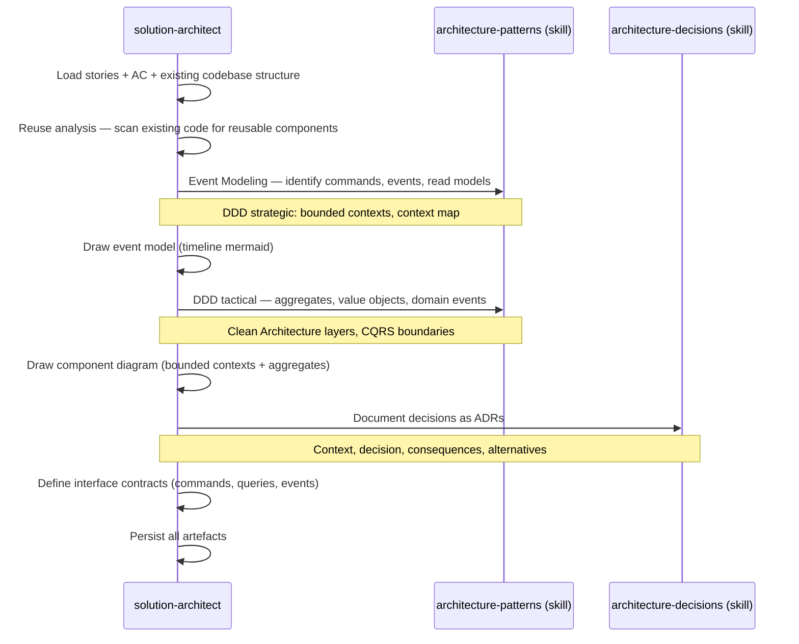

# Spec — Phase DESIGN : solution-architect

> Référence master : [`2026-05-12-skraft-sdlc-pipeline.md`](./2026-05-12-skraft-sdlc-pipeline.md)

## Contexte

La phase DESIGN transforme les stories raffinées (DISCUSS) en **décisions d'architecture** formalisées et en **contrats d'interface** exploitables par DISTILL. Agent spécialiste avec persona, skills profonds, et reviewer adversarial.

Aujourd'hui dans skraft, l'architecture émerge durant l'implémentation — l'engineer prend les décisions structurelles en codant. Résultat : des décisions implicites, non documentées, parfois incohérentes entre stories.

## Objectifs

1. Produire des ADRs (Architecture Decision Records) pour chaque décision structurelle.
2. Générer des diagrammes de composants (mermaid) montrant boundaries et dépendances.
3. Définir des contrats d'interface (signatures, DTOs, boundaries) avant implémentation.
4. Détecter les violations d'architecture via un reviewer adversarial.

## Hors périmètre

- Implémentation du code (c'est DELIVER).
- Infrastructure et déploiement (pas de phase DEVOPS).
- Choix technologiques hors scope du projet courant (frameworks, languages).
- Design patterns d'implémentation (c'est le skill `clean-architecture-testing` dans DELIVER).

---

## Modules à produire

| Module | Type | Pattern Genesis |
|---|---|---|
| `solution-architect` | Agent (PERSONA) | A3 ORCHESTRATOR-SAGA |
| `solution-architect-reviewer` | Agent (PERSONA) | A7 ADVERSARIAL REVIEW + B1 FAN-OUT |
| `architecture-patterns` | Skill | B8 ATTENTION ANCHOR |
| `architecture-decisions` | Skill | B8 ATTENTION ANCHOR |
| `architecture-review-criteria` | Skill (RULE) | S6 RULE BRIDGE |

---

## Agent : `solution-architect`

### Intent + scope (Genesis step 1)

**Capacité** : Transformer des stories raffinées en décisions d'architecture documentées via Event Modeling, DDD strategic/tactical design, diagrammes de composants, et contrats d'interface.

**Triggers** : L'utilisateur demande de "designer", "architecturer", "produire un ADR", "event modeling", "bounded context", "aggregate", ou le SDLC orchestrator entre en phase DESIGN.

**Boundary** : NE PAS implémenter. NE PAS écrire de tests. NE PAS modifier les stories (remonter à DISCUSS si ambiguïté).

**Dispatch description** (draft) :
> Use when designing software architecture for refined stories using Event Modeling, DDD strategic design (bounded contexts, context mapping), DDD tactical patterns (aggregates, value objects, domain events), producing Architecture Decision Records, component diagrams, and interface contracts. Activate on "design", "architect", "ADR", "event modeling", "bounded context", "aggregate", "domain event", "context map", or when the SDLC pipeline enters DESIGN phase.

### Inputs

| Source | Artefact | Obligatoire |
|---|---|---|
| DISCUSS | `stories-{milestone}.md` | ✅ |
| DISCUSS | `ac-draft-{story}.md` | ✅ |
| Codebase | Existing architecture files | Recommandé |

### Outputs

| Artefact | Format | Localisation |
|---|---|---|
| Event Model | Mermaid timeline (commands, events, read models) | `.skraft/sdlc/design/event-model-{story}.md` |
| ADR | Template markdown | `.skraft/sdlc/design/adr-{n}-{slug}.md` |
| Component diagram | Mermaid flowchart (bounded contexts, aggregates) | `.skraft/sdlc/design/diagrams-{story}.md` |
| Interface contracts | Signatures, DTOs, domain events | `.skraft/sdlc/design/contracts-{story}.md` |
| Context map | Mermaid relationships entre bounded contexts | `.skraft/sdlc/design/context-map.md` |

### Workflow interne



### Tools requis

- `readFile` — lire stories, AC, code existant
- `createFile` / `editFile` — écrire ADRs, diagrams, contracts
- `listDirectory` — scanner la structure existante
- `grep` / `search` — analyser les patterns dans le code existant

### Skills chargés

| Skill | Moment | Mode |
|---|---|---|
| `architecture-patterns` | Au démarrage | FORCED |
| `architecture-decisions` | Lors de l'écriture d'ADRs | FORCED |

---

## Agent : `solution-architect-reviewer`

### Intent + scope (Genesis step 1)

**Capacité** : Revue adversariale des décisions d'architecture, diagrammes et contrats produits par le solution-architect, via 3 lenses.

**Triggers** : Dispatché par le SDLC orchestrator après production des artefacts DESIGN, ou invoqué manuellement.

**Boundary** : NE PAS modifier les artefacts. Constater et reporter.

**Dispatch description** (draft) :
> Use when reviewing architecture decisions, component diagrams, or interface contracts for consistency, Clean Architecture compliance, and fitness for purpose. Dispatched after solution-architect produces DESIGN artefacts.

### Architecture (A7 + B1)

3 lenses parallèles :

| Lens | Responsabilité | Gates |
|---|---|---|
| **consistency-lens** | Les ADRs ne se contredisent pas. Les diagrammes reflètent les ADRs. Les contrats sont cohérents avec les diagrammes. | G1: ADR↔diagram coherence, G2: no contradicting decisions |
| **architecture-compliance-lens** | Les boundaries respectent Clean Architecture et DDD. Les dépendances pointent vers l'intérieur. Les aggregates encapsulent les invariants. Context map cohérent. | G3: dependency rule, G4: layer boundaries, G5: aggregate invariants, G6: context map consistency |
| **fitness-lens** | L'architecture résout le problème des stories. L'event model couvre le flux métier. Les contrats sont suffisants pour implémenter. Pas d'over-engineering. | G7: stories coverage, G8: event model completeness, G9: YAGNI compliance |

### Verdict

```yaml
verdict: approved | changes_requested | rejected
confidence: high | medium | low
lenses:
  consistency: {status, findings: [...]}
  architecture-compliance: {status, findings: [...]}
  fitness: {status, findings: [...]}
synthesis:
  blocking_findings: [...]
  recommendations: [...]
  dissent: [...]
```

---

## Skill : `architecture-patterns`

### Intent + scope

**Capacité** : Catalogue complet de patterns architecturaux couvrant Event Modeling, DDD (strategic + tactical), Clean Architecture, CQRS, et hexagonal, avec guidelines de sélection et d'application.

**Dispatch description** :
> Use when selecting architecture patterns for a new feature, performing Event Modeling, defining bounded contexts, choosing DDD tactical patterns, evaluating pattern fitness, or understanding how patterns compose. Covers Event Modeling methodology, DDD strategic design (bounded contexts, context mapping, subdomains), DDD tactical patterns (aggregates, entities, value objects, domain events, repositories, domain services), Clean Architecture, CQRS, hexagonal ports & adapters.

### Contenu attendu

- **Event Modeling** : méthodologie complète (timeline, commands, events, read models, slices). Comment partir des stories pour modéliser le flux d'événements. Notation visuelle et conventions mermaid.
- **DDD Strategic** : bounded contexts, context mapping (upstream/downstream, conformist, ACL, shared kernel, partnership), subdomains (core, supporting, generic), ubiquitous language.
- **DDD Tactical** : aggregates (invariants, consistency boundaries), entities, value objects, domain events, repositories, domain services, factories, specifications.
- **Clean Architecture** : couches, règle de dépendance, boundaries, use cases.
- **CQRS** : quand appliquer, séparation commands/queries, projection de read models.
- **Event Sourcing** : heuristique de décision ("Does knowing the history provide business value?"), quand utiliser (audit trail, temporal queries, multiple views, complex DDD, event-driven integration) vs quand ne pas utiliser (simple CRUD, no audit, no history value). Aggregate event lifecycle (receive command → validate → emit events → apply → persist). Event store (append-only, versioned, immutable facts in past tense). Projections & read models (disposable, eventually consistent, purpose-specific, rebuildable). Snapshots (every N events for performance). Sagas / process managers (cross-aggregate coordination, react to events, issue commands, maintain process state). Upcasting (event versioning — transform old event schemas during loading, weak schema first, explicit upcaster chains). Conflict resolution (retry default, merge domain-specific, reject critical ops). Eventual consistency mitigation (read-your-own-writes, optimistic UI, causal consistency). Outbox pattern (atomic event store + message broker update). Reservation pattern (uniqueness constraints in ES).
- **Composition** : comment les patterns se combinent (Event Modeling → DDD → Clean Arch → CQRS).
- **Decision matrix** : quel pattern pour quel type de problème.

### Références à inclure

- `references/event-modeling.md` — méthodologie Event Modeling complète avec exemples.
- `references/ddd-strategic.md` — bounded contexts, context mapping patterns.
- `references/ddd-tactical.md` — aggregates, value objects, domain events, repositories.
- `references/pattern-catalog.md` — fiches Clean Architecture, CQRS, hexagonal.
- `references/pattern-selection-matrix.md` — matrice de décision.
- `references/anti-patterns.md` — erreurs architecturales communes.
- `references/event-sourcing.md` — guide complet Event Sourcing : heuristique de décision, aggregate lifecycle, projections, snapshots, sagas, upcasting, conflict resolution, outbox pattern.

---

## Skill : `architecture-decisions`

### Intent + scope

**Capacité** : Méthodologie de documentation des décisions d'architecture sous forme d'ADRs, avec template, conventions, et lifecycle.

**Dispatch description** :
> Use when documenting architecture decisions as ADRs, evaluating trade-offs between alternatives, or managing the lifecycle of existing decisions. Covers ADR template, status transitions, and consequence analysis.

### Contenu attendu

- **Template ADR** : titre, statut, contexte, décision, conséquences, alternatives rejetées.
- **Conventions** : numérotation, nommage des fichiers, linking entre ADRs.
- **Lifecycle** : proposed → accepted → deprecated → superseded.
- **Trade-off analysis** : framework pour évaluer les alternatives.
- **ADR quality** : quand un ADR est suffisamment précis vs trop phase.

### Références à inclure

- `references/adr-template.md` — template vierge.
- `references/decision-drivers.md` — framework de trade-off analysis.

---

## Skill : `architecture-review-criteria`

### Intent + scope

**Capacité** : Critères de revue spécifiques aux artefacts DESIGN, utilisés par le `solution-architect-reviewer`.

**Dispatch description** :
> Use when reviewing DESIGN artefacts (event models, ADRs, component diagrams, context maps, interface contracts) for quality, DDD compliance, and architectural correctness. Contains gate definitions and scoring rubric for the solution-architect-reviewer lenses.

### Contenu attendu

- **Gates** : G1-G9 (voir table des lenses).
- **Scoring** : rubrique par gate.
- **Event Modeling validation** : complétude du flux (commands → events → read models), cohérence avec les stories.
- **DDD compliance** : aggregate invariants respectés, bounded context boundaries claires, context map cohérent.
- **Clean Architecture rules** : dependency rule formalisée, violations typiques.
- **YAGNI detection** : heuristiques pour identifier l'over-engineering.
- **Completeness** : quand un design est suffisant pour passer à DISTILL.

### Références à inclure

- `references/gate-definitions.md` — G1-G9 détaillées.
- `references/ddd-violations.md` — catalogue de violations DDD.
- `references/clean-arch-violations.md` — catalogue de violations Clean Architecture.
- `references/verdict-rubric.md` — table de décision.

---

## Intégration avec DISTILL

L'artefact clé du handoff DESIGN→DISTILL :

```markdown
# Design Package — {story}

## Event Model
→ event-model-{story}.md (timeline: commands → events → read models)

### Key flows:
- Command: `CheckEligibility` → Event: `EligibilityChecked` → ReadModel: `EligibilityResult`
- Command: `SubmitApplication` → Event: `ApplicationSubmitted` → ReadModel: `ApplicationStatus`

## Bounded Contexts
→ context-map.md

### Contexts:
- Eligibility (core subdomain) — aggregate: EligibilityCheck
- Application (core subdomain) — aggregate: InsuranceApplication
- Pricing (supporting subdomain) — downstream of Eligibility

## ADRs
- adr-001-cqrs.md — Applied CQRS for command/query separation
- adr-002-aggregate-design.md — One aggregate per bounded context
- adr-003-event-sourcing.md — NOT applied (simple state, no audit trail needed)

## Component Diagram
→ diagrams-{story}.md (bounded contexts + aggregates + dependencies)

## Interface Contracts
→ contracts-{story}.md

### Key contracts:
- `CheckEligibilityCommand` : Command DTO (input)
- `EligibilityChecked` : Domain event
- `EligibilityResult` : Read model DTO (output)
- `IEligibilityRepository` : Driven port
```

L'`acceptance-designer` consomme ce package pour aligner les scénarios Gherkin avec les bounded contexts, aggregates, et domain events.

---

## Genesis execution plan

| Step | Action | Output |
|---|---|---|
| 1-6 | Design `solution-architect` + reviewer + 3 skills | Handoff packet |
| 7-8 | Draft `solution-architect.agent.md` | Agent file |
| 7-8 | Draft `solution-architect-reviewer.agent.md` | Agent file |
| 7-8 | Draft `architecture-patterns/SKILL.md` + references | Skill folder |
| 7-8 | Draft `architecture-decisions/SKILL.md` + references | Skill folder |
| 7-8 | Draft `architecture-review-criteria/SKILL.md` + references | Skill folder |
