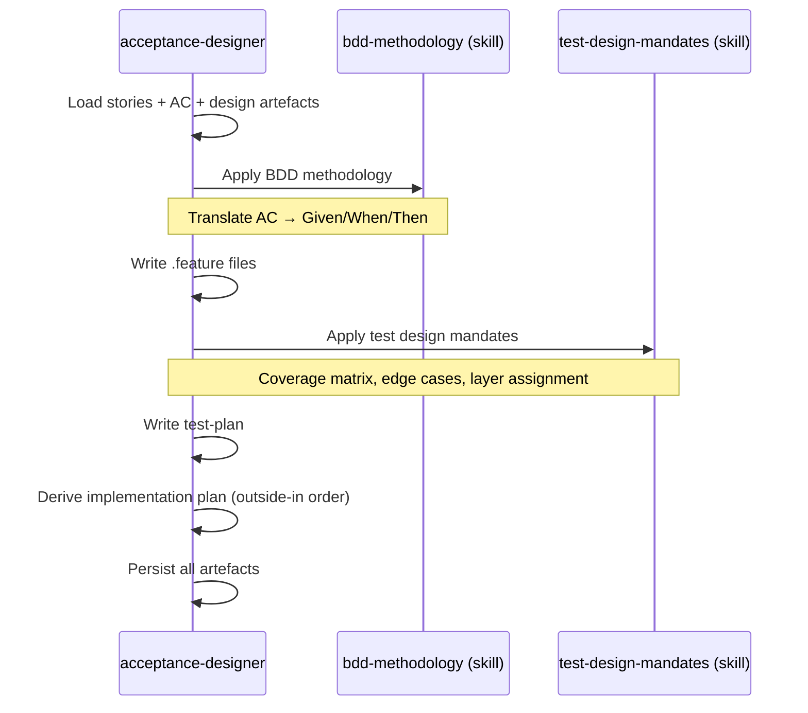

# Spec — Phase DISTILL : acceptance-designer

> Référence master : [`2026-05-12-skraft-sdlc-pipeline.md`](./2026-05-12-skraft-sdlc-pipeline.md)

## Contexte

La phase DISTILL transforme les artefacts de design (ADRs, diagrammes, contrats d'interface) en **scénarios Gherkin exécutables** et en **plan d'implémentation** consommable par la phase DELIVER. C'est le pont entre l'architecture et le code.

Aujourd'hui, cette traduction est faite manuellement ou ad-hoc par le `software-engineer` qui découvre les comportements en codant. Résultat : des tests qui suivent l'implémentation au lieu de la guider.

## Objectifs

1. Produire des scénarios BDD Given/When/Then formels avant toute implémentation.
2. Garantir la couverture des acceptance criteria définis dans DISCUSS.
3. Générer un plan d'implémentation structuré (étapes ordonnées) pour l'engineer.
4. Détecter les trous de couverture via un reviewer adversarial dédié.

## Hors périmètre

- Exécution des tests Gherkin (c'est DELIVER qui implémente).
- Modification des acceptance criteria (c'est DISCUSS qui les raffine).
- Tests unitaires ou d'intégration (le test plan les mentionne mais DELIVER les écrit).

---

## Modules à produire

| Module | Type | Pattern Genesis |
|---|---|---|
| `acceptance-designer` | Agent (PERSONA) | A3 ORCHESTRATOR-SAGA |
| `acceptance-designer-reviewer` | Agent (PERSONA) | A7 ADVERSARIAL REVIEW + B1 FAN-OUT |
| `bdd-methodology` | Skill | B8 ATTENTION ANCHOR |
| `test-design-mandates` | Skill | B8 ATTENTION ANCHOR |
| `acceptance-review-criteria` | Skill (RULE) | S6 RULE BRIDGE |

---

## Agent : `acceptance-designer`

### Intent + scope (Genesis step 1)

**Capacité** : Transformer des stories raffinées + design d'architecture en scénarios Gherkin structurés et en plan d'implémentation pour l'engineer.

**Triggers** : L'utilisateur demande de "distiller", "écrire les scénarios", "préparer les tests d'acceptation", ou le SDLC orchestrator entre en phase DISTILL.

**Boundary** : NE PAS implémenter les tests. NE PAS modifier le design. NE PAS raffiner les stories (remonter à DISCUSS si ambiguïté).

**Dispatch description** (draft) :
> Use when transforming refined stories and architecture decisions into executable BDD scenarios and implementation plans, before any code is written. Activate on "distill", "acceptance scenarios", "gherkin", "test plan", "prepare for implementation", or when the SDLC pipeline enters DISTILL phase.

### Inputs

| Source | Artefact | Obligatoire |
|---|---|---|
| DISCUSS | `stories-{milestone}.md` | ✅ |
| DISCUSS | `ac-draft-{story}.md` | ✅ |
| DESIGN | `adr-{n}-{slug}.md` | Recommandé |
| DESIGN | `diagrams-{story}.md` | Recommandé |
| DESIGN | `contracts-{story}.md` | Recommandé |

### Outputs

| Artefact | Format | Localisation |
|---|---|---|
| Scénarios Gherkin | `.feature` markdown | `.skraft/sdlc/distill/{feature}.feature` |
| Test plan | Matrice (scénario × couche × priorité) | `.skraft/sdlc/distill/test-plan-{story}.md` |
| Plan d'implémentation | Étapes numérotées (outside-in order) | `.skraft/sdlc/distill/impl-plan-{story}.md` |

### Workflow interne



### Tools requis

- `readFile` — lire les artefacts DISCUSS/DESIGN
- `createFile` / `editFile` — écrire les artefacts DISTILL
- `listDirectory` — scanner `.skraft/sdlc/`

### Skills chargés

| Skill | Moment | Mode |
|---|---|---|
| `bdd-methodology` | Au démarrage | FORCED (toujours chargé) |
| `test-design-mandates` | Après écriture des .feature | FORCED |

---

## Agent : `acceptance-designer-reviewer`

### Intent + scope (Genesis step 1)

**Capacité** : Revue adversariale des scénarios Gherkin et du test plan produits par l'acceptance-designer, via 3 lenses indépendantes.

**Triggers** : Dispatché par le SDLC orchestrator après production des artefacts DISTILL, ou invoqué manuellement pour auditer des scénarios existants.

**Boundary** : NE PAS modifier les scénarios. NE PAS ajouter de scénarios. Constater et reporter.

**Dispatch description** (draft) :
> Use when reviewing BDD scenarios, test plans, or implementation plans for completeness, business alignment, and testability gaps. Dispatched after acceptance-designer produces DISTILL artefacts, or manually to audit existing Gherkin scenarios.

### Architecture (A7 + B1)

3 lenses parallèles (plus léger que les 4 du software-engineer-reviewer car scope plus réduit) :

| Lens | Responsabilité | Gates |
|---|---|---|
| **coverage-lens** | Chaque AC a au minimum un scénario. Pas de scénario orphelin sans AC. | G1: bijection AC↔scénario, G2: edge cases couverts |
| **business-alignment-lens** | Le langage Gherkin reflète le vocabulaire métier. Les scénarios sont compréhensibles par un non-technique. | G3: termes du lexique métier, G4: pas de jargon technique dans Given/When/Then |
| **testability-lens** | Les scénarios sont implémentables. Le test plan est cohérent avec l'outside-in order. L'impl plan est séquençable. | G5: pas d'ambiguïté dans les steps, G6: impl plan couvre tous les scénarios |

### Verdict

Même structure que le `software-engineer-reviewer` :

```yaml
verdict: approved | changes_requested | rejected
confidence: high | medium | low
lenses:
  coverage: {status, findings: [...]}
  business-alignment: {status, findings: [...]}
  testability: {status, findings: [...]}
synthesis:
  blocking_findings: [...]
  recommendations: [...]
  dissent: [...]  # findings minoritaires examinés
```

---

## Skill : `bdd-methodology`

### Intent + scope

**Capacité** : Fournir la méthodologie BDD complète pour la rédaction de scénarios Gherkin, incluant les patterns, les anti-patterns, et les conventions de nommage.

**Dispatch description** :
> Use when writing, reviewing, or structuring BDD scenarios in Gherkin format. Covers Given/When/Then conventions, scenario outline patterns, background usage, tag strategies, and domain language alignment. Load before any Gherkin authoring.

### Contenu attendu

- **Patterns Gherkin** : scenario vs scenario outline, background, tags, data tables.
- **Conventions de nommage** : features, scenarios, steps.
- **Mapping AC → Gherkin** : technique de traduction des acceptance criteria.
- **Anti-patterns** : trop de steps, implementation leaking, incidental details.
- **Langue** : utiliser le vocabulaire métier (cf. lexique FR→EN si applicable).
- **Granularité** : un scénario = un comportement observable.

### Références à inclure

- `references/gherkin-patterns.md` — catalogue de patterns avec exemples.
- `references/anti-patterns.md` — erreurs communes et corrections.

---

## Skill : `test-design-mandates`

### Intent + scope

**Capacité** : Fournir les règles de design de tests pour garantir couverture, orthogonalité, et assignation correcte aux couches de l'architecture.

**Dispatch description** :
> Use when designing test coverage matrices, assigning tests to architecture layers, prioritizing test scenarios, or planning the outside-in implementation order. Ensures every behavior is tested at the right level with no redundancy.

### Contenu attendu

- **Matrice de couverture** : template (scénario × couche × priorité).
- **Assignation par couche** : quels tests à Domain, Application, Infrastructure, API.
- **Outside-in ordering** : comment séquencer l'implémentation depuis le test le plus externe.
- **Prioritisation** : happy path d'abord, edge cases ensuite, error cases enfin.
- **Orthogonalité** : un test = un comportement, pas de redondance inter-couches.
- **Boundary testing** : quand tester aux frontières vs au cœur.

### Références à inclure

- `references/coverage-matrix-template.md` — template vierge.
- `references/layer-assignment-rules.md` — règles par couche.

---

## Skill : `acceptance-review-criteria`

### Intent + scope

**Capacité** : Fournir les critères de revue spécifiques aux artefacts DISTILL, utilisés par l'`acceptance-designer-reviewer` pour évaluer les scénarios.

**Dispatch description** :
> Use when reviewing DISTILL artefacts (Gherkin scenarios, test plans, implementation plans) for quality, completeness, and alignment. Contains the gate definitions and scoring rubric for the acceptance-designer-reviewer lenses.

### Contenu attendu

- **Gates** : définition formelle de G1-G6 (voir table des lenses).
- **Scoring** : rubrique de notation par gate (pass/fail avec seuils).
- **Verdict derivation** : comment les findings des 3 lenses se combinent en verdict final.
- **Dissent handling** : quand une lens minoritaire peut bloquer le verdict.
- **Severity levels** : BLOCKER / HIGH / MEDIUM / LOW par type de finding.

### Références à inclure

- `references/gate-definitions.md` — G1-G6 détaillées.
- `references/verdict-rubric.md` — table de décision.

---

## Intégration avec DELIVER

L'artefact clé du handoff DISTILL→DELIVER est le **impl-plan** :

```markdown
# Implementation Plan — {story}

## Scenarios to implement (outside-in order)

1. **{scenario-name}** — acceptance test at API layer
   - Test: `tests/{feature}/{scenario}.cs`
   - Implementation: `src/{layer}/{component}.cs`
   
2. **{scenario-name}** — unit test at Application layer
   - Test: `tests/{feature}/{scenario}.cs`
   - Implementation: `src/{layer}/{handler}.cs`

## Dependencies
- ADR: {link}
- Contracts: {link}

## Notes for engineer
- {context useful for implementation}
```

Ce format est directement consommable par le `skraft-orchestrator` qui le charge via B4 PLAN MEMENTO.

---

## Genesis execution plan

| Step | Action | Output |
|---|---|---|
| 1-6 | Design `acceptance-designer` + reviewer + 3 skills | Handoff packet |
| 7-8 | Draft `acceptance-designer.agent.md` | Agent file |
| 7-8 | Draft `acceptance-designer-reviewer.agent.md` | Agent file |
| 7-8 | Draft `bdd-methodology/SKILL.md` + references | Skill folder |
| 7-8 | Draft `test-design-mandates/SKILL.md` + references | Skill folder |
| 7-8 | Draft `acceptance-review-criteria/SKILL.md` + references | Skill folder |
