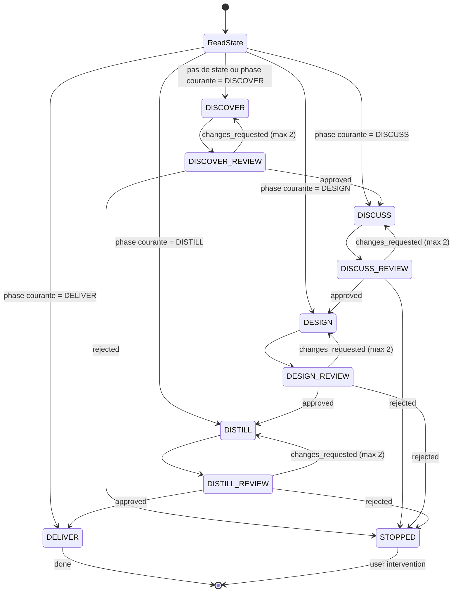

# Spec — Orchestrateur unifié : skraft-orchestrator

> Référence master : [`2026-05-12-skraft-sdlc-pipeline.md`](./2026-05-12-skraft-sdlc-pipeline.md)

## Contexte

Un seul orchestrateur couvre le pipeline SDLC complet : séquencement inter-phases (DISCOVER → DELIVER), verdicts reviewers, boucle engineer↔reviewer pour DELIVER, et reprise automatique depuis l'état persistant. Il remplace la séparation précédente entre `skraft-sdlc-orchestrator` et `skraft-orchestrator`.

## Objectifs

1. Orchestrer le flux DISCOVER → DISCUSS → DESIGN → DISTILL → DELIVER avec gestion des verdicts.
2. Gérer la boucle engineer↔reviewer dans DELIVER (même logique de retry).
3. Reprendre automatiquement depuis `state.md` — une seule commande `/sdlc`.
4. Commenter l'issue GitHub à chaque transition de phase.
5. Capturer et attacher des évidences (screenshots, rapports) aux commentaires.

## Hors périmètre

- Logique interne de chaque phase (chaque agent est autonome).
- Interaction utilisateur directe sur le contenu (il orchestre, il ne produit pas).

---

## Module à produire

| Module | Type | Pattern Genesis |
|---|---|---|
| `skraft-orchestrator` | Agent (ORCHESTRATOR) | A5 PIPELINE + B4 PLAN MEMENTO |

---

## Agent : `skraft-orchestrator`

### Intent + scope (Genesis step 1)

**Capacité** : Orchestrer le pipeline SDLC complet en séquençant les phases, gérant les verdicts reviewers, exécutant la boucle engineer↔reviewer dans DELIVER, et maintenant l'état de progression.

**Triggers** : L'utilisateur invoque `/sdlc` ou demande de "lancer le pipeline", "continuer", "reprendre".

**Boundary** : NE PAS produire de contenu métier. NE PAS prendre de décisions d'architecture ou de refinement. Orchestrer et router.

**Dispatch description** (draft) :
> Use when running the full SDLC pipeline from discovery to delivery.
> Automatically resumes from the last persisted state. Handles all
> phase transitions, reviewer verdicts with retry logic, and the
> engineer↔reviewer implementation loop. Single entry point: /sdlc.

### Pattern : A5 PIPELINE

L'orchestrateur suit le pattern A5 PIPELINE :
- **Stages** : DISCOVER → DISCUSS → DESIGN → DISTILL → DELIVER
- **Gate** : chaque stage a un reviewer qui gate la transition
- **Retry** : `changes_requested` → retry same stage (max 2 retries)
- **Reject** : `rejected` → stop pipeline, report to user
- **Resume** : `/sdlc` lit `state.md` et reprend à la phase courante

### Workflow principal



### State management (B4 PLAN MEMENTO)

L'état est persisté dans `.skraft/sdlc/state.md` et **rechargé à chaque transition** (truth #1 : context degrades).

```markdown
# SDLC Pipeline State

## Entry point
/sdlc

## Current phase
DISCUSS

## Issue tracking
- issue: #42
- comments-posted: [DISCOVER]
- evidence: []

## Phase history
| Phase | Attempt | Verdict | Timestamp |
|---|---|---|---|
| DISCOVER | 1 | approved | 2026-05-12T10:00 |
| DISCUSS | 1 | changes_requested | 2026-05-12T10:30 |
| DISCUSS | 2 | — (in progress) | 2026-05-12T10:45 |

## Active context
- Story: #42 — Add eligibility check
- Milestone: v0.2-eligibility

## Artefacts registry
- discover/triage-2026-05-12.md ✅
- discuss/stories-v0.2.md 🔄
```

### Reprise automatique

Une seule commande : `/sdlc`. L'orchestrateur lit `state.md` et reprend.

| Situation | Comportement |
|---|---|
| Pas de `state.md` | Démarre à DISCOVER |
| Phase en cours `🔄 in progress` | Reprend cette phase |
| Dernière phase `✅ done` | Avance à la suivante |
| Toutes les phases `✅ done` | Pipeline terminé, signale à l'utilisateur |

### Retry logic

| Verdict | Action | Max |
|---|---|---|
| `approved` | Advance to next phase | — |
| `changes_requested` | Re-dispatch same agent with reviewer findings | 2 retries |
| `rejected` | Stop pipeline, surface to user | — |

Sur retry, le reviewer findings sont passés à l'agent comme contexte additionnel (pattern B8 ATTENTION ANCHOR : l'agent relit son output + les findings pour corriger).

### Dispatch table

| Phase | Agent dispatché | Reviewer dispatché | Output check |
|---|---|---|---|
| DISCOVER | `backlog-discoverer` | `backlog-discoverer-reviewer` | `triage-*.md` exists |
| DISCUSS | `backlog-planner` | `backlog-planner-reviewer` | `stories-*.md` exists |
| DESIGN | `solution-architect` | `solution-architect-reviewer` | `adr-*.md` + `contracts-*.md` exist |
| DISTILL | `acceptance-designer` | `acceptance-designer-reviewer` | `*.feature` + `impl-plan-*.md` exist |
| DELIVER | `software-engineer` | `software-engineer-reviewer` | Code + tests pass |

### Tools requis

- `agent` — dispatch des agents spécialistes et reviewers
- `readFile` / `createFile` / `editFile` — state management
- `listDirectory` — vérifier existence des artefacts

### Points d'entrée

| Commande | Comportement |
|---|---|
| `/sdlc` | Reprend depuis `state.md`, ou démarre à DISCOVER si pas d'état |

### Boucle DELIVER (absorbée)

En phase DELIVER, l'orchestrateur exécute directement la boucle engineer↔reviewer :

1. Dispatch `software-engineer` avec `impl-plan-{story}.md`
2. Dispatch `software-engineer-reviewer` sur le code produit
3. Verdict `approved` → pipeline terminé
4. Verdict `changes_requested` → re-dispatch engineer avec findings (max 2 retries)
5. Verdict `rejected` → stop, signale à l'utilisateur

La même logique de retry s'applique à toutes les phases.

### Feedback GitHub

À chaque transition de phase, l'orchestrateur poste un commentaire structuré sur l'issue GitHub :

```markdown
## Phase DESIGN ✅ terminée

**Artefacts produits :**
- ADR-001: CQRS with Event Sourcing
- Component diagram: eligibility-bounded-context
- Contrats d'interface: 3 driving ports, 2 driven ports

**Prochaine phase :** DISTILL
```

Le commentaire final (post-DELIVER) peut inclure des évidences : screenshots Playwright, rapports de tests, couverture.

---

## Intégration dans le plugin

### Fichier

`plugins/agents/skraft-orchestrator.agent.md`

### Frontmatter attendu

```yaml
---
name: skraft-orchestrator
description: >-
  Use when running the full SDLC pipeline from discovery to delivery.
  Automatically resumes from the last persisted state. Handles all
  phase transitions, reviewer verdicts with retry logic, and the
  engineer-reviewer implementation loop. Single entry point: /sdlc.
tools:
  - agent
  - read
  - edit
  - execute
agents:
  - backlog-discoverer
  - backlog-discoverer-reviewer
  - backlog-planner
  - backlog-planner-reviewer
  - solution-architect
  - solution-architect-reviewer
  - acceptance-designer
  - acceptance-designer-reviewer
  - software-engineer
  - software-engineer-reviewer
userInvocable: true
---
```

---

## Genesis execution plan

| Step | Action | Output |
|---|---|---|
| 1-6 | Design `skraft-orchestrator` (unifié) | Handoff packet |
| 7-8 | Draft `skraft-orchestrator.agent.md` | Agent file |

Note : cet orchestrateur est construit en DERNIER car il dépend de tous les agents des 5 phases.
