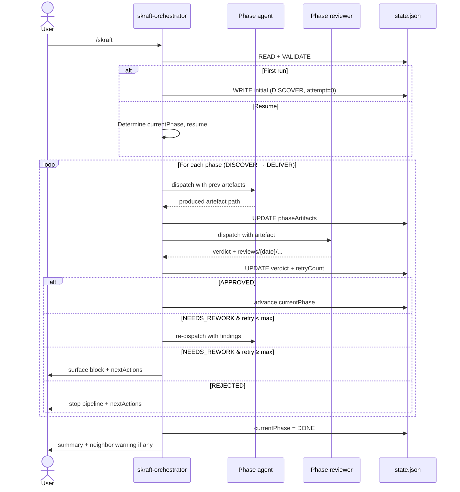

# Spec — SKRAFT × HVE Compatibility

## Contexte

`skraft-plugin` couvre le SDLC (DISCOVER → DELIVER) via un orchestrateur unique et 5 paires (phase agent + reviewer). Le repo `hve-core` propose un écosystème de planners (Security, SSSC, RAI, DT, ADO, GitHub, Jira, Doc Ops, BRD, RPI) qui partagent des conventions strictes : fichier `state.json`, protocole 6-étapes par tour, arborescence `.copilot-tracking/{domain}/{slug}/`, artefacts datés (`research/`, `plans/`, `adrs/`, `details/`, `changes/`, `reviews/`).

SKRAFT et l'écosystème HVE coexistent dans les mêmes workspaces utilisateur, mais SKRAFT utilise aujourd'hui `.skraft/sdlc/state.md` et `.skraft/sdlc/{phase}/` — conventions divergentes qui empêchent l'interopérabilité.

## Objectif

Rendre SKRAFT **compatible HVE** en remplaçant uniquement l'agent RPI (Researcher / Planner / Implementor) de HVE par le pipeline SKRAFT, tout en réutilisant **verbatim** les conventions HVE pour la persistence d'état et les chemins d'artefacts. Les 9 autres planners HVE restent indépendants et opèrent en pairs sans couplage.

## Périmètre

### Inclus

1. Renommage de la commande d'entrée `/sdlc` → `/skraft`.
2. Adoption du fichier d'état `state.json` (JSON, jamais markdown) au chemin `.copilot-tracking/skraft-plans/{project-slug}/state.json`.
3. Adoption du protocole 6-étapes HVE (READ → VALIDATE → DETERMINE → EXECUTE → UPDATE → WRITE) et de la séquence Resume 4-étapes.
4. Remplacement de l'arborescence `.skraft/sdlc/{phase}/` par les chemins HVE datés : `research/{YYYY-MM-DD}/`, `plans/{YYYY-MM-DD}/`, `adrs/`, `details/{YYYY-MM-DD}/`, `changes/{YYYY-MM-DD}/`, `reviews/{YYYY-MM-DD}/`.
5. Création de 2 fichiers d'instructions scope-attachées et 2 nouvelles skills.
6. Politique de retry max 2 (paramétrable via `userPreferences.maxRetriesPerPhase`) inline dans l'orchestrateur.
7. Évaluation de difficulté en sortie de DISCOVER (3 axes : entry point, rigor, difficulty), persistée dans `state.json::difficulty`.
8. Avertissement neighbor planners : si Security/RAI/SSSC existent au même `projectSlug`, l'orchestrateur l'ajoute à `nextActions` (lecture seule, aucun couplage).

### Exclus

- Modification des 9 autres planners HVE (Security, SSSC, RAI, DT, ADO, GitHub, Jira, Doc Ops, BRD).
- Coordination cross-planner automatique au-delà de l'avertissement (différé v2).
- Exposition de la télémétrie interne de la boucle TDD (DELIVER reste opaque : seul le résultat final commit SHAs + mutation score remonte).
- Saut de phase piloté par la difficulté (la difficulté influence la rigueur, pas le skipping).

## Contraintes dures

| Contrainte | Justification |
|---|---|
| `state.json` (jamais `.md`) | Convention universelle HVE ; seule DT déroge avec `coaching-state.md` |
| Tous chemins sous `.copilot-tracking/` | Conformité HVE ; permet la coexistence cross-planner |
| Reviewers en lecture seule | `review-artifacts.instructions.md` HVE ; n'écrivent que dans `reviews/{date}/` |
| Single entrypoint `/skraft` | Décision utilisateur explicite |
| Réutilisation verbatim des chemins HVE existants | Hard rule utilisateur : « Si le fichier existe déjà, il faut se conformer EXACTEMENT au phase d'avant » |
| Markdown header `<!-- markdownlint-disable-file -->` sous `.copilot-tracking/` | Convention HVE pour fichiers générés |

## Architecture

### Composition

| Élément | Type | Cible | Action |
|---|---|---|---|
| `skraft-orchestrator` | persona | `plugins/agents/skraft-orchestrator.agent.md` | **Modifier** : `/sdlc`→`/skraft`, paths HVE, retry inline, neighbor warning |
| 5 phase agents | personas | `plugins/agents/*.agent.md` | **Modifier** : retarget paths HVE |
| 5 reviewer agents | personas | `plugins/agents/*.agent.md` | **Modifier** : retarget paths HVE, write only `reviews/{date}/` |
| `skraft-state` | scope-attached rule | `plugins/instructions/skraft-state.instructions.md` | **Créer** — applyTo `**/.copilot-tracking/skraft-plans/**` |
| `skraft-artifacts` | scope-attached rule | `plugins/instructions/skraft-artifacts.instructions.md` | **Créer** — applyTo `**/.copilot-tracking/**` (scope SKRAFT) |
| `skraft-difficulty-routing` | skill | `plugins/skills/skraft-difficulty-routing/SKILL.md` | **Créer** — 3-axis assessment |
| `adversarial-review-lenses` | skill | `plugins/skills/adversarial-review-lenses/SKILL.md` | **Créer** — Genesis A7 4-lens procedure |
| TDD/contract/playwright skills | skills | existants | **Réutiliser tel quel** |

### state.json — schéma

```json
{
  "projectSlug": "string",
  "skraftPlanFile": "plans/{YYYY-MM-DD}/...-plan.instructions.md",
  "currentPhase": "DISCOVER|DISCUSS|DESIGN|DISTILL|DELIVER|DONE",
  "entryMode": "capture | from-issue | from-prd",
  "issueNumber": "number | null",
  "difficulty": "simple | medium | medium-hard | challenging | null",
  "phasesCompleted": ["..."],
  "phaseArtifacts": {
    "DISCOVER": [],
    "DISCUSS": [],
    "DESIGN": [],
    "DISTILL": [],
    "DELIVER": []
  },
  "reviewerVerdicts": {
    "DISCOVER": "APPROVED|REJECTED|NEEDS_REWORK|null",
    "DISCUSS": "...|null",
    "DESIGN": "...|null",
    "DISTILL": "...|null",
    "DELIVER": "...|null"
  },
  "reviewArtifacts": ["reviews/{YYYY-MM-DD}/..."],
  "retryCount": {"DISCOVER": 0, "DISCUSS": 0, "DESIGN": 0, "DISTILL": 0, "DELIVER": 0},
  "referencesProcessed": ["..."],
  "nextActions": ["..."],
  "userPreferences": {"autonomyTier": "full|partial|manual", "maxRetriesPerPhase": 2},
  "neighborPlanners": {
    "securityPlanFile": "string | null",
    "raiPlanFile": "string | null",
    "ssscPlanFile": "string | null"
  }
}
```

### Mapping artefacts SKRAFT → HVE

| Phase | Artefact SKRAFT | Chemin HVE |
|---|---|---|
| DISCOVER | Triage + sprint proposal | `research/{YYYY-MM-DD}/*-research.md` |
| DISCUSS | User stories | `plans/{YYYY-MM-DD}/*-plan.instructions.md` (frontmatter `applyTo`) |
| DESIGN | ADRs + contracts | `adrs/ADR-{NNN}-{slug}.md` + `details/{date}/*-contracts.md` |
| DISTILL | Gherkin + impl plan | `details/{YYYY-MM-DD}/*-details.md` + `features/*.feature` (existant) |
| DELIVER | Commits + changes log | `changes/{YYYY-MM-DD}/*-changes.md` |
| Reviews (toutes phases) | Verdict + findings | `reviews/{YYYY-MM-DD}/*-review.md` |

### Diagramme de séquence (vue exécution)



## Décisions clés (Genesis Step 4 SoC)

1. **Pas de cross-ref automatique v1.** L'orchestrateur lit `.copilot-tracking/` au même `projectSlug` pour détecter Security/RAI/SSSC et ajoute un avertissement dans `nextActions`. Aucune écriture croisée.
2. **Retry policy inline.** Max 2 retries (3 attempts total) configuré dans `userPreferences.maxRetriesPerPhase`. Pas de skill séparée.
3. **Difficulty à la sortie de DISCOVER.** L'évaluation 3-axes (entry point, rigor, difficulty) est faite UNE fois en sortie de DISCOVER, écrite dans `state.json::difficulty`. Les phases ultérieures lisent.
4. **DELIVER opaque.** La boucle TDD interne (RED → GREEN → COMMIT + mutation) reste invisible à l'orchestrateur. Le software-engineer reporte seulement commit SHAs + mutation score. Détails dans `changes/{date}/*-changes.md`.

## Conformité HVE

| Convention HVE | Statut SKRAFT |
|---|---|
| `state.json` JSON uniforme | ✅ adopté |
| Protocole 6-étapes par tour | ✅ adopté dans `skraft-state.instructions.md` |
| Resume sequence 4-étapes | ✅ adopté |
| Chemins datés sous `.copilot-tracking/` | ✅ adopté |
| `review-artifacts.instructions.md` | ✅ référencé pour reviewers |
| Markdown header `markdownlint-disable-file` | ✅ requis |
| Pas de collision avec planners voisins | ✅ namespace `skraft-plans/` |

## Risques et atténuations

| Risque | Atténuation |
|---|---|
| Confusion `/sdlc` ↔ `/skraft` après renommage | Frontmatter description met à jour, anciens artefacts `.skraft/sdlc/` orphelins (migration manuelle si projet existant) |
| state.json corrompu | Procédure recovery héritée de HVE (security/identity.instructions.md) |
| Neighbor planners écrasés | Reviewers et orchestrator interdits d'écrire hors namespace SKRAFT |
| Retry infini | Hard cap 2 retries, surface utilisateur si dépassé |

## Validation

Critères de réussite :

1. `state.json` créé et conforme au schéma sur premier `/skraft`.
2. Aucun fichier écrit sous `.skraft/sdlc/` après la migration.
3. Reviewers n'écrivent que sous `reviews/{date}/`.
4. Un workspace contenant déjà `.copilot-tracking/security-plans/<slug>/` peut exécuter `/skraft` sans collision.
5. Lint markdown vert sur les nouveaux fichiers.

## Décisions ouvertes (v2)

- Coordination cross-planner active (lecture/écriture de `nextActions` partagé).
- Télémétrie TDD exposée à l'orchestrateur (mutation score time-series).
- Difficulty-driven phase skipping (sauter DESIGN si simple + tests existants).
