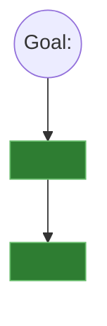

# Mikado Method

A discipline for restructuring code whose true dependency graph is not knowable in advance: try
the change, let the compiler and test suite reveal what it actually depends on, revert, then build
the missing prerequisites bottom-up. The graph is the artifact — the failed experiment's code is
always thrown away.

**Precondition.** A green safety net must exist before starting (see `characterize-with-contracts`
/ `brownfield-harness-builder`). Mikado surfaces prerequisites via real compiler/test failures — a
codebase with weak or no test coverage gives false leaves (nothing breaks because nothing was
checked, not because nothing depends on it). If the harness gate was CONCERNS or FAIL, stop and
strengthen the harness first.

## The loop (four primitives — apply exactly)

1. **Goal** — one concrete, business-value-framed sentence agreed with the human. "Admin services
   are in a separate package deployable without customer services" is a goal. "Improve the
   architecture" is not — reject vague goals, ask the human to sharpen it.
2. **Naive experiment** — in an isolated worktree (`git worktree add <path> <branch>`), attempt the
   goal the most obvious way, no scaffolding. Run the build. Run the full test suite (harness
   included). This experiment is a SENSOR, not a draft — never polish it, never try to fix what
   breaks.
3. **Visualize** — every failure is a prerequisite: something that must be true before the goal is
   achievable. Record it as a graph node with an edge pointing toward the goal (or toward the
   prerequisite it was discovered under, if nested). Cite the evidence: file:line + error message.
4. **Undo** — discard the worktree entirely (`git worktree remove <path> --force`). Never `git
   stash`, never keep "almost working" code. The revert is free for an agent — there is no sunk
   cost. Return to the last known-green state.

Repeat the loop on each prerequisite (and its own prerequisites) until reaching leaves —
prerequisites with no unimplemented children. Leaves are implemented for real, on the actual
branch, one at a time, committing green after each. Never start a parent until all its children
are done.

## Graph persistence (the durable artifact)

Persist the graph to `.copilot-tracking/skraft-plans/{projectSlug}/refactoring/{YYYY-MM-DD}/
mikado-<slug>.md` as a Mermaid `graph TD`:

`observed` = a real naive-experiment failure. `anticipated` = a hypothesis (e.g. carried in from a
design doc or a prior planning pass) not yet confirmed by an experiment — confirm or refute it
with a real attempt before treating it as a true prerequisite. One writer on this file per run
(the `brownfield-refactorer` agent); reload it at every re-grounding boundary (before each leaf,
after each spawn returns) rather than trusting recall.

## Driving leaves to completion (per-leaf worker contract)

Each leaf is dispatched to `refactoring-worker` as a fresh, isolated unit — one spawn per leaf,
never accumulate leaves in one session (context drift risk). The dispatch packet MUST include:

1. The full current graph file content.
2. The specific leaf to implement, verbatim, with its evidence citation.
3. Acceptance: the harness (characterization + contract tests) passes; the full regression suite
   passes; no new failures anywhere; the change is scoped strictly to this leaf — nothing else.
4. The explicit instruction: if this leaf turns out to have its own unimplemented prerequisites,
   STOP and report them as new sub-prerequisites. Do not attempt to fix them inline.

## Terminal signals (worker -> orchestrator)

The worker reports exactly one of these per invocation — this is the drive-to-terminal-state
contract the `brownfield-refactorer` orchestrator polls:

- `ADVANCE` — this leaf is done and committed green; more leaves remain.
- `EXPAND` — this leaf had its own undiscovered prerequisites; new graph nodes were recorded;
  no code was implemented or committed for this leaf.
- `DONE` — the goal is achievable cleanly now (verified by a final naive re-attempt that no longer
  breaks); the graph is empty of unimplemented leaves.
- `BLOCKED` — needs human input (ambiguous prerequisite, conflicting constraint, harness itself
  broke in a way the worker cannot diagnose).

## Common failure modes (reject these)

- **Skipping the revert** — "I'll keep this working code and clean up later." This is how the
  method's guarantee (codebase never broken) is lost. Always revert; always start the leaf fresh
  on the real branch.
- **Fixing during the naive experiment** — the experiment collects signal only; patching mid-attempt
  contaminates the failure list.
- **Treating the graph as optional documentation** — it is the only artifact that survives between
  loop iterations; if it is not reloaded before each leaf, prerequisites get re-discovered or missed.
- **Running the naive experiment against a shared/live environment** — always an isolated worktree;
  stale state (caches, migrations) produces false signal otherwise.
