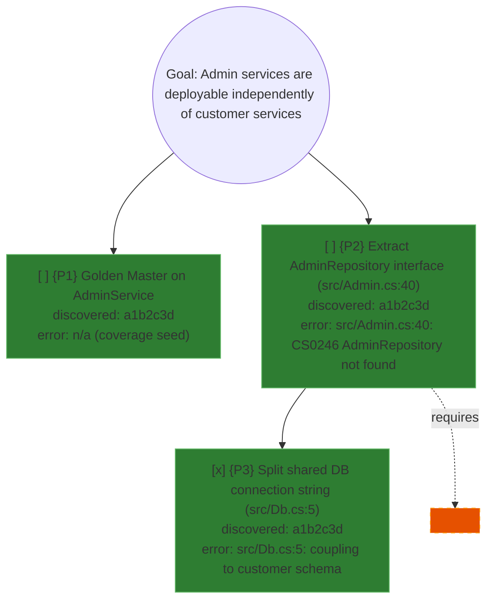

# Mikado graph format (full spec)

Loaded on demand from `SKILL.md` when the exact syntax of a graph element is
needed (e.g. before writing the first node, or when `scripts/validate-mikado.sh`
reports a parse issue). This is the annotated reference; `SKILL.md` only shows the
minimal skeleton.

Format and validation discipline adapted from
[chaabani-anis/mikado-method](https://github.com/chaabani-anis/mikado-method)
(MIT License) — that project encodes the same graph in a rail-notation plain-text
format designed for its own bash validator. This skill keeps SKRAFT's house
convention of Mermaid `graph TD` instead (consistent with every other diagram in
the SKRAFT handbook) and reimplements the validation passes against that syntax.

## File location

```
.copilot-tracking/skraft-plans/{projectSlug}/refactoring/{YYYY-MM-DD}/mikado-<slug>.md
```

One file per goal. Wrapped in a fenced ` ```mermaid ` block so it both renders in
any markdown viewer and is machine-parseable by `scripts/validate-mikado.sh`.

## Node types

### Goal node (exactly one, the root)

```mermaid
G((Goal: <one business-value sentence>))
```

- Must use the double-circle `((...))` shape.
- The label MUST start with `Goal:` (case-insensitive) — the validator's Pass 1
  root-detection depends on this literal prefix.
- Frame the goal in business value, not a technical task:

  | Avoid | Prefer |
  |---|---|
  | "Inject a notification gateway into BillingService" | "Invoices can be issued without the billing logic knowing how customers are notified" |
  | "Replace the hardcoded SMTP client with an interface" | "A customer notification failure never blocks invoice issuance" |

### Prerequisite node

```mermaid
P1["[ ] {P1} <description> (file:line)<br/>discovered: <sha><br/>error: <file:line: message>"]
```

- `[ ]` / `[x]` — pending / done. The `[x]` mark and the leaf's implementation
  commit happen together, never separately.
- `{P1}` — a short, unique, stable id. Used by `requires:` cross-links and by
  the validator to report findings.
- `discovered: <sha>` — the HEAD commit SHA captured at the START of the naive
  experiment cycle that revealed this prerequisite.
- `error: <file:line: message>` — the exact compiler/test failure that made this
  node necessary. This is the evidence trail; never invent one, never omit it.
- Both `discovered:` and `error:` are REQUIRED on every non-goal node, UNLESS the
  node is tagged `anticipated` (see below) — an anticipated node is a hypothesis
  not yet confirmed by a real experiment.

### Anticipated node (hypothesis, not yet confirmed)

If a design doc or a prior planning pass already suggests a prerequisite, seed it
as `anticipated` before running any naive experiment against it:

```mermaid
P4["<hypothesis, no evidence yet>"]
```

```mermaid
class P4 anticipated
```

A naive experiment must CONFIRM or REFUTE it before it is treated as a true
prerequisite (i.e. before it gets `discovered:`/`error:` and its `observed` class).

## Edges

### Tree edge (parent → child = "child is a prerequisite of parent")

```mermaid
G --> P1
P1 --> P2
```

Read `A --> B` as "B is a prerequisite of A; B must be done before A". The
deeper a node sits, the earlier it is implemented — leaves (nodes with no
outgoing tree/requires edges) go first.

### Requires cross-link (shared prerequisite, makes the tree a true DAG)

```mermaid
P2 -.requires.-> P5
```

Use this when two different parents depend on the SAME prerequisite, instead of
duplicating the node. Dotted style keeps it visually distinct from the tree
structure in any Mermaid renderer. `scripts/validate-mikado.sh` Pass 3 rejects any
edge (tree or `requires:`) whose target id is not a defined node — fix the id or
add the missing node before re-running.

## Status classes

```mermaid
classDef observed fill:#2e7d32,stroke:#66bb6a
classDef anticipated fill:#e65100,stroke:#ff9800,stroke-dasharray:5 5
class P1,P2,P3 observed
class P4 anticipated
```

`observed` (solid green) = a real naive-experiment failure. `anticipated` (dashed
orange) = a hypothesis not yet confirmed. A node with no class assignment is
treated by the validator as `observed` (traceability required).

## Commit convention (required for the tree-direction check)

Every graph-update commit — creating the file, recording a new discovery — uses
the message prefix `refactor(mikado-graph): <what>`, matching this repo's
existing conventional-commit scopes:

```
refactor(mikado-graph): initial graph for <goal>
refactor(mikado-graph): {P1} requires {P2} in src/Admin.cs:40
```

`scripts/validate-mikado.sh` Pass 5 reads each node's `discovered:` sha via
`git log`, verifies the commit message carries this prefix, and verifies a child's
commit is the same commit as its parent's or a descendant of it (via `git
merge-base --is-ancestor`) — children are prerequisites, discovered during or
after the parent's naive attempt, never before. Run with `--no-git` to skip this
check against fixtures/examples with fictional SHAs (like the ones in this file) —
never skip it on a real graph.

## Orphan detection (warning only)

Pass 6 warns — does not fail — on any non-goal node that is never the target of a
tree or `requires:` edge. A warning usually means a node was recorded but never
wired into the tree; wire it in, or remove it if it was superseded.

## Golden master gate (mandatory declaration)

Before the first leaf implementation, the graph MUST contain either:

- a node whose description contains "Golden Master" (add one as a child of the
  first node touching an under-covered module, e.g. `P1["[ ] {P1} Golden Master
  on AdminService..."]`), OR
- an explicit skip declaration as a Mermaid comment, anywhere in the file:

  ```
  %% no-golden-master: coverage 92% on AdminService, characterization tests exist
  ```

`scripts/validate-mikado.sh` Pass 7 fails the graph if neither is present. This
mirrors the source project's golden-master gate: never start restructuring a
module with unmeasured, unprotected coverage.

## Full example



Validate any graph file with (add `--no-git` since the SHAs above are fictional):

```bash
bash plugins/skills/mikado-method/scripts/validate-mikado.sh --no-git <path-to-graph.md>
```
