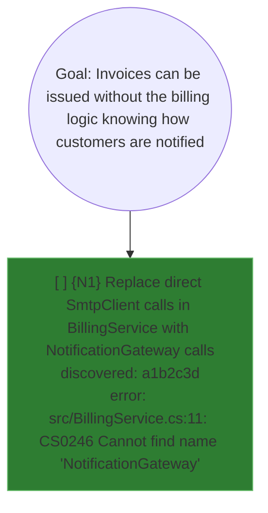
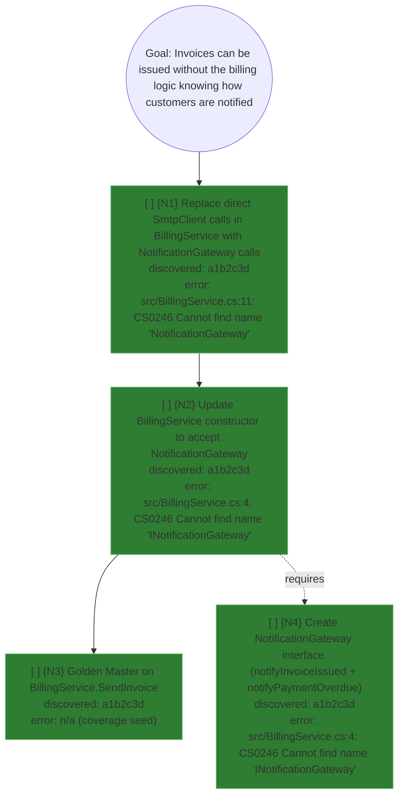

# Worked example (short)

Loaded on demand from `SKILL.md` when a concrete end-to-end trace is needed —
e.g. the first time this skill runs in a session, or when a leaf-dispatch packet
needs a reference shape to imitate.

**Goal.** "Invoices can be issued without the billing logic knowing how customers
are notified, so billing tests run without an SMTP server."

## Cycle 1 — naive experiment

1. Note HEAD: `git rev-parse HEAD` → `a1b2c3d`.
2. In an isolated worktree, replace the direct `SmtpClient` call in
   `BillingService` with a call to a not-yet-existing `NotificationGateway`.
3. Run the full test suite. Failure: `src/BillingService.cs:11: CS0246 Cannot
   find name 'NotificationGateway'`.
4. Record the prerequisite:

5. Discard the worktree (`git worktree remove <path> --force`). Return to the
   known-green state.

## Cycle 2 — recurse on the prerequisite

1. Note HEAD again (same commit, nothing was kept): `a1b2c3d`.
2. Naive attempt: update `BillingService`'s constructor to accept a
   `NotificationGateway`. Failure: `src/BillingService.cs:4: CS0246 Cannot find
   name 'INotificationGateway'` — the interface itself does not exist yet.
3. Record the nested prerequisite (deeper = earlier):

4. Validate: `bash scripts/validate-mikado.sh mikado-billing.md` → exit 0, and
   Pass 5 reports `{N3}` and `{N4}` as true leaves (deepest, no pending
   children).

## Execution — bottom-up, leaves first

- Implement `{N3}` (Golden Master) and `{N4}` (the interface) — either order,
  both are leaves. Each gets its own fresh `refactoring-worker` dispatch, its
  own RED→GREEN cycle, its own commit, marked `[x]` in the same commit as the
  code.
- Re-validate after each: `{N2}` becomes a leaf once both its children are
  `[x]`.
- Implement `{N2}`, then `{N1}`, then re-attempt the goal directly — it now
  succeeds cleanly. `DONE`.

## Discovery commit message convention

| Event | Message |
|---|---|
| Graph created | `mikado-graph: initial graph for <goal>` |
| New prerequisite recorded | `mikado-graph: {parent} requires {child} in file:line` |
| Leaf implemented | `feat: {NodeDescription}` (or `fix:`, matching the change) |
