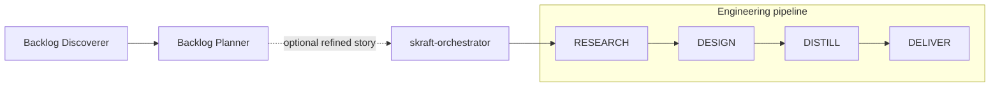

│   ├── agents/                      31 flat `.agent.md` synchronized descriptors
# SKRAFT plugin

Deterministic agentic software delivery for Claude Code and GitHub Copilot.

SKRAFT turns a refined story into researched, designed, executable, and reviewed
software changes. Specialized agents perform each engineering phase. Adversarial
reviewers challenge their outputs. Runtime hooks enforce phase order, required
skills, artifacts, verdicts, commits, and state integrity outside model reasoning.

## What this plugin provides

- One engineering entry point: `skraft-orchestrator`.
- Four ordered phases: `RESEARCH → DESIGN → DISTILL → DELIVER`.
- Dedicated specialists and reviewers for architecture, acceptance design, and implementation.
- Optional product workflows for backlog discovery and story refinement.
- Direct brownfield workflows for characterization and safe modernization.
- Outside-In TDD, BDD, Clean Architecture, mutation testing, contract testing, ADR,
  refactoring, and quality-evidence skills.
- Internal workers for mocking, contract testing, and refactoring.
- Deterministic hooks, persistent state, recovery data, and an append-only audit trail.

## Install

### Claude Code

Run these commands inside Claude Code:

```text
/plugin marketplace add SebastienDegodez/skraft-plugin
/plugin install skraft
```

### GitHub Copilot

For Copilot CLI, install `skraft` from this repository's marketplace, or load the
`plugins/skraft-framework` directory with `--plugin-dir` for local development.
The root [plugin.json](plugin.json) declares Agent Plugins v1 with no root `agents` list;
Copilot discovers the generated namespaced agents. In the CLI, select `skraft:skraft-orchestrator`.

Copilot CLI 1.0.74 introduced Open Plugin Spec v1 support. That does not imply
identical discovery or hook behavior across Copilot CLI, VS Code, and Claude Code.
This package declares the v1 schema and retains native compatibility manifests;
see the measured scope and pending checks below.

Codex and Cursor manifests expose the shared plugin skills. The complete guarded
agent pipeline currently targets Claude Code and GitHub Copilot.

## Run the engineering pipeline

1. Select `skraft-orchestrator` in the agent picker.
2. Give it one refined story with acceptance criteria.
3. Let it resume or initialize the work item.
4. Review the artifacts and commits produced during each phase.

The orchestrator owns only engineering work:



`backlog-discoverer` and `backlog-planner` are optional, directly invocable product
workflows. They are not orchestrator children. Invoke them in that order when both are
needed, then pass the refined story to `skraft-orchestrator`.

Brownfield agents are also direct entry points:

- `brownfield-analyst` characterizes an existing system and composes modernization intent.
- `brownfield-harness-builder` captures current behavior through tests and contracts.
- `brownfield-refactorer` applies incremental Mikado or Strangler Fig changes.

## Engineering phases

| Phase | Specialist | Reviewer | Primary result |
|---|---|---|---|
| `RESEARCH` | `solution-researcher` | None | Research brief and constraints |
| `DESIGN` | `solution-architect` | `solution-architect-reviewer` | Architecture decisions and implementation shape |
| `DISTILL` | `acceptance-designer` | `acceptance-designer-reviewer` | Gherkin scenarios, test plan, and implementation plan |
| `DELIVER` | `software-engineer` | `software-engineer-reviewer` | Tested code, quality evidence, and verified commits |

Reviewers are read-only. A rejected result returns to its specialist; it never silently
advances to the next phase.

## Runtime guardrails

| Guard | What the user gets | Failure mode |
|---|---|---|
| G1 | Out-of-order phase dispatch blocked before execution | Fail closed |
| G2 | Mandatory skills and declared companion rules injected on agent start | Fail open on hook error |
| G3 | Skill reads recorded in the audit trail | Fail open on hook error |
| G4 | Phase completion blocked until required artifacts exist | Fail closed |
| G5 | Reviewer verdict, persisted state, and DELIVER commit must agree | Fail closed |
| G6 | Next-phase or retry context injected after a dispatch | Fail open on hook error |
| G7 | Direct mutation of state and execution logs blocked | Fail closed |
| G8 | Source and test writes restricted to monitored DELIVER work | Fail open on hook error |

Off-pipeline agents and internal workers are intentionally not subject to G1 phase ordering.
Missing or corrupt pipeline state still blocks a governed phase.

## State and artifacts

SKRAFT persists work under:

```text
.copilot-tracking/skraft-plans/{project-slug}/
├── research/
├── plans/
├── features/
├── details/
├── changes/
├── reviews/
├── state.json
└── execution-log.json
```

Each artifact becomes context for the next phase. `state.json` is a deterministic runtime
contract, not an editable planning document. Use the state CLI instead of modifying it
directly:

```bash
node "<plugin-root>/src/cli/state.mjs" get --slug my-feature
node "<plugin-root>/src/cli/health-check.mjs"
```

Run these from the consumer repository so SKRAFT resolves that repository's tracking
state. Hook commands use `CLAUDE_PLUGIN_ROOT`; actual Copilot CLI 1.0.83 fixtures verified
its expansion, including paths with spaces. Full live VS Code v1 validation remains unverified.

Repository configuration lives in `skraft-config.json`. The supported tracking layout is
`namespaced`; quality thresholds and engineering invariants are deliberately not user-relaxable.

## Harness packaging

One canonical source set feeds native packaging surfaces:

```text
plugins/skraft-framework/
├── plugin.json                      canonical v1 schema; no root agents list
├── .claude-plugin/plugin.json        explicit registration of all 31 agents
├── com.github.copilot/
│   ├── agents/                      31 flat `.agent.md` synchronized descriptors
│   ├── hooks/hooks.json             generated exact copy of root hooks
│   └── rules/                       native path-scoped rules
├── com.anthropic.claude-code/
│   └── agents/                      31 flat editable native Claude `.md` descriptors
├── hooks/hooks.json                 canonical source; Claude compatibility
├── skills/                         shared skills
└── src/                            shared zero-dependency runtime
```

Copilot loads path-scoped rules natively. Claude's `SubagentStart` hook resolves the
canonical agent identity and injects only rules declared by that agent. Catalogue,
configuration, and evaluation scans read the Copilot runtime tree only, preserving
original provenance metadata without counting a logical agent twice.

The Claude [manifest](.claude-plugin/plugin.json) must enumerate **all 31** individual
native runtime agents, including workers and reviewer lenses, for registration and delegation.
Claude rejects directory paths in `agents`. Never delete internal agents from this list to hide
them. Internal `user-invocable: false` flags remain byte-preserved, but that field is not
documented for Claude **subagents**; it does not promise hiding in Claude's picker.

Six standalone roots are intended public Copilot entry points: `skraft-orchestrator`,
`backlog-discoverer`, `backlog-planner`, `brownfield-analyst`, `brownfield-harness-builder`,
and `brownfield-refactorer`. Internal agents remain available for delegation.

Shared agents use a scalar `model` value. VS Code's fallback-array syntax is not
portable to Copilot CLI and can silently remove an agent from discovery.

VS Code **1.126** actual source currently falls back through `.plugin` then `.claude-plugin`.
Full live v1 validation is unverified; this is not a reason to omit the root `$schema`.
The `rules` field is retained for VS Code; Claude Code ignores it and reports a
validation warning. Claude rule injection remains the responsibility of the hooks.

Actual Copilot CLI **1.0.83** fixture tests **passed** namespaced agent discovery and
`SessionStart` / `PreToolUse` with `CLAUDE_PLUGIN_ROOT`, including paths with spaces.
[scripts/copilot-hook-smoke.mjs](../../scripts/copilot-hook-smoke.mjs) also **passed** against
the current migrated plugin installed from the local marketplace checkout, with exact CLI
**1.0.83** pinned via `--cli` and an isolated `COPILOT_HOME`: **PASS allowed** (1 hook audit
entry), **PASS denied** (1 hook audit entry), forbidden write absent. This verifies the probed
SKRAFT refusal, not the full six-root picker, hidden-subagent invocation, model IDs, general
tool permissions, or the full engineering pipeline. Full live VS Code validation remains unverified.

Hooks have one source and two physical surfaces: canonical [hooks/hooks.json](hooks/hooks.json)
for Claude compatibility and generated [com.github.copilot/hooks/hooks.json](com.github.copilot/hooks/hooks.json)
for Copilot v1. No extra manifest `hooks` pointers: do not register either auto-loaded surface twice.
These are current packaging facts; [ADR-008](../../docs/adr/adr-008-single-hook-manifest.md)
retains its measured legacy record, not a current cross-client guarantee.

## Maintainer workflow

Run commands from repository root.

Edit either `com.github.copilot/agents/<id>.agent.md` or
`com.anthropic.claude-code/agents/<id>.md`. These are the only two editable runtime trees.
`plugin:sync` merges body and description against `.agent-sync.json` v2 using stable basename IDs
and per-side normalized shared fields. It translates Markdown destinations for the receiving
client, preserves native name/model/tools/agents and all other header bytes, and rejects
conflicting edits before writing anything. Unchanged differential prose stays client-local.
Never reset a baseline to accept unexplained drift. New IDs require both explicitly authored
client versions; sync does not invent native tools or clone broad permissions.
Edit hooks in the root source. Run `npm run plugin:sync` and `npm run plugin:check`, which invoke
[scripts/project-plugin-adapters.mjs](../../scripts/project-plugin-adapters.mjs) with `--apply`
and `--check`. `plugin:build` is an alias for the same synchronization, not native generation.
Commit both runtime descriptors, shared baseline and generated hook copy together:
marketplace Git installs do not run a build.
Keep the Claude manifest's full agent list synchronized when adding or removing agents.

After changing an agent, regenerate the guardrail config:

```bash
node plugins/skraft-framework/src/cli/build-config-bin.mjs
```

Before opening a pull request:

```bash
npm run paths:check
node plugins/skraft-framework/src/cli/build-config-bin.mjs --check
node plugins/skraft-framework/src/cli/resolve-model-bin.mjs --check
node --test "tests/skraft-framework/**/*.test.mjs"
npm run ci:local
```

Tests live in `tests/skraft-framework/<feature>/`, with unit tests, acceptance tests and fixtures grouped by feature. Agent sources are the two runtime trees above.
Generated catalogue, evaluation, dashboard, and graph outputs must not be committed.

## Documentation

- [SKRAFT handbook](https://sebastiendegodez.github.io/skraft-plugin/en/)
- [Repository architecture](https://github.com/SebastienDegodez/skraft-plugin/blob/main/docs/architecture.md)
- [Roadmap](https://github.com/SebastienDegodez/skraft-plugin/blob/main/docs/roadmap.md)
- [Skill evaluation](https://github.com/SebastienDegodez/skraft-plugin/blob/main/docs/skill-evaluation.md)
- [Contributing rules](https://github.com/SebastienDegodez/skraft-plugin/blob/main/AGENTS.md)

## License

GPL-3.0-or-later. See the
[repository license](https://github.com/SebastienDegodez/skraft-plugin/blob/main/LICENSE).
