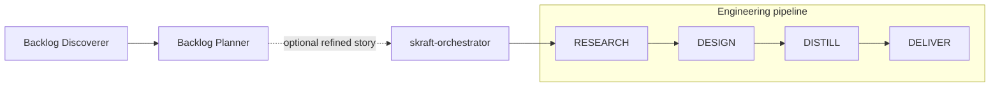

# SKRAFT plugin

Deterministic agentic software delivery for Claude Code and GitHub Copilot.

SKRAFT turns a refined story into researched, designed, executable, and reviewed
software changes. Specialized agents perform each engineering phase. Adversarial
reviewers challenge their outputs. Runtime hooks enforce phase order, required
skills, artifacts, verdicts, commits, and state integrity outside model reasoning.

## What this plugin provides

- One engineering entry point: `skraft-orchestrator`.
- Four ordered phases: `RESEARCH → DESIGN → DISTILL → DELIVER`.
- Dedicated specialists and reviewers for architecture, acceptance design, and implementation.
- Optional product workflows for backlog discovery and story refinement.
- Direct brownfield workflows for characterization and safe modernization.
- Outside-In TDD, BDD, Clean Architecture, mutation testing, contract testing, ADR,
  refactoring, and quality-evidence skills.
- Internal workers for mocking, contract testing, and refactoring.
- Deterministic hooks, persistent state, recovery data, and an append-only audit trail.

## Install

### Claude Code

Run these commands inside Claude Code:

```text
/plugin marketplace add SebastienDegodez/skraft-plugin
/plugin install skraft
```

### GitHub Copilot

Install the `plugins/skraft-framework` directory with an Agent Plugins 1.0-compatible
plugin client. Copilot discovers its agents, rules, and hooks from the
`com.github.copilot` namespace.

Codex and Cursor manifests expose the shared plugin skills. The complete guarded
agent pipeline currently targets Claude Code and GitHub Copilot.

## Run the engineering pipeline

1. Select `skraft-orchestrator` in the agent picker.
2. Give it one refined story with acceptance criteria.
3. Let it resume or initialize the work item.
4. Review the artifacts and commits produced during each phase.

The orchestrator owns only engineering work:



`backlog-discoverer` and `backlog-planner` are optional, directly invocable product
workflows. They are not orchestrator children. Invoke them in that order when both are
needed, then pass the refined story to `skraft-orchestrator`.

Brownfield agents are also direct entry points:

- `brownfield-analyst` characterizes an existing system and composes modernization intent.
- `brownfield-harness-builder` captures current behavior through tests and contracts.
- `brownfield-refactorer` applies incremental Mikado or Strangler Fig changes.

## Engineering phases

| Phase | Specialist | Reviewer | Primary result |
|---|---|---|---|
| `RESEARCH` | `solution-researcher` | None | Research brief and constraints |
| `DESIGN` | `solution-architect` | `solution-architect-reviewer` | Architecture decisions and implementation shape |
| `DISTILL` | `acceptance-designer` | `acceptance-designer-reviewer` | Gherkin scenarios, test plan, and implementation plan |
| `DELIVER` | `software-engineer` | `software-engineer-reviewer` | Tested code, quality evidence, and verified commits |

Reviewers are read-only. A rejected result returns to its specialist; it never silently
advances to the next phase.

## Runtime guardrails

| Guard | What the user gets | Failure mode |
|---|---|---|
| G1 | Out-of-order phase dispatch blocked before execution | Fail closed |
| G2 | Mandatory skills and declared companion rules injected on agent start | Fail open on hook error |
| G3 | Skill reads recorded in the audit trail | Fail open on hook error |
| G4 | Phase completion blocked until required artifacts exist | Fail closed |
| G5 | Reviewer verdict, persisted state, and DELIVER commit must agree | Fail closed |
| G6 | Next-phase or retry context injected after a dispatch | Fail open on hook error |
| G7 | Direct mutation of state and execution logs blocked | Fail closed |
| G8 | Source and test writes restricted to monitored DELIVER work | Fail open on hook error |

Off-pipeline agents and internal workers are intentionally not subject to G1 phase ordering.
Missing or corrupt pipeline state still blocks a governed phase.

## State and artifacts

SKRAFT persists work under:

```text
.copilot-tracking/skraft-plans/{project-slug}/
├── research/
├── plans/
├── features/
├── details/
├── changes/
├── reviews/
├── state.json
└── execution-log.json
```

Each artifact becomes context for the next phase. `state.json` is a deterministic runtime
contract, not an editable planning document. Use the state CLI instead of modifying it
directly:

```bash
node "<plugin-root>/src/cli/state.mjs" get --slug my-feature
node "<plugin-root>/src/cli/health-check.mjs"
```

Run these from the consumer repository so SKRAFT resolves that repository's tracking
state. Installed Claude Code and Copilot plugin hooks supply `<plugin-root>` as
`$CLAUDE_PLUGIN_ROOT`.

Repository configuration lives in `skraft-config.json`. The supported tracking layout is
`namespaced`; quality thresholds and engineering invariants are deliberately not user-relaxable.

## Harness packaging

Copilot sources are canonical. Claude files are a generated native projection:

```text
plugins/skraft-framework/
├── plugin.json
├── .claude-plugin/plugin.json
├── com.github.copilot/
│   ├── agents/                     canonical `.agent.md` files
│   ├── rules/                      native path-scoped rules
│   └── hooks/hooks.json
├── com.anthropic.claude-code/
│   ├── agents/                     generated `.md` mirror
│   └── hooks/hooks.json
├── skills/                         shared skills
└── src/                            shared zero-dependency runtime
```

Copilot loads path-scoped rules natively. Claude's `SubagentStart` hook resolves the
canonical agent identity and injects only rules declared by that agent. Catalogue,
configuration, and evaluation scans read only canonical Copilot sources, preventing
duplicate identities.

## Maintainer workflow

Run commands from repository root.

After changing a canonical agent:

```bash
npm run agents:sync
npm run agents:check
```

Before opening a pull request:

```bash
npm run paths:check
node plugins/skraft-framework/src/cli/build-config-bin.mjs --check
node plugins/skraft-framework/src/cli/resolve-model-bin.mjs --check
node --test tests/skraft-framework/*.test.mjs
npm run ci:local
```

Tests live in `tests/skraft-framework/`. Generated Claude agents must never be edited
directly. Generated catalogue, evaluation, dashboard, and graph outputs must not be committed.

## Documentation

- [SKRAFT handbook](https://sebastiendegodez.github.io/skraft-plugin/en/)
- [Repository architecture](https://github.com/SebastienDegodez/skraft-plugin/blob/main/docs/architecture.md)
- [Roadmap](https://github.com/SebastienDegodez/skraft-plugin/blob/main/docs/roadmap.md)
- [Skill evaluation](https://github.com/SebastienDegodez/skraft-plugin/blob/main/docs/skill-evaluation.md)
- [Contributing rules](https://github.com/SebastienDegodez/skraft-plugin/blob/main/AGENTS.md)

## License

GPL-3.0-or-later. See the
[repository license](https://github.com/SebastienDegodez/skraft-plugin/blob/main/LICENSE).
