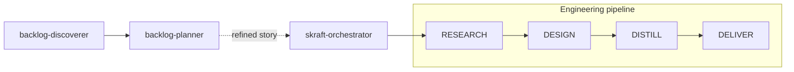

# SKRAFT plugin

Deterministic agentic software delivery for Claude Code and GitHub Copilot.

Give SKRAFT one refined story. Specialist agents research it, design it, turn it into
acceptance tests and deliver tested code, each phase challenged by a read-only reviewer.
The pipeline code and runtime hooks enforce the phase order, the skills each agent
must load, the artifacts a phase must produce, the verdicts and the commits.

## Why SKRAFT

- **Phases you can trust.** A phase cannot start out of order, and cannot close without its
  artifacts, a recorded review verdict and, for delivery, a new commit.
- **Proof, not claims.** Tests, architecture checks, coverage and mutation scores are run by
  scripts and recorded as evidence; a missing proof blocks delivery instead of passing silently.
- **Craft by default.** Outside-In TDD, BDD, Clean Architecture per stack, contract testing,
  ADRs and mutation testing ship as skills the agents load when they need them.
- **Resumable.** State, recovery data and an append-only audit trail live in your repository.

## Install

**Claude Code** — inside Claude Code:

```text
/plugin marketplace add SebastienDegodez/skraft-plugin
/plugin install skraft
```

**GitHub Copilot** — install `skraft` from this repository's marketplace (or load
`plugins/skraft-framework` with `--plugin-dir` for local development), then select
`skraft:skraft-orchestrator` in the agent picker.

## Run a story

1. Select `skraft-orchestrator` and give it one refined story with acceptance criteria.
2. It launches [RunPipeline](../../docs/run-pipeline.md), the pipeline use case running as
   code through a Claude Code mod or a GitHub Copilot dynamic workflow.
3. Answer checkpoints, then review the artifacts and commits it produces; it resumes
   where it stopped.

You can also launch the pipeline directly:

- In Claude Code, `/skraft <slug> [#issue] [title]` starts or resumes the pipeline in the
  Skraft pane. `/skraft decide <slug> <key> <answer>` answers a checkpoint;
  `/skraft close <slug> [findings]` closes a phase after human-validated reworks;
  `/skraft` shows run status.
- In GitHub Copilot CLI, run
  `copilot workflow run skraft-pipeline --args '{"slug":"checkout","issue":42}'`.
  Answer checkpoints with `skraft_decide`, resume with `/workflows` → R, and use
  `skraft_close_phase` to close a phase by hand.
- In GitHub Copilot app, ask to open the **Skraft pipeline** canvas (`{ "slug": "checkout" }`,
  or the active pipeline): phases, attempts, reviews and verdicts, the question the run waits
  for with one-click answers, decisions, reports and the run log, live.


```mermaid
flowchart LR
    D[backlog-discoverer] --> P[backlog-planner]
    P -. refined story .-> O[skraft-orchestrator]
    subgraph Engineering pipeline
        R[RESEARCH] --> A[DESIGN] --> T[DISTILL] --> I[DELIVER]
    end
    O --> R
```

| Phase | Specialist | Reviewer | Result |
|---|---|---|---|
| `RESEARCH` | `solution-researcher` | — | Research brief and constraints |
| `DESIGN` | `solution-architect` | `solution-architect-reviewer` | Architecture decisions and implementation shape |
| `DISTILL` | `acceptance-designer` | `acceptance-designer-reviewer` | Gherkin scenarios, test plan, implementation plan |
| `DELIVER` | `software-engineer` | `software-engineer-reviewer` | Tested code, quality evidence, verified commits |

A rejected result goes back to its specialist; it never advances silently.

Other entry points you can call directly:

- **Product:** `backlog-discoverer` then `backlog-planner` turn a need into refined stories.
- **Brownfield:** `brownfield-analyst` characterizes an existing system,
  `brownfield-harness-builder` pins its behavior with tests and contracts,
  `brownfield-refactorer` modernizes it step by step (Mikado, Strangler Fig).

## Supported stacks

| Stack | Clean Architecture | Quality gates and mutation | Mocking and contract tests |
|---|---|---|---|
| .NET | `clean-architecture-dotnet` | `quality-gates-dotnet` (Stryker.NET) | Microcks or in-process doubles; `WebApplicationFactory` |
| Python | `clean-architecture-python` | `quality-gates-python` (cosmic-ray) | Microcks or respx; FastAPI `TestClient` |
| Java / Spring Boot | `clean-architecture-java` | not yet | not yet |
| React / TypeScript (Vitest) | `clean-architecture-react` | `quality-gates-typescript` (StrykerJS on Vitest 4) | MSW or Microcks; no contract test, a front end exposes no API |
| Node JavaScript | — | `quality-gates-javascript` (`node --test`, StrykerJS TAP) | not yet |

A stack without a quality-gates adapter blocks DELIVER with a structured reason: SKRAFT never
guesses a command or skips a gate.

## Guarantees

RunPipeline checks dispatch order (G1) and handoff completeness (G9) before dispatching,
and records agent results itself. Hooks retain skill loading, provenance and write guards.

| Guard | What you get |
|---|---|
| G1 | A phase agent dispatched out of order is blocked before it runs |
| G2 / G3 | Each agent starts with its mandatory skills, and is sent back if it never loaded them |
| G4 / G5 | A phase closes only with its artifacts, a matching review verdict and, for DELIVER, a new commit |
| G7 | State, execution logs and the active-pipeline pointer cannot be edited by hand |
| G8 | During DELIVER, only the delivery agents write source and test files |
| G9 | A dispatch must pass every recorded input, and the previous review on a retry |

Every guard is covered by unit and acceptance tests; the
[hooks reference](../../docs/site/en/reference/infrastructure/hooks.md) lists what each one
checks, how it fails, and what has been verified live.

## Where the work lives

```text
.copilot-tracking/skraft-plans/{project-slug}/
├── research/  plans/  features/  details/  changes/  reviews/
├── state.json
└── execution-log.json
```

Each artifact feeds the next phase. `state.json` is a runtime contract, not a planning
document: read it through the state CLI, run from your repository.

```bash
node "<plugin-root>/src/cli/state.mjs" get --slug my-feature
node "<plugin-root>/src/cli/state.mjs" timeline
node "<plugin-root>/src/cli/health-check.mjs"
```

Repository settings live in `skraft-config.json`; quality thresholds and engineering
invariants are deliberately not user-relaxable.

`handoff` prints the block the pipeline puts into a phase dispatch: the recorded inputs
the agent must read instead of re-deriving them, and on a retry the rework or re-review
mode with the previous review. `timeline` reports, per phase, specialist and reviewer time
and the number of attempts from the dispatch journal. At DESIGN start the pipeline runs the
structural scan once, in process; the architect and the DESIGN reviewer read its JSON report
instead of re-grepping the code. The pipeline applies state events in process.

## Reports in pull requests (in progress)

SKRAFT is gaining two stable PR comments per story: a forecast from the approved scenarios and
test plan, and an outcome from the delivered code, evidence and review. The scope, the current
state and what remains unverified are in [REPORTING.md](REPORTING.md).

The pipeline renders reports and runs the publication protocol in code; only host MCP
calls are delegated. [github-search-protocol](skills/github-search-protocol/SKILL.md)
owns GitHub transport, including its announced `gh` fallback.

## Documentation

- [SKRAFT handbook](https://sebastiendegodez.github.io/skraft-plugin/en/)
- [Repository architecture](https://github.com/SebastienDegodez/skraft-plugin/blob/main/docs/architecture.md)
- [Roadmap](https://github.com/SebastienDegodez/skraft-plugin/blob/main/docs/roadmap.md)
- [Skill evaluation](https://github.com/SebastienDegodez/skraft-plugin/blob/main/docs/skill-evaluation.md)
- [Maintaining the plugin](MAINTAINING.md): packaging, client compatibility, agent sync, checks before a PR
- [Contributing rules](https://github.com/SebastienDegodez/skraft-plugin/blob/main/AGENTS.md)

## License

GPL-3.0-or-later. See the
[repository license](https://github.com/SebastienDegodez/skraft-plugin/blob/main/LICENSE).
