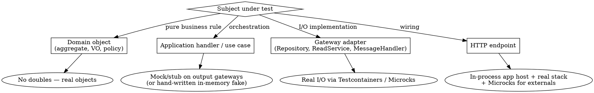
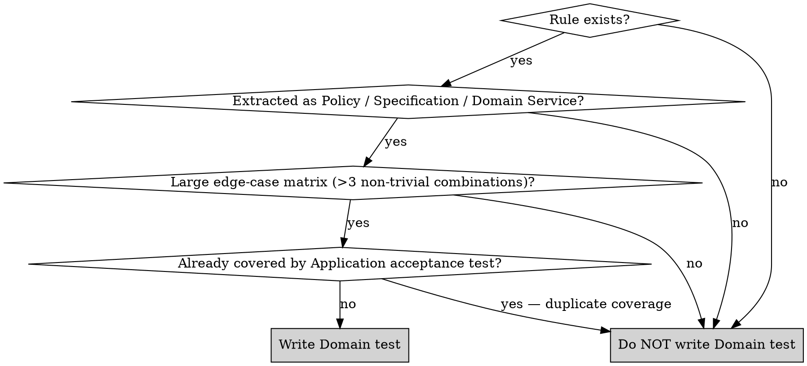

# Doubles Decision Tree (Extended)

Use this when the main decision tree in `SKILL.md` does not answer your case.

## Root Question: What boundary does the test cross?

## Tie-breakers

### "Mock/stub vs hand-written fake at Application level"

| Condition | Choose |
|---|---|
| Single test, simple stub (one call, one return) | Mock/stub (your solution's mocking library) |
| >3 tests need the gateway to behave as a store (add / find / update) | Hand-written in-memory fake |
| Test asserts "was the gateway called with X?" | Mock/stub (verification built-in) |
| Test asserts state ("after N commands, repository contains Y") | In-memory fake (then a `getAll()`/`GetAll()` read in the assertion) |

### "In-memory fake vs real container"

| Layer | Choose | Reason |
|---|---|---|
| Application | In-memory fake (or mock/stub) | Acceptance tests must stay <100 ms; the DB is not under test |
| Infrastructure | Real container (Testcontainers or equivalent) | The adapter IS the I/O boundary — in-memory defeats the purpose |

An in-memory ORM provider (EF Core's in-memory provider, Hibernate's in-memory dialect, …) is **never** acceptable for Infrastructure tests: it accepts invalid SQL, ignores constraints, and silently diverges from the production provider.

### "In-process app host vs Application test"

| Intent | Choose |
|---|---|
| Verify HTTP status code, route, JSON shape, DI wiring | In-process app host (API layer) |
| Verify business rule, orchestration, domain event dispatch | Application layer (mock/stub) |

If an in-process app host test is used to verify a business rule, it is misplaced — rewrite as an Application test.

### "Contract mock server vs mock/stub at Infrastructure"

| External type | Choose |
|---|---|
| Real HTTP / gRPC API we do not own | Contract mock server (Microcks), contract from their OpenAPI / proto / AsyncAPI |
| gRPC / HTTP API we own but lives in another service | Contract mock server (share the contract) |
| Internal gateway whose implementation we are testing | Neither — this is Application-level; use a mock/stub |
| Kafka / RabbitMQ topic exchange | Contract mock server, async mode (contract testing on messages) |

### "Should I add a Domain test?"

The gate is deliberately restrictive. Domain tests are the exception, not the rule.

## Cheat Sheet

| You are writing… | Layer | Doubles |
|---|---|---|
| `PlaceOrderCommandHandlerTests` | Application | Mock/stub on the repository and event dispatcher output gateways |
| `OrderRepositoryTests` | Infrastructure | Real PostgreSQL container |
| `PaymentGatewayAdapterTests` | Infrastructure | Contract mock server (REST) from OpenAPI |
| `OrderPlacedConsumerTests` | Infrastructure | Real broker container + contract mock server (async) |
| `OrdersEndpointsTests` | API | In-process app host + contract mock server for externals |
| `ArchitectureTests` | Architecture | None — architecture scanner |
| `EligibilityPolicyTests` | Domain | None — real `EligibilityPolicy`, only if extracted with ≥3 edge cases |
