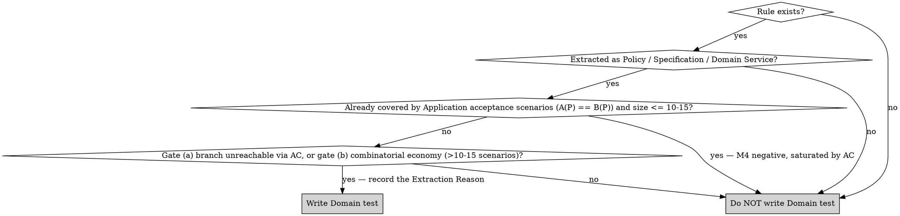

# Doubles Decision Tree (Extended)

Use this when the main decision tree in `SKILL.md` does not answer your case.

## Root Question: What boundary does the test cross?

## Tie-breakers

### "Which double at Application level"

No mocking library in the core (Domain, Application, `<Context>.UnitTest`): gate G7 `no-mocks-in-core.sh` fails the build. Always a very simple hand-written InMemory double (Dictionary / List / Map behind the port).

| Condition | Choose |
|---|---|
| Gateway must behave as a store (add / find / update) | InMemory double over a Dictionary |
| Test must observe an outgoing effect (published event, sent message) | InMemory double that records the calls in a List, assert on that list |
| Test asserts state ("after N commands, repository contains Y") | InMemory double (then `repo.GetAll()` in assertion) |
| Test wants "was the gateway called with X?" | Assert on the recorded state of the double or on the use-case result; no behaviour-verification (`MustHaveHappened`, `Received`, `Verify`) |

### "In-memory fake vs Testcontainers"

| Layer | Choose | Reason |
|---|---|---|
| Application | InMemory double | Acceptance tests must stay <100 ms; the DB is not under test |
| Infrastructure | Testcontainers | The adapter IS the I/O boundary — in-memory defeats the purpose |

`InMemoryDbContext` (EF Core in-memory provider) is **never** acceptable for Infrastructure tests: it accepts invalid SQL, ignores constraints, and silently diverges from the production provider.

### "WebApplicationFactory vs Application test"

| Intent | Choose |
|---|---|
| Verify HTTP status code, route, JSON shape, DI wiring | WebApplicationFactory (API layer) |
| Verify business rule, orchestration, domain event dispatch | Application layer (InMemory doubles) |

If a `WebApplicationFactory` test is used to verify a business rule, it is misplaced — rewrite as an Application test.

### "Which external mock strategy at Infrastructure"

| External type | Choose |
|---|---|
| Real HTTP / gRPC API we do not own | The strategy resolved by `mocking-strategy-roster` (default Microcks; contract comes from their OpenAPI / proto / AsyncAPI) |
| gRPC / HTTP API we own but lives in another service | The strategy resolved by `mocking-strategy-roster` (default Microcks; share the contract) |
| Internal gateway whose implementation we are testing | Neither — this is Application level, use the double allowed by the doubles policy (InMemory fake per G7) |
| Kafka / RabbitMQ topic exchange | The strategy resolved by `mocking-strategy-roster` (default Microcks async; contract testing on messages) |

### "Should I add a Domain test?"

The gate is `test-design-mandates` Mandate 4 (single owner of the criterion). It is deliberately restrictive. Domain tests are the exception, not the rule.

## Cheat Sheet

| You are writing… | Layer | Doubles |
|---|---|---|
| `PlaceOrderCommandHandlerTests` | Application | InMemory doubles for `IOrderRepository`, `IDomainEventDispatcher` |
| `OrderRepositoryTests` | Infrastructure | PostgreSQL Testcontainer |
| `PaymentGatewayAdapterTests` | Infrastructure | Microcks REST mock from OpenAPI |
| `OrderPlacedConsumerTests` | Infrastructure | RabbitMQ Testcontainer + Microcks async contract |
| `OrdersEndpointsTests` | API | `WebApplicationFactory<Program>` + Microcks for externals |
| `ArchitectureTests` | Architecture | None — NetArchTest |
| `EligibilityPolicyTests` | Domain | None — real `EligibilityPolicy`, only if a Mandate 4 gate opens (Extraction Reason recorded) |
