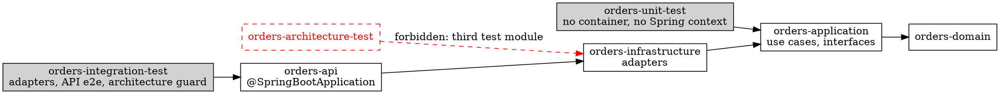

# Clean Architecture Testing — Java / Spring Boot (Maven)

Full runnable examples per layer. Roles and doubles follow the tables in `SKILL.md` — identical across languages, only the library names differ (here: JUnit 5, Mockito, Testcontainers, Spring Boot Test, ArchUnit).



`orders-integration-test` depends on `orders-api` so `@SpringBootTest` finds the `@SpringBootApplication`. Set `<classifier>exec</classifier>` on the `spring-boot-maven-plugin` `repackage` goal in `orders-api`; the repackaged jar hides its classes from dependents.

## Domain — pure unit test (rare, extracted rule only)

Only applies when a rule was extracted into a reusable Policy / Specification with a non-trivial edge-case matrix.

```java
class EligibilityPolicyTest {

    @ParameterizedTest
    @CsvSource({"17,0,false", "18,0,true", "25,3,true"})
    void evaluate_appliesAgeAndExperienceRules(int age, int yearsOfExperience, boolean expectedEligible) {
        var result = new EligibilityPolicy().evaluate(new UserInfo(age, yearsOfExperience), new ResourceInfo("standard", 1));

        assertThat(result.isEligible()).isEqualTo(expectedEligible);
    }
}
```

**Not a Domain test:** a single `@Test` asserting `new Money(10, "EUR").amount() == 10`. Delete and rely on usage in Application tests.

## Application — acceptance test (default layer, Mockito)

Sociable test: real domain objects, mocks only on output gateways.

```java
class PlaceOrderCommandHandlerTest {

    @Test
    void handle_persistsOrderAndDispatchesEvent() {
        var repository = mock(OrderRepository.class);
        var dispatcher = mock(DomainEventDispatcher.class);
        var handler = new PlaceOrderCommandHandler(repository, dispatcher);

        handler.handle(new PlaceOrderCommand(OrderId.newId(), "Alice"));

        verify(repository).add(argThat(order -> order.customerName().equals("Alice")));
        verify(dispatcher).dispatch(argThat(events ->
                events.stream().anyMatch(OrderPlacedEvent.class::isInstance)));
    }

    @Test
    void handle_whenCustomerNameIsBlank_rejectsBeforePersisting() {
        var repository = mock(OrderRepository.class);
        var handler = new PlaceOrderCommandHandler(repository, mock(DomainEventDispatcher.class));

        assertThatThrownBy(() -> handler.handle(new PlaceOrderCommand(OrderId.newId(), "")))
                .isInstanceOf(DomainException.class);
        verifyNoInteractions(repository);
    }
}
```

Use a hand-written in-memory fake instead of `mock(...)` once more than three tests need the repository to behave as a store (add / find).

## Infrastructure — integration test with Testcontainers

One container per test class. Real provider, never an in-memory JPA/Hibernate provider.

```java
@Testcontainers
class OrderRepositoryTest {

    @Container
    static final PostgreSQLContainer<?> db = new PostgreSQLContainer<>("postgres:16-alpine");

    private static DataSource dataSource;
    private OrderRepository sut;

    @BeforeAll
    static void migrate() {
        dataSource = new DriverManagerDataSource(db.getJdbcUrl(), db.getUsername(), db.getPassword());
        Flyway.configure().dataSource(dataSource).load().migrate();
    }

    @BeforeEach
    void emptyTables() {
        var jdbc = new JdbcTemplate(dataSource);
        jdbc.execute("TRUNCATE TABLE orders");
        sut = new JdbcOrderRepository(jdbc);
    }

    @Test
    void add_persistsOrder() {
        sut.add(Order.create(OrderId.newId(), "Alice"));

        assertThat(sut.findAll()).extracting(Order::customerName).containsExactly("Alice");
    }

    @Test
    void find_whenOrderMissing_returnsEmpty() {
        assertThat(sut.find(OrderId.newId())).isEmpty();
    }
}
```

## API — end-to-end test with Spring Boot Test

One happy-path test per endpoint + walking skeleton.

```java
@SpringBootTest(webEnvironment = SpringBootTest.WebEnvironment.RANDOM_PORT)
class OrdersEndpointTest {

    @Autowired
    private TestRestTemplate client;

    @Test
    void postOrders_withValidBody_returns201() {
        var response = client.postForEntity("/orders", new PlaceOrderRequest("Alice"), Void.class);

        assertThat(response.getStatusCode()).isEqualTo(HttpStatus.CREATED);
        assertThat(response.getHeaders().getLocation()).isNotNull();
    }

    @Test
    void getOrder_whenMissing_returns404() {
        var response = client.getForEntity("/orders/" + UUID.randomUUID(), Void.class);

        assertThat(response.getStatusCode()).isEqualTo(HttpStatus.NOT_FOUND);
    }
}
```

For E2E tests that hit a DB, point `spring.datasource.*` at a Testcontainers database via `@DynamicPropertySource` (or `@ServiceConnection`). Downstream HTTP calls to external APIs → route them to a contract mock server (Microcks).

## Architecture guard

In `orders-integration-test` (test scope: `com.tngtech.archunit:archunit-junit5:1.4.0`).

```java
package com.example.orders.integrationtest.architecture;

import static com.tngtech.archunit.lang.syntax.ArchRuleDefinition.classes;
import static org.assertj.core.api.Assertions.assertThat;

import com.tngtech.archunit.core.domain.JavaClasses;
import com.tngtech.archunit.core.importer.ClassFileImporter;
import com.tngtech.archunit.core.importer.ImportOption;
import java.nio.file.Files;
import java.nio.file.Path;
import java.util.List;
import java.util.regex.Pattern;
import org.junit.jupiter.api.Test;
import org.junit.jupiter.params.ParameterizedTest;
import org.junit.jupiter.params.provider.CsvSource;

class LayerDependencyTest {

    private static final String ROOT = "com.example.orders";
    private static final Pattern INTERNAL_DEPENDENCY = Pattern.compile(
            "<dependency>(?:(?!</dependency>).)*?<artifactId>(orders-[a-z-]+)</artifactId>", Pattern.DOTALL);
    private static final JavaClasses PRODUCTION = new ClassFileImporter()
            .withImportOption(ImportOption.Predefined.DO_NOT_INCLUDE_TESTS)
            .importPackages(ROOT);

    @ParameterizedTest
    @CsvSource({"orders-domain,", "orders-application, orders-domain",
                "orders-infrastructure, orders-application", "orders-api, orders-infrastructure"})
    void each_module_references_only_its_inner_neighbour(String module, String allowed) throws Exception {
        var pom = Files.readString(root().resolve(module).resolve("pom.xml"));
        var internal = INTERNAL_DEPENDENCY.matcher(pom).results().map(match -> match.group(1)).toList();
        assertThat(internal).containsExactlyInAnyOrderElementsOf(allowed == null ? List.of() : List.of(allowed));
    }

    @Test
    void domain_depends_only_on_itself_and_the_jdk_core() {
        onlyDependOn("domain", "domain");
    }

    @Test
    void application_depends_only_on_inner_layers_and_the_jdk_core() {
        onlyDependOn("application", "application", "domain");
    }

    // JDK core without I/O, network or persistence.
    private static void onlyDependOn(String layer, String... allowedLayers) {
        var allowed = new java.util.ArrayList<>(List.of("java.lang..", "java.util..", "java.time..", "java.math.."));
        for (var allowedLayer : allowedLayers) allowed.add(ROOT + "." + allowedLayer + "..");
        classes().that().resideInAPackage(ROOT + "." + layer + "..")
                .should().onlyDependOnClassesThat().resideInAnyPackage(allowed.toArray(String[]::new))
                .check(PRODUCTION);
    }

    private static Path root() {
        var directory = Path.of("").toAbsolutePath();
        while (!Files.exists(directory.resolve("orders-domain"))) directory = directory.getParent();
        return directory;
    }
}
```

| Change | Guard |
|---|---|
| `orders-api` → `orders-application` reference | red |
| Domain/Application imports `org.springframework..`, `jakarta.persistence..`, `com.fasterxml.jackson..` | red |
| Domain/Application uses `java.net.http.HttpClient`, `java.nio.file.Files`, `java.sql..` | red |
| Infrastructure imports Domain types; Api imports Application use cases (transitive) | green |

`layeredArchitecture().consideringOnlyDependenciesInLayers()` alone stays green on both leaks: add it only on top of the allow-list.
