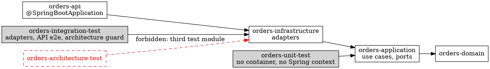

# Clean Architecture Testing — Java / Spring Boot (Maven)

Roles and doubles: [examples-dotnet.md](examples-dotnet.md). Maven specifics only.



## Architecture guard

In `orders-integration-test` (test scope: `com.tngtech.archunit:archunit-junit5:1.4.0`).

```java
package com.example.orders.integrationtest.architecture;

import static com.tngtech.archunit.lang.syntax.ArchRuleDefinition.classes;
import static org.assertj.core.api.Assertions.assertThat;

import com.tngtech.archunit.core.domain.JavaClasses;
import com.tngtech.archunit.core.importer.ClassFileImporter;
import com.tngtech.archunit.core.importer.ImportOption;
import java.nio.file.Files;
import java.nio.file.Path;
import java.util.List;
import java.util.regex.Pattern;
import org.junit.jupiter.api.Test;
import org.junit.jupiter.params.ParameterizedTest;
import org.junit.jupiter.params.provider.CsvSource;

class LayerDependencyTest {

    private static final String ROOT = "com.example.orders";
    private static final Pattern INTERNAL_DEPENDENCY =
            Pattern.compile("<dependency>\\s*<groupId>" + Pattern.quote(ROOT) + "</groupId>\\s*<artifactId>([^<]+)</artifactId>");
    private static final JavaClasses PRODUCTION = new ClassFileImporter()
            .withImportOption(ImportOption.Predefined.DO_NOT_INCLUDE_TESTS)
            .importPackages(ROOT);

    @ParameterizedTest
    @CsvSource({"orders-domain,", "orders-application, orders-domain",
                "orders-infrastructure, orders-application", "orders-api, orders-infrastructure"})
    void each_module_references_only_its_inner_neighbour(String module, String allowed) throws Exception {
        var pom = Files.readString(root().resolve(module).resolve("pom.xml"));
        var internal = INTERNAL_DEPENDENCY.matcher(pom).results().map(match -> match.group(1)).toList();
        assertThat(internal).containsExactlyInAnyOrderElementsOf(allowed == null ? List.of() : List.of(allowed));
    }

    @Test
    void domain_depends_only_on_itself_and_the_jdk_core() {
        onlyDependOn("domain", "domain");
    }

    @Test
    void application_depends_only_on_inner_layers_and_the_jdk_core() {
        onlyDependOn("application", "application", "domain");
    }

    // JDK core without I/O, network or persistence.
    private static void onlyDependOn(String layer, String... allowedLayers) {
        var allowed = new java.util.ArrayList<>(List.of("java.lang..", "java.util..", "java.time..", "java.math.."));
        for (var allowedLayer : allowedLayers) allowed.add(ROOT + "." + allowedLayer + "..");
        classes().that().resideInAPackage(ROOT + "." + layer + "..")
                .should().onlyDependOnClassesThat().resideInAnyPackage(allowed.toArray(String[]::new))
                .check(PRODUCTION);
    }

    private static Path root() {
        var directory = Path.of("").toAbsolutePath();
        while (!Files.exists(directory.resolve("orders-domain"))) directory = directory.getParent();
        return directory;
    }
}
```

| Change | Guard |
|---|---|
| `orders-api` → `orders-application` reference | red |
| Domain/Application imports `org.springframework..`, `jakarta.persistence..`, `com.fasterxml.jackson..` | red |
| Domain/Application uses `java.net.http.HttpClient`, `java.nio.file.Files`, `java.sql..` | red |
| Infrastructure imports Domain types; Api imports Application use cases (transitive) | green |

`layeredArchitecture().consideringOnlyDependenciesInLayers()` alone stays green on both leaks: add it only on top of the allow-list.
