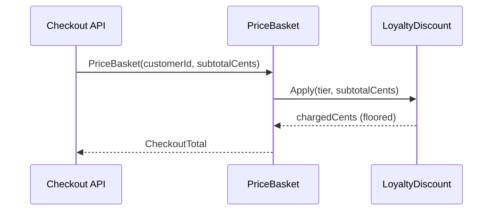

<!-- markdownlint-disable-file -->
# Diagrams — discount

```mermaid
sequenceDiagram
    participant API as Checkout API
    participant App as PriceBasket
    participant Dom as LoyaltyDiscount
    API->>App: PriceBasket(customerId, subtotalCents)
    App->>Dom: Apply(tier, subtotalCents)
    Dom-->>App: chargedCents (floored)
    App-->>API: CheckoutTotal
```
